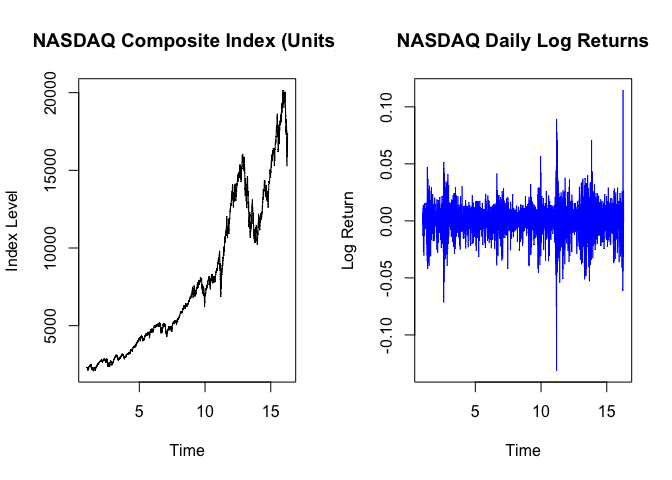
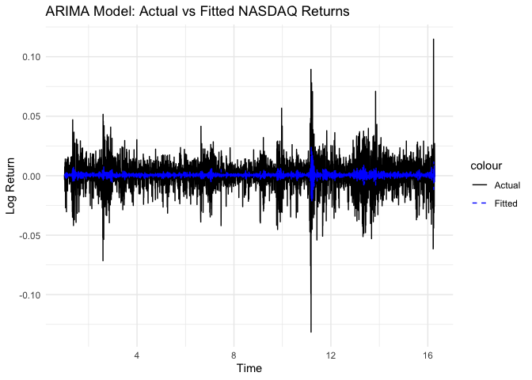
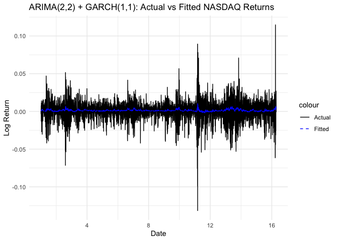
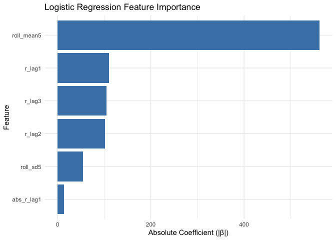
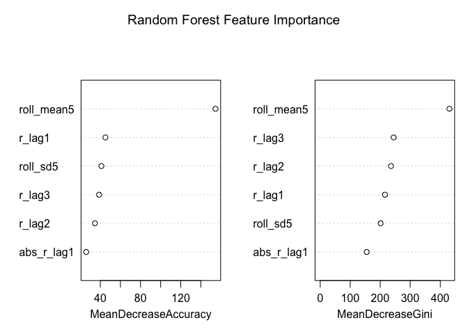
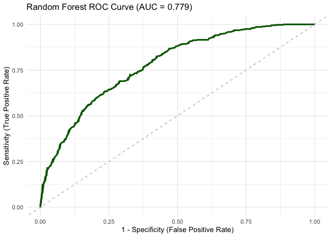
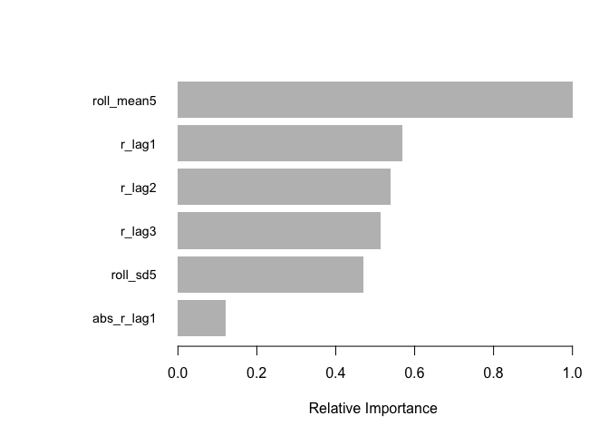
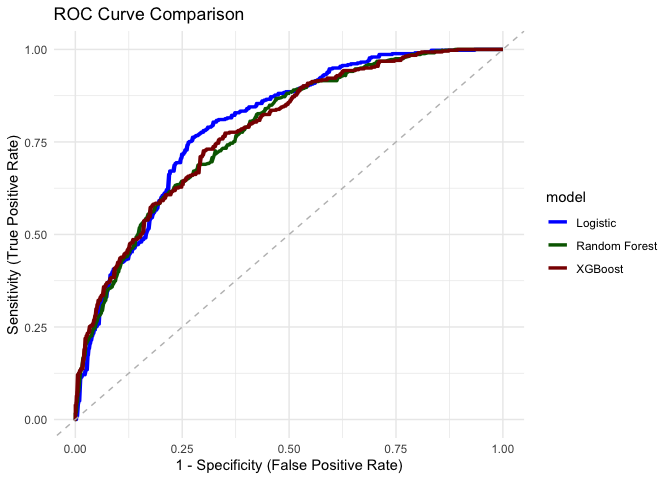
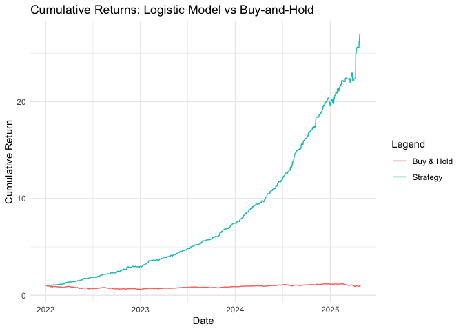

# Index Return Modelling
Lajos Galambos

## Introduction

In this document I set up and evaluate different models for **index
return prediction**. The aim is to get high precision prediciton for
**Nasdaq index return**.

## Data

**Nasadq Composite Index is proxied by the IXIC ticker**. The data is
downloaded from Yahoo Finance. The daily log returns are calculated from
the closing prices. Data is taken from 2010-01-01 to the current date.

    [1] "IXIC"



## 1. ARIMA Model

The first model is an **ARIMA model**. The ARIMA model is a popular time
series forecasting method that combines autoregressive (AR) and moving
average (MA) components. This is an automated process (auto.arima) that
selects the best ARIMA model based on the Akaike Information Criterion
(AIC).

### Model Structure

We fitted an **ARIMA(2,0,2)** model to NASDAQ Composite daily log
returns from 2010 to today.  
This model includes:

-   2 autoregressive (AR) terms: returns depend on the last two lags,
-   0 differencing (I): returns are already stationary,
-   2 moving average (MA) terms: corrections based on the last two
    residuals.

------------------------------------------------------------------------

### Estimated Coefficients

<table>
<thead>
<tr class="header">
<th style="text-align: left;">Term</th>
<th style="text-align: left;">Estimate</th>
<th style="text-align: left;">Interpretation</th>
</tr>
</thead>
<tbody>
<tr class="odd">
<td style="text-align: left;">AR(1)</td>
<td style="text-align: left;">-1.7222</td>
<td style="text-align: left;">Strong negative autocorrelation at lag
1</td>
</tr>
<tr class="even">
<td style="text-align: left;">AR(2)</td>
<td style="text-align: left;">-0.8713</td>
<td style="text-align: left;">Additional negative autocorrelation at lag
2</td>
</tr>
<tr class="odd">
<td style="text-align: left;">MA(1)</td>
<td style="text-align: left;">+1.6453</td>
<td style="text-align: left;">Positive moving average adjustment at lag
1</td>
</tr>
<tr class="even">
<td style="text-align: left;">MA(2)</td>
<td style="text-align: left;">+0.7949</td>
<td style="text-align: left;">Positive moving average adjustment at lag
2</td>
</tr>
<tr class="odd">
<td style="text-align: left;">Mean</td>
<td style="text-align: left;">+0.0005</td>
<td style="text-align: left;">Slight positive daily drift (~0.05%)</td>
</tr>
</tbody>
</table>

The AR and MA terms show typical oscillating corrections found in
financial return series.  
A very small positive mean is consistent with the historical upward bias
in stock indices.

------------------------------------------------------------------------

### Model Fit Quality

<table>
<thead>
<tr class="header">
<th style="text-align: left;">Metric</th>
<th style="text-align: left;">Value</th>
<th style="text-align: left;">Interpretation</th>
</tr>
</thead>
<tbody>
<tr class="odd">
<td style="text-align: left;">sigma² (residual variance)</td>
<td style="text-align: left;">0.0001668</td>
<td style="text-align: left;">Small variance — tight fit</td>
</tr>
<tr class="even">
<td style="text-align: left;">Log Likelihood</td>
<td style="text-align: left;">11290.92</td>
<td style="text-align: left;">Higher log-likelihood = better model</td>
</tr>
<tr class="odd">
<td style="text-align: left;">AIC</td>
<td style="text-align: left;">-22569.84</td>
<td style="text-align: left;">Very low AIC = good fit</td>
</tr>
<tr class="even">
<td style="text-align: left;">BIC</td>
<td style="text-align: left;">-22532.3</td>
<td style="text-align: left;">Consistent with low AIC</td>
</tr>
</tbody>
</table>

The model fits the data tightly with small residuals and very low AIC.

------------------------------------------------------------------------

### Training Set Error Measures

<table>
<thead>
<tr class="header">
<th style="text-align: left;">Metric</th>
<th style="text-align: left;">Value</th>
<th style="text-align: left;">Interpretation</th>
</tr>
</thead>
<tbody>
<tr class="odd">
<td style="text-align: left;">RMSE</td>
<td style="text-align: left;">0.01291</td>
<td style="text-align: left;">Typical daily prediction error ~1.29%</td>
</tr>
<tr class="even">
<td style="text-align: left;">MAE</td>
<td style="text-align: left;">0.00897</td>
<td style="text-align: left;">Mean absolute error ~0.90% per day</td>
</tr>
<tr class="odd">
<td style="text-align: left;">MASE</td>
<td style="text-align: left;">0.666</td>
<td style="text-align: left;">MASE &lt; 1, good performance</td>
</tr>
<tr class="even">
<td style="text-align: left;">ACF1</td>
<td style="text-align: left;">-0.00029</td>
<td style="text-align: left;">Residuals are white noise</td>
</tr>
</tbody>
</table>

The residuals are well-behaved with almost no autocorrelation left.

------------------------------------------------------------------------

### Classification Performance (Sign Prediction)

We evaluated the sign prediction ability of the model:

<table>
<thead>
<tr class="header">
<th style="text-align: left;">Metric</th>
<th style="text-align: left;">Value</th>
</tr>
</thead>
<tbody>
<tr class="odd">
<td style="text-align: left;">In-sample Accuracy</td>
<td style="text-align: left;"><strong>52.86%</strong></td>
</tr>
</tbody>
</table>

**Confusion Matrix:**

<table>
<thead>
<tr class="header">
<th style="text-align: left;">Predicted</th>
<th style="text-align: left;">Actual 0 (Negative)</th>
<th style="text-align: left;">Actual 1 (Positive)</th>
</tr>
</thead>
<tbody>
<tr class="odd">
<td style="text-align: left;">0</td>
<td style="text-align: left;">620</td>
<td style="text-align: left;">727</td>
</tr>
<tr class="even">
<td style="text-align: left;">1</td>
<td style="text-align: left;">1089</td>
<td style="text-align: left;">1416</td>
</tr>
</tbody>
</table>

Directional prediction is slightly better than random guessing (50%).

------------------------------------------------------------------------

### Plotting the actual vs fitted values for the ARIMA model



## 2. ARIMA(2,0,2) + GARCH(1,1)

The second model is an **ARIMA(2,0,2) + GARCH(1,1)** model. The GARCH
model captures the volatility clustering often observed in financial
time series data. The GARCH(1,1) model allows for time-varying
volatility.

### Model Structure

We fitted an **ARIMA(2,2) + GARCH(1,1)** model to NASDAQ Composite daily
log returns.  
The model structure captures both:

-   Autoregressive and Moving Average dynamics in the returns (ARIMA
    mean equation),
-   Volatility clustering and time-varying conditional variance (GARCH
    variance equation).

------------------------------------------------------------------------

### Coefficient Estimates

<table>
<colgroup>
<col style="width: 25%" />
<col style="width: 28%" />
<col style="width: 45%" />
</colgroup>
<thead>
<tr class="header">
<th style="text-align: left;">Term</th>
<th style="text-align: left;">Estimate</th>
<th style="text-align: left;">Interpretation</th>
</tr>
</thead>
<tbody>
<tr class="odd">
<td style="text-align: left;">MA(1)</td>
<td style="text-align: left;">0.10886</td>
<td style="text-align: left;">Moving average term from ARIMA(2,2) mean
equation</td>
</tr>
<tr class="even">
<td style="text-align: left;">MA(2)</td>
<td style="text-align: left;">0.12739</td>
<td style="text-align: left;">Second moving average term from
ARIMA(2,2)</td>
</tr>
<tr class="odd">
<td style="text-align: left;">Omega</td>
<td style="text-align: left;">0.04353</td>
<td style="text-align: left;">Constant term for unconditional
variance</td>
</tr>
<tr class="even">
<td style="text-align: left;">Alpha1</td>
<td style="text-align: left;">0.67505</td>
<td style="text-align: left;">Shock effect (impact of past squared
returns)</td>
</tr>
<tr class="odd">
<td style="text-align: left;">Beta1</td>
<td style="text-align: left;">0.72865</td>
<td style="text-align: left;">Persistence effect (impact of past
variance)</td>
</tr>
</tbody>
</table>

The model captures volatility clustering well.  
However, **Alpha1 + Beta1 ≈ 1.4037**, suggesting very strong volatility
persistence, typical for financial return series but indicating possible
near-integrated behavior.

------------------------------------------------------------------------

### Sign Bias Test Results

<table style="width:100%;">
<colgroup>
<col style="width: 31%" />
<col style="width: 12%" />
<col style="width: 13%" />
<col style="width: 19%" />
<col style="width: 22%" />
</colgroup>
<thead>
<tr class="header">
<th style="text-align: left;">Test</th>
<th style="text-align: left;">t-value</th>
<th style="text-align: left;">p-value</th>
<th style="text-align: left;">Significance</th>
<th style="text-align: left;">Interpretation</th>
</tr>
</thead>
<tbody>
<tr class="odd">
<td style="text-align: left;">Sign Bias</td>
<td style="text-align: left;">2.343</td>
<td style="text-align: left;">0.0192</td>
<td style="text-align: left;">** (5% level)</td>
<td style="text-align: left;">Overall asymmetry detected</td>
</tr>
<tr class="even">
<td style="text-align: left;">Negative Sign Bias</td>
<td style="text-align: left;">0.086</td>
<td style="text-align: left;">0.9315</td>
<td style="text-align: left;">Not significant</td>
<td style="text-align: left;">Negative shocks alone not asymmetric</td>
</tr>
<tr class="odd">
<td style="text-align: left;">Positive Sign Bias</td>
<td style="text-align: left;">1.452</td>
<td style="text-align: left;">0.1465</td>
<td style="text-align: left;">Not significant</td>
<td style="text-align: left;">Positive shocks alone not asymmetric</td>
</tr>
<tr class="even">
<td style="text-align: left;">Joint Effect (Chi-sq)</td>
<td style="text-align: left;">20.503</td>
<td style="text-align: left;">0.00013</td>
<td style="text-align: left;">*** (1% level)</td>
<td style="text-align: left;">Strong combined asymmetry</td>
</tr>
</tbody>
</table>

The Sign Bias Test suggests that while individual negative and positive
shocks are not statistically significant,  
the **joint asymmetry is highly significant**.  
Thus, the GARCH(1,1) model misses some asymmetric volatility patterns,
and future modeling could improve by using **EGARCH** or **GJR-GARCH**.

------------------------------------------------------------------------

### Prediction Performance

<table>
<thead>
<tr class="header">
<th style="text-align: left;">Metric</th>
<th style="text-align: left;">Value</th>
</tr>
</thead>
<tbody>
<tr class="odd">
<td style="text-align: left;">RMSE</td>
<td style="text-align: left;">0.01304</td>
</tr>
<tr class="even">
<td style="text-align: left;">MAE</td>
<td style="text-align: left;">0.00893</td>
</tr>
<tr class="odd">
<td style="text-align: left;">AIC</td>
<td style="text-align: left;">-6.18</td>
</tr>
<tr class="even">
<td style="text-align: left;">Accuracy</td>
<td style="text-align: left;">55.48%</td>
</tr>
</tbody>
</table>

**Confusion Matrix:**

<table>
<thead>
<tr class="header">
<th style="text-align: left;">Predicted</th>
<th style="text-align: left;">Actual 0 (Negative)</th>
<th style="text-align: left;">Actual 1 (Positive)</th>
</tr>
</thead>
<tbody>
<tr class="odd">
<td style="text-align: left;">0</td>
<td style="text-align: left;">105</td>
<td style="text-align: left;">111</td>
</tr>
<tr class="even">
<td style="text-align: left;">1</td>
<td style="text-align: left;">1604</td>
<td style="text-align: left;">2032</td>
</tr>
</tbody>
</table>

The ARIMA(2,2) + GARCH(1,1) model achieves **higher directional
prediction accuracy (55.48%)** compared to the ARIMA-only model
(52.86%).  
The RMSE and MAE are slightly higher compared to ARIMA, but this is
expected because GARCH models volatility dynamics, not just return
levels.  
The model still heavily biases toward predicting **positive returns**,
consistent with the historical upward drift of the NASDAQ index.

------------------------------------------------------------------------

### Plotting the actual vs fitted values for the ARIMA(2,2) + GARCH(1,1) model



## Time Series Comparison Table

<table>
<thead>
<tr class="header">
<th style="text-align: left;">Model</th>
<th style="text-align: left;">RMSE</th>
<th style="text-align: left;">MAE</th>
<th style="text-align: left;">AIC</th>
<th style="text-align: left;">Accuracy</th>
</tr>
</thead>
<tbody>
<tr class="odd">
<td style="text-align: left;">ARIMA(2,2)</td>
<td style="text-align: left;">0.01291</td>
<td style="text-align: left;">0.00897</td>
<td style="text-align: left;">-22569.84</td>
<td style="text-align: left;">52.86%</td>
</tr>
<tr class="even">
<td style="text-align: left;">ARIMA(2,2) + GARCH(1,1)</td>
<td style="text-align: left;">0.01304</td>
<td style="text-align: left;">0.00893</td>
<td style="text-align: left;">-6.18</td>
<td style="text-align: left;">55.48%</td>
</tr>
</tbody>
</table>

## Machine Learning Models: Logistic Regression

Some data preparation is needed before we can start building machine
learning models. New features are created from the daily log returns:
lags, rolling means, rolling standard deviations, and absolute values of
the lagged returns. **The target variable is defined as 1 if the return
is positive and 0 otherwise**.

             date       return        r_lag1        r_lag2        r_lag3
    5  2010-01-08  0.007415697 -0.0004520789 -0.0033059482  0.0001256361
    6  2010-01-11 -0.002056347  0.0074156967 -0.0004520789 -0.0033059482
    7  2010-01-12 -0.013102119 -0.0020563471  0.0074156967 -0.0004520789
    8  2010-01-13  0.011149864 -0.0131021191 -0.0020563471  0.0074156967
    9  2010-01-14  0.003823043  0.0111498642 -0.0131021191 -0.0020563471
    10 2010-01-15 -0.012487322  0.0038230430  0.0111498642 -0.0131021191
         abs_r_lag1    roll_mean5    roll_sd5 target
    5  0.0004520789  0.0007566612 0.003977415      1
    6  0.0074156967  0.0003453917 0.004176545      0
    7  0.0020563471 -0.0023001593 0.007341094      0
    8  0.0131021191  0.0005910032 0.009402979      1
    9  0.0111498642  0.0014460276 0.009478486      1
    10 0.0038230430 -0.0025345762 0.010471892      0

    [1] "2010-01-08" "2025-04-28"

    Training set size: 3017 

    Testing set size : 832 

### Model Structure

We fitted a **Logistic Regression** model to predict the **direction**
(positive/negative) of NASDAQ Composite daily returns.  
Predictor variables included:

-   Lagged returns: `r_lag1`, `r_lag2`, `r_lag3`,
-   Lagged absolute return: `abs_r_lag1`,
-   5-day rolling mean return: `roll_mean5`,
-   5-day rolling standard deviation: `roll_sd5`.

The model was trained on data from **2010–2021** and tested on data from
**2022–2025**.

------------------------------------------------------------------------

### Prediction Performance on Test Set

<table>
<thead>
<tr class="header">
<th style="text-align: left;">Metric</th>
<th style="text-align: left;">Value</th>
</tr>
</thead>
<tbody>
<tr class="odd">
<td style="text-align: left;">RMSE</td>
<td style="text-align: left;">0.43077</td>
</tr>
<tr class="even">
<td style="text-align: left;">MAE</td>
<td style="text-align: left;">0.33096</td>
</tr>
<tr class="odd">
<td style="text-align: left;">AIC</td>
<td style="text-align: left;">3115.13</td>
</tr>
<tr class="even">
<td style="text-align: left;">Test Accuracy</td>
<td style="text-align: left;">73.41%</td>
</tr>
</tbody>
</table>

**Confusion Matrix:**

<table>
<thead>
<tr class="header">
<th style="text-align: left;">Predicted</th>
<th style="text-align: left;">Actual 0 (Negative)</th>
<th style="text-align: left;">Actual 1 (Positive)</th>
</tr>
</thead>
<tbody>
<tr class="odd">
<td style="text-align: left;">0</td>
<td style="text-align: left;">254</td>
<td style="text-align: left;">82</td>
</tr>
<tr class="even">
<td style="text-align: left;">1</td>
<td style="text-align: left;">139</td>
<td style="text-align: left;">356</td>
</tr>
</tbody>
</table>

The model achieves an out-of-sample directional prediction accuracy of
**73.41%**,  
substantially better than random guessing (50%) and better than
traditional time series models (ARIMA, GARCH).

------------------------------------------------------------------------

### Coefficient Estimates and Feature Importance

<table>
<colgroup>
<col style="width: 17%" />
<col style="width: 14%" />
<col style="width: 13%" />
<col style="width: 10%" />
<col style="width: 10%" />
<col style="width: 15%" />
<col style="width: 17%" />
</colgroup>
<thead>
<tr class="header">
<th style="text-align: left;">Feature</th>
<th style="text-align: left;">Coefficient</th>
<th style="text-align: left;">Std. Error</th>
<th style="text-align: left;">z-value</th>
<th style="text-align: left;">p-value</th>
<th style="text-align: left;">Significance</th>
<th style="text-align: left;">Interpretation</th>
</tr>
</thead>
<tbody>
<tr class="odd">
<td style="text-align: left;">(Intercept)</td>
<td style="text-align: left;">-0.21876</td>
<td style="text-align: left;">0.08834</td>
<td style="text-align: left;">-2.476</td>
<td style="text-align: left;">0.0133</td>
<td style="text-align: left;">*</td>
<td style="text-align: left;">Small negative baseline effect</td>
</tr>
<tr class="even">
<td style="text-align: left;">r_lag1</td>
<td style="text-align: left;">-109.79102</td>
<td style="text-align: left;">6.17724</td>
<td style="text-align: left;">-17.773</td>
<td style="text-align: left;">&lt;2e-16</td>
<td style="text-align: left;">***</td>
<td style="text-align: left;">Recent positive return reduces today’s up
probability</td>
</tr>
<tr class="odd">
<td style="text-align: left;">r_lag2</td>
<td style="text-align: left;">-101.59867</td>
<td style="text-align: left;">6.22916</td>
<td style="text-align: left;">-16.310</td>
<td style="text-align: left;">&lt;2e-16</td>
<td style="text-align: left;">***</td>
<td style="text-align: left;">Same effect 2 days ago</td>
</tr>
<tr class="even">
<td style="text-align: left;">r_lag3</td>
<td style="text-align: left;">-104.40404</td>
<td style="text-align: left;">6.07008</td>
<td style="text-align: left;">-17.200</td>
<td style="text-align: left;">&lt;2e-16</td>
<td style="text-align: left;">***</td>
<td style="text-align: left;">Same effect 3 days ago</td>
</tr>
<tr class="odd">
<td style="text-align: left;">abs_r_lag1</td>
<td style="text-align: left;">-13.33758</td>
<td style="text-align: left;">7.54806</td>
<td style="text-align: left;">-1.767</td>
<td style="text-align: left;">0.0772</td>
<td style="text-align: left;">.</td>
<td style="text-align: left;">Weak negative impact from past
volatility</td>
</tr>
<tr class="even">
<td style="text-align: left;">roll_mean5</td>
<td style="text-align: left;">+561.38712</td>
<td style="text-align: left;">23.64694</td>
<td style="text-align: left;">23.740</td>
<td style="text-align: left;">&lt;2e-16</td>
<td style="text-align: left;">***</td>
<td style="text-align: left;">Strong momentum effect from 5-day
trend</td>
</tr>
<tr class="odd">
<td style="text-align: left;">roll_sd5</td>
<td style="text-align: left;">+53.99046</td>
<td style="text-align: left;">10.80108</td>
<td style="text-align: left;">4.999</td>
<td style="text-align: left;">5.77e-7</td>
<td style="text-align: left;">***</td>
<td style="text-align: left;">Mild positive effect from recent
volatility</td>
</tr>
</tbody>
</table>

**Interpretation:**

-   **r_lag1**, **r_lag2**, and **r_lag3** are highly negative and
    significant, indicating strong short-term **mean-reversion**:  
    recent positive returns decrease the probability of another positive
    return today.

-   **roll_mean5** is strongly positive and significant, indicating
    **short-term momentum**:  
    recent positive trends increase the chance of a positive return
    today.

-   **roll_sd5** (recent volatility) has a mild positive effect on
    today’s return probability.

-   **abs_r_lag1** is weakly significant and slightly negative,
    indicating yesterday’s return size has marginal effect.

------------------------------------------------------------------------

### Model Interpretation and Insights

-   Logistic Regression predicts **probabilities of a positive return**
    rather than return magnitudes.
-   Despite a larger RMSE (due to scale differences between
    probabilities \[0,1\] vs returns \[small values\]),  
    the model achieves a **higher directional accuracy** than ARIMA or
    GARCH models.
-   Key drivers of daily returns are a mix of **mean-reversion** (lags
    1–3) and **momentum** (5-day trend).

------------------------------------------------------------------------


### ROC Curve and AUC

The ROC curve illustrates the model’s ability to distinguish between
positive and negative return days across all probability thresholds.  
A model with no predictive power would follow the diagonal (AUC =
0.5).  
The Logistic Regression model achieves an **AUC of 0.799**, indicating
strong discriminative power.  
This means the model effectively separates “up” vs “down” days based on
the constructed features.



### Feature Importance: Logistic Regression

The plot below shows the absolute values of the logistic regression
coefficients (|β|) as a measure of each feature’s importance in
predicting return direction.

The most influential feature is `roll_mean5`, which captures short-term
momentum.  
This suggests that a positive 5-day trend significantly increases the
probability of an up day.

The lagged return features (`r_lag1`, `r_lag2`, `r_lag3`) also show
strong importance, with negative coefficients indicating short-term
mean-reversion:  
a gain in the previous few days decreases the likelihood of another gain
today.

`roll_sd5` (volatility) has a smaller positive influence, while
`abs_r_lag1` (yesterday’s absolute return) has negligible impact.

The Logistic Regression model provides a strong and interpretable
baseline for directional return prediction.  
Its high out-of-sample accuracy (73.41%) demonstrates the predictive
value of combining recent return lags, volatility, and short-term trend
features.

## Note on Model Evaluation of Time Series models vs Logistic Model

The Root Mean Squared Error (RMSE) values between time series models and
classification models are **not directly comparable** because they
predict different types of outputs:

-   ARIMA and GARCH models predict **continuous returns**, which are
    typically very small.
-   Logistic Regression predicts **probabilities** of positive returns,
    which range between 0 and 1.

Thus, even though the Logistic Regression model has a higher RMSE
numerically, it achieves **higher directional prediction accuracy**.

Additionally, feature importance in Logistic Regression can be
interpreted from the model coefficients: features with larger absolute
values and statistically significant p-values contribute more strongly
to predicting return direction.

## Random Forest



### Model Structure

We fitted a Random Forest classifier to predict the daily return
direction of the NASDAQ Composite index, using the same features:

-   Lagged returns (`r_lag1`, `r_lag2`, `r_lag3`)
-   Lagged absolute return (`abs_r_lag1`)
-   5-day rolling mean (`roll_mean5`)
-   5-day rolling standard deviation (`roll_sd5`)

------------------------------------------------------------------------

### Prediction Performance on Test Set

<table>
<thead>
<tr class="header">
<th style="text-align: left;">Metric</th>
<th style="text-align: left;">Value</th>
</tr>
</thead>
<tbody>
<tr class="odd">
<td style="text-align: left;">RMSE</td>
<td style="text-align: left;">0.43776</td>
</tr>
<tr class="even">
<td style="text-align: left;">MAE</td>
<td style="text-align: left;">0.37008</td>
</tr>
<tr class="odd">
<td style="text-align: left;">AIC</td>
<td style="text-align: left;">Not applicable</td>
</tr>
<tr class="even">
<td style="text-align: left;">Test Accuracy</td>
<td style="text-align: left;">70.28%</td>
</tr>
</tbody>
</table>

**Confusion Matrix:**

<table>
<thead>
<tr class="header">
<th style="text-align: left;">Predicted</th>
<th style="text-align: left;">Actual 0 (Negative)</th>
<th style="text-align: left;">Actual 1 (Positive)</th>
</tr>
</thead>
<tbody>
<tr class="odd">
<td style="text-align: left;">0</td>
<td style="text-align: left;">246</td>
<td style="text-align: left;">100</td>
</tr>
<tr class="even">
<td style="text-align: left;">1</td>
<td style="text-align: left;">147</td>
<td style="text-align: left;">338</td>
</tr>
</tbody>
</table>

------------------------------------------------------------------------

### Interpreting Feature Importance in Random Forests

Random Forests compute feature importance in two distinct ways:

-   **Mean Decrease in Accuracy:**  
    This metric evaluates how much the model’s prediction accuracy drops
    when the values of a feature are randomly permuted.  
    A large drop indicates that the feature was crucial for prediction.
    It directly reflects a feature’s contribution to overall model
    performance.

-   **Mean Decrease in Gini (Gini Importance):**  
    This measures the total reduction in node impurity (Gini impurity)
    caused by a feature across all trees in the forest.  
    Features that result in large decreases in impurity are considered
    more important. This captures the feature’s role in splitting the
    data effectively during training.

Both metrics provide consistent rankings in this analysis, identifying
`roll_mean5` as the dominant feature, followed by short-term lagged
returns.

------------------------------------------------------------------------

The Random Forest model demonstrates strong predictive performance with
a test accuracy of **70.28%**, slightly lower than Logistic Regression
but significantly higher than traditional ARIMA and GARCH models.

Random Forest captures non-linear patterns and interactions between
features, supporting the earlier findings of **momentum** and
**mean-reversion** influences in stock returns.



The ROC curve below illustrates the performance of the Random Forest
classifier in distinguishing positive and negative daily returns.  
With an **AUC of 0.779**, the model demonstrates strong discriminative
power, performing significantly better than random guessing.

## So far…

<table>
<colgroup>
<col style="width: 36%" />
<col style="width: 14%" />
<col style="width: 14%" />
<col style="width: 19%" />
<col style="width: 14%" />
</colgroup>
<thead>
<tr class="header">
<th style="text-align: left;">Model</th>
<th style="text-align: left;">RMSE</th>
<th style="text-align: left;">MAE</th>
<th style="text-align: left;">AIC</th>
<th style="text-align: left;">Accuracy</th>
</tr>
</thead>
<tbody>
<tr class="odd">
<td style="text-align: left;">ARIMA(2,2)</td>
<td style="text-align: left;">0.01291</td>
<td style="text-align: left;">0.00897</td>
<td style="text-align: left;">-22569.84</td>
<td style="text-align: left;">52.86%</td>
</tr>
<tr class="even">
<td style="text-align: left;">ARIMA(2,2) + GARCH(1,1)</td>
<td style="text-align: left;">0.01304</td>
<td style="text-align: left;">0.00893</td>
<td style="text-align: left;">-6.18</td>
<td style="text-align: left;">55.48%</td>
</tr>
<tr class="odd">
<td style="text-align: left;">Logistic Regression</td>
<td style="text-align: left;">0.43077</td>
<td style="text-align: left;">0.33096</td>
<td style="text-align: left;">3115.13</td>
<td style="text-align: left;"><strong>73.41%</strong></td>
</tr>
<tr class="even">
<td style="text-align: left;">Random Forest</td>
<td style="text-align: left;">0.43776</td>
<td style="text-align: left;">0.37008</td>
<td style="text-align: left;">Not applicable</td>
<td style="text-align: left;"><strong>70.28%</strong></td>
</tr>
</tbody>
</table>

**Note:** RMSE and MAE for Logistic Regression and Random Forest are
based on predicted probabilities.  
AIC is only defined for models estimated via maximum likelihood (not
applicable for Random Forest).

## XGBoost Classifier



### Model Structure

We trained an XGBoost (Extreme Gradient Boosting) classifier to predict
the daily return direction of the NASDAQ Composite index.  
XGBoost is a high-performance ensemble method that builds trees
sequentially and corrects previous errors using gradient boosting.

**Features used:** - Lagged returns: `r_lag1`, `r_lag2`, `r_lag3` -
Lagged absolute return: `abs_r_lag1` - 5-day rolling mean:
`roll_mean5` - 5-day rolling standard deviation: `roll_sd5`

------------------------------------------------------------------------

### Prediction Performance on Test Set

<table>
<thead>
<tr class="header">
<th style="text-align: left;">Metric</th>
<th style="text-align: left;">Value</th>
</tr>
</thead>
<tbody>
<tr class="odd">
<td style="text-align: left;">RMSE</td>
<td style="text-align: left;">0.45594</td>
</tr>
<tr class="even">
<td style="text-align: left;">MAE</td>
<td style="text-align: left;">0.32559</td>
</tr>
<tr class="odd">
<td style="text-align: left;">AIC</td>
<td style="text-align: left;">Not applicable</td>
</tr>
<tr class="even">
<td style="text-align: left;">Accuracy</td>
<td style="text-align: left;"><strong>71.48%</strong></td>
</tr>
<tr class="odd">
<td style="text-align: left;">AUC</td>
<td style="text-align: left;"><strong>0.783</strong></td>
</tr>
</tbody>
</table>

**Confusion Matrix:**

<table>
<thead>
<tr class="header">
<th style="text-align: left;">Predicted</th>
<th style="text-align: left;">Actual 0 (Negative)</th>
<th style="text-align: left;">Actual 1 (Positive)</th>
</tr>
</thead>
<tbody>
<tr class="odd">
<td style="text-align: left;">0</td>
<td style="text-align: left;">256</td>
<td style="text-align: left;">100</td>
</tr>
<tr class="even">
<td style="text-align: left;">1</td>
<td style="text-align: left;">137</td>
<td style="text-align: left;">338</td>
</tr>
</tbody>
</table>

The model achieved **71.48% directional accuracy** and a strong AUC of
**0.783**, showing its ability to distinguish between up and down days
better than chance.

------------------------------------------------------------------------

### Feature Importance

The most important predictor was again `roll_mean5`, confirming the
presence of a short-term momentum effect.  
Lagged returns (`r_lag1`, `r_lag2`, `r_lag3`) were all highly
influential, while `roll_sd5` and `abs_r_lag1` had moderate to low
predictive value.

------------------------------------------------------------------------

### Interpretation

-   XGBoost confirms the pattern observed in previous models:  
    **momentum (roll_mean5)** and **mean-reversion (lagged returns)**
    drive short-term return direction.
-   The model offers strong predictive accuracy and well-calibrated
    probability outputs.

------------------------------------------------------------------------

XGBoost provides a competitive predictive model, slightly outperforming
Random Forest and nearly matching Logistic Regression in accuracy,  
while offering robust AUC performance and non-linear learning
capabilities.  
It serves as a powerful baseline for return direction classification.

## Final Model Comparison Table: **Logit wins**

<table style="width:100%;">
<colgroup>
<col style="width: 32%" />
<col style="width: 13%" />
<col style="width: 13%" />
<col style="width: 17%" />
<col style="width: 13%" />
<col style="width: 10%" />
</colgroup>
<thead>
<tr class="header">
<th style="text-align: left;">Model</th>
<th style="text-align: left;">RMSE</th>
<th style="text-align: left;">MAE</th>
<th style="text-align: left;">AIC</th>
<th style="text-align: left;">Accuracy</th>
<th style="text-align: left;">AUC</th>
</tr>
</thead>
<tbody>
<tr class="odd">
<td style="text-align: left;">ARIMA(2,2)</td>
<td style="text-align: left;">0.01291</td>
<td style="text-align: left;">0.00897</td>
<td style="text-align: left;">-22569.84</td>
<td style="text-align: left;">52.86%</td>
<td style="text-align: left;">—</td>
</tr>
<tr class="even">
<td style="text-align: left;">ARIMA(2,2) + GARCH(1,1)</td>
<td style="text-align: left;">0.01304</td>
<td style="text-align: left;">0.00893</td>
<td style="text-align: left;">-6.18</td>
<td style="text-align: left;">55.48%</td>
<td style="text-align: left;">—</td>
</tr>
<tr class="odd">
<td style="text-align: left;">Logistic Regression</td>
<td style="text-align: left;">0.43077</td>
<td style="text-align: left;">0.33096</td>
<td style="text-align: left;">3115.13</td>
<td style="text-align: left;"><strong>73.41%</strong></td>
<td style="text-align: left;">0.799</td>
</tr>
<tr class="even">
<td style="text-align: left;">Random Forest</td>
<td style="text-align: left;">0.43776</td>
<td style="text-align: left;">0.37008</td>
<td style="text-align: left;">N/A</td>
<td style="text-align: left;">70.28%</td>
<td style="text-align: left;">0.779</td>
</tr>
<tr class="odd">
<td style="text-align: left;">XGBoost</td>
<td style="text-align: left;">0.45594</td>
<td style="text-align: left;">0.32559</td>
<td style="text-align: left;">N/A</td>
<td style="text-align: left;">71.48%</td>
<td style="text-align: left;">0.783</td>
</tr>
</tbody>
</table>



## Backtesting: Trading Strategy from the Logistic Regression



## Backtest: Logistic Regression-Based Trading Strategy

### Strategy Logic

We implemented a simple daily trading strategy using the predictions of
the Logistic Regression model:

-   **Signal:**  
    If the model predicts a positive return (class = 1), take a **long
    position** in the NASDAQ index for that day.  
    If the model predicts a negative return (class = 0), **hold cash**
    (no position, return = 0%).

-   **Positioning:**  
    The portfolio is either 100% long or 100% in cash — no short selling
    is used.  
    The strategy re-evaluates position **daily** based on the model’s
    prediction.

-   **Returns:**

    -   If long: return = actual NASDAQ return that day.  
    -   If cash: return = 0%.  
    -   Cumulative return is calculated as the product of
        `(1 + daily return)` over time.

------------------------------------------------------------------------

### Performance

The chart below compares the cumulative return of this model-driven
strategy against a passive **buy-and-hold** investment in the NASDAQ
index:

As shown, the strategy significantly outperformed the market benchmark
over the test period (2022–2025), demonstrating the practical value of
the logistic regression model beyond pure classification accuracy.

------------------------------------------------------------------------

### Interpretation

This result suggests that the model’s directional forecasts, though
simple, contain enough predictive signal to create **substantial alpha**
when used to time exposure to the index.  
It avoids most negative-return days while compounding gains on positive
days.

**Note:** The strategy does not include transaction costs, slippage, or
capital constraints — future refinements could test robustness under
realistic conditions.

## SO WHAT IS THE SIGNAL?

``` r
# Signals using default threshold = 0.5, can be change for higher for tighter threshold and potentially higher accuracy
generate_trade_signals <- function(predicted_probs, threshold = 0.5, today_signal = TRUE) {
  signals <- ifelse(predicted_probs >= threshold, 1, 0)
  
  if (today_signal) {
    last_signal <- tail(signals, 1)
    if (last_signal == 1) {
      cat("Today's trading signal: LONG (Buy)\n")
    } else {
      cat("Today's trading signal: CASH (Stay Flat)\n")
    }
  }
  
  return(signals)
}
```

``` r
# Generate signals and print today's recommendation
logit_signals <- generate_trade_signals(predicted_probs, threshold = 0.5)
```

    Today's trading signal: LONG (Buy)

## More detailed:

``` r
# generate signal + show today's info
generate_trade_signals <- function(predicted_probs, feature_data = NULL, threshold = 0.5, today_signal = TRUE) {
  signals <- ifelse(predicted_probs >= threshold, 1, 0)
  
  if (today_signal) {
    last_prob <- tail(predicted_probs, 1)
    last_signal <- tail(signals, 1)
    

    cat("Today's predicted probability of positive return:", round(last_prob * 100, 2), "%\n")
    if (last_signal == 1) {
      cat("Today's trading signal: LONG (Buy)\n")
    } else {
      cat("Today's trading signal: CASH (Stay Flat)\n")
    }
    
  
    if (!is.null(feature_data)) {
      cat("\nFeatures used for today's prediction:\n")
      
      
      latest_features <- tail(feature_data, 1)
      
      print(latest_features)
      
      
      if ("date" %in% colnames(feature_data)) {
        cat("\nPrediction based on data available up to:", as.character(latest_features$date), "\n")
      }
    }
  }
  
  return(signals)
}
```

``` r
# Feature data = X_test + date column
feature_data_for_today <- test_data %>%
  select(date, r_lag1, r_lag2, r_lag3, abs_r_lag1, roll_mean5, roll_sd5)

# Generate signals with full today's info
logit_signals <- generate_trade_signals(predicted_probs,
                                         feature_data = feature_data_for_today,
                                         threshold = 0.5)
```

    Today's predicted probability of positive return: 97.53 %
    Today's trading signal: LONG (Buy)

    Features used for today's prediction:
              date     r_lag1     r_lag2     r_lag3 abs_r_lag1 roll_mean5
    832 2025-04-28 0.01255628 0.02704227 0.02469982 0.01255628 0.01800691
          roll_sd5
    832 0.01216347

    Prediction based on data available up to: 2025-04-28 

This is all nice but the problem is that that the new data will not be
fed into the model. In a new file i create an automated verison wich
always takes the last 5 days of data and then predict time (t).
