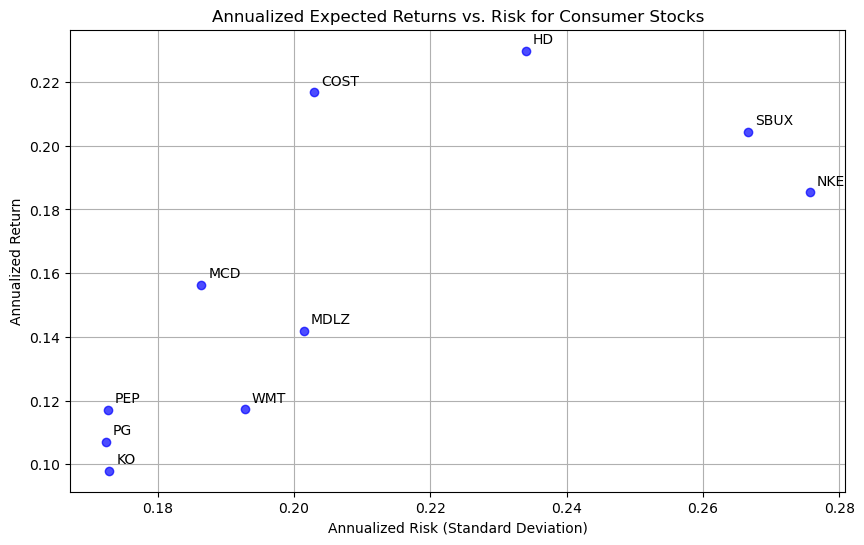

# **Identifying the Best Consumer Stock for Portfolio Allocation**

## **Project Overview**  
This project evaluates the performance of leading **consumer staples and consumer discretionary** stocks to determine the best candidate for portfolio allocation. The selection includes ten major consumer-focused companies with strong market presence and historical performance data:

- **Procter & Gamble (PG)**
- **Coca-Cola (KO)**
- **PepsiCo (PEP)**
- **Walmart (WMT)**
- **Costco Wholesale (COST)**
- **Mondelez International (MDLZ)**
- **McDonald's (MCD)**
- **Home Depot (HD)**
- **Nike (NKE)**
- **Starbucks (SBUX)**

## **Objective**  
The goal of this project is to determine the **best-performing consumer stock** for portfolio allocation by evaluating each company’s **risk-adjusted return**. The analysis focuses on three key financial metrics:

- **Annualized Expected Return**: The average return generated by the stock over the given period (2010-2024), adjusted for annualization.
- **Annualized Risk (Standard Deviation)**: The volatility of each stock’s returns, measured as the standard deviation of daily returns scaled to an annual basis.
- **Sharpe Ratio**: A measure of risk-adjusted performance that compares each stock’s excess return (above the risk-free rate) to its volatility. A higher Sharpe ratio indicates a better risk-reward tradeoff.

## **Methodology**  
- **Data Collection**: Historical adjusted closing prices were retrieved for all ten stocks from Yahoo Finance, covering the period from 2010 to 2024.  
- **Risk-Free Rate**: A fixed **4.5%** risk-free rate was manually set for calculating excess returns.  
- **Sharpe Ratio Ranking**: Stocks were ranked in descending order based on their Sharpe ratio, identifying the best-performing stock in terms of risk-adjusted return.


```python
import yfinance as yf
import pandas as pd
import numpy as np
import matplotlib.pyplot as plt

consumer_stocks = ["PG", "KO", "PEP", "WMT", "COST", "MDLZ", "MCD", "HD", "NKE", "SBUX"]

start_date = "2010-01-01"
end_date = "2024-01-01"

data = yf.download(consumer_stocks, start=start_date, end=end_date)["Adj Close"]

daily_returns = data.pct_change().dropna()

annual_returns = daily_returns.mean() * 252
annual_risks = daily_returns.std() * np.sqrt(252)

summary_df = pd.DataFrame({
    "Annual Return": annual_returns,
    "Annual Risk": annual_risks
})

plt.figure(figsize=(10, 6))
plt.scatter(summary_df["Annual Risk"], summary_df["Annual Return"], color="blue", alpha=0.7)

for ticker in summary_df.index:
    plt.annotate(ticker, (summary_df.loc[ticker, "Annual Risk"], summary_df.loc[ticker, "Annual Return"]),
                 fontsize=10, xytext=(5, 5), textcoords='offset points')

plt.xlabel("Annualized Risk (Standard Deviation)")
plt.ylabel("Annualized Return")
plt.title("Annualized Expected Returns vs. Risk for Consumer Stocks")
plt.grid(True)
plt.show()
```

    [*********************100%***********************]  10 of 10 completed


    

    


```python
us_risk_free_rate = 0.045

sharpe_ratios = (annual_returns - us_risk_free_rate) / annual_risks

summary_df = pd.DataFrame({
    "Annual Return": annual_returns,
    "Annual Risk": annual_risks,
    "Sharpe Ratio": sharpe_ratios
})

summary_df = summary_df.sort_values(by="Sharpe Ratio", ascending=False)
```


```python
print("Consumer Stocks ranked by Sharpe Ratio (highest to lowest):")
print(summary_df)
```

    Consumer Stocks ranked by Sharpe Ratio (highest to lowest):
            Annual Return  Annual Risk  Sharpe Ratio
    Ticker                                          
    COST         0.216795     0.202991      0.846315
    HD           0.229862     0.234004      0.789994
    SBUX         0.204478     0.266647      0.598087
    MCD          0.156392     0.186402      0.597591
    NKE          0.185463     0.275724      0.509435
    MDLZ         0.141931     0.201440      0.481192
    PEP          0.117121     0.172640      0.417755
    WMT          0.117258     0.192760      0.374858
    PG           0.107038     0.172321      0.360015
    KO           0.097956     0.172897      0.306286


## **Outcome**  
By comparing expected returns, risks, and Sharpe ratios, the project identifies which of these leading consumer stocks presents the best opportunity for portfolio allocation. The stock with the **highest Sharpe ratio** will be considered the most attractive choice, offering the best tradeoff between return and risk in the consumer sector.

Based on the ranking of Sharpe Ratios, **Costco (COST)** emerges as the best-performing consumer stock for portfolio allocation, offering the highest risk-adjusted return at **0.8463**.

