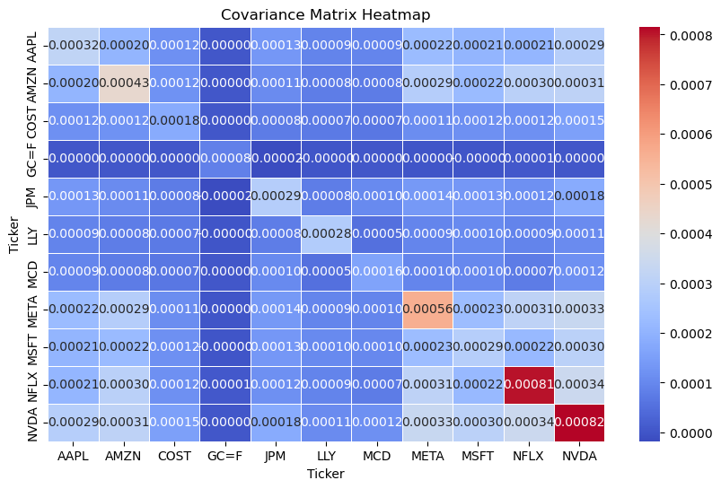
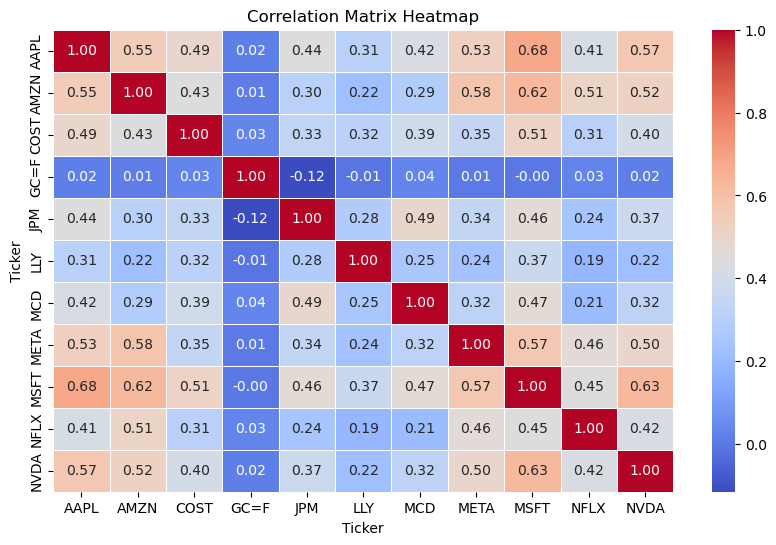
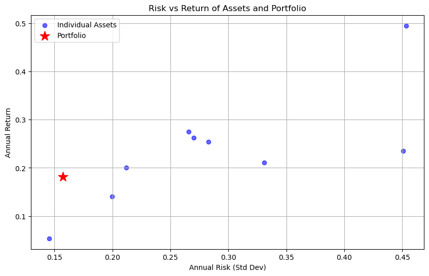

# Diagnostics of my Portfolio

In modern portfolio management, understanding **risk-return relationships** is essential for constructing **efficient and resilient portfolios**. This project analyzes a selection of **technology, consumer, financial, and gold assets** to assess **risk dynamics**, explore **diversification potential**, and optimize asset allocation.


```python
import yfinance as yf
import numpy as np
import pandas as pd
import matplotlib.pyplot as plt
import seaborn as sns
```

## Covariance matrix of historical returns on assets associated with my Portfolio

### Objective
The **covariance matrix** quantifies how different assets in the portfolio move **together** in terms of returns. A **higher covariance** between two assets suggests they move in the same direction, while a **lower or negative covariance** indicates potential diversification benefits.

### Methodology  
1. **Retrieve Historical Data** (2014-2024) using `yfinance`.  
2. **Compute Daily Log Returns** to standardize percentage changes.  
3. **Generate the Covariance Matrix** to analyze the joint risk behavior of assets.  
4. **Visualize with a Heatmap** to interpret asset interactions.  

### Interpretation
- **Higher values** indicate strong co-movements (higher risk exposure when held together).  
- **Lower values** suggest assets move more independently (better for diversification).  
- **Diversified portfolios** should include assets with **low or negative covariances**.  

The heatmap provides a **visual representation** of risk relationships, allowing us to identify **correlated** and **independent** asset behaviors.


```python
stocks = ['AMZN', 'AAPL', 'MCD', 'COST', 'LLY', 'NVDA', 'NFLX', 'MSFT', 'JPM', 'META', 'GC=F']

start_date = '2014-01-30'
end_date = '2024-01-30'

data = yf.download(stocks, start=start_date, end=end_date)['Adj Close']

returns = np.log(data / data.shift(1)).dropna()

cov_matrix = returns.cov()

plt.figure(figsize=(10, 6))
sns.heatmap(cov_matrix, annot=True, fmt=".5f", cmap="coolwarm", linewidths=0.5)
plt.title("Covariance Matrix Heatmap")
plt.show()
```

    [*********************100%***********************]  11 of 11 completed


    

    


### Key Observations:
- **Tech stocks have the highest covariances** among each other, meaning they share volatility risks.
- **Gold (GC=F) has near-zero covariance with most stocks**, reinforcing its role as a risk diversifier.
- **NVDA and META show the highest covariance**, meaning their price movements are closely tied.

## Correlation matrix of historical returns on assets associated with my Portfolio

### Objective
The **correlation matrix** measures the **strength and direction** of relationships between asset returns. It helps determine whether assets **move together or independently**, which is critical for **diversification and portfolio risk management**.

### Methodology
1. **Compute the Correlation Matrix** from daily log returns.  
2. **Visualize with a Heatmap** to interpret relationships.  
3. **Analyze asset interdependencies** for better risk allocation.  

### Interpretation
- **Correlation values range from -1 to 1**:
  - **+1.00** → Perfect positive correlation (move together).  
  - **0.00** → No correlation (independent movements).  
  - **-1.00** → Perfect negative correlation (move in opposite directions).  
- **Diversification Benefits**:
  - Assets with **low or negative correlations** help **reduce portfolio risk**.  
  - **Highly correlated assets** add similar risks and may increase volatility.  

This heatmap provides an intuitive **visual representation** of asset dependencies, highlighting opportunities for diversification.


```python
correlation_matrix = returns.corr()

plt.figure(figsize=(10, 6))
sns.heatmap(correlation_matrix, annot=True, fmt=".2f", cmap="coolwarm", linewidths=0.5)
plt.title("Correlation Matrix Heatmap")
plt.show()
```


    

    


### Key Observations:
- **Tech-heavy stocks** (AAPL, AMZN, NVDA, META) show **strong positive correlations**, meaning they tend to move together.
- **Gold (GC=F) has near-zero or slightly negative correlation** with most equities, making it a valuable hedge against stock market risk.
- **JPM and consumer stocks (MCD, COST) have moderate correlations** with tech stocks, suggesting sector-based diversification.

## Analysing the historical risk-return relationship of my Portfolio with the latest weights


```python
stocks = ['AMZN', 'AAPL', 'MCD', 'COST', 'LLY', 'NVDA', 'NFLX', 'MSFT', 'GC=F']

start_date = '2014-01-30'
end_date = '2024-01-30'

data = yf.download(stocks, start=start_date, end=end_date)['Adj Close']

returns = np.log(data / data.shift(1)).dropna()

annual_returns = returns.mean() * 252
annual_risks = returns.std() * np.sqrt(252)

weights = np.array([0.1334, 0.1216, 0.1115, 0.1073, 0.1070, 0.1055, 0.1051, 0.0916, 0])
portfolio_return = np.dot(weights, annual_returns)
portfolio_risk = np.sqrt(np.dot(weights.T, np.dot(returns.cov() * 252, weights)))

plt.figure(figsize=(10, 6))
plt.scatter(annual_risks, annual_returns, c='blue', label="Individual Assets", alpha=0.6)
plt.scatter(portfolio_risk, portfolio_return, c='red', marker='*', s=200, label="Portfolio")


plt.xlabel("Annual Risk (Std Dev)")
plt.ylabel("Annual Return")
plt.title("Risk vs Return of Assets and Portfolio")
plt.legend()
plt.grid()
plt.show()
```

    [*********************100%***********************]  9 of 9 completed


    

    


```python
print(annual_returns)
print("Portfolio Return  ",portfolio_return)
```

    Ticker
    AAPL    0.254369
    AMZN    0.210578
    COST    0.200505
    GC=F    0.053554
    LLY     0.275435
    MCD     0.140974
    MSFT    0.262639
    NFLX    0.235270
    NVDA    0.495133
    dtype: float64
    Portfolio Return   0.1811401824774242


## Conclusion  
- **High correlations and covariances suggest concentration risk** (especially in tech).  
- **Gold provides hedging benefits** due to its low correlation with equities.  
- **Diversification is crucial** to balance risks across sectors.  


```python

```
