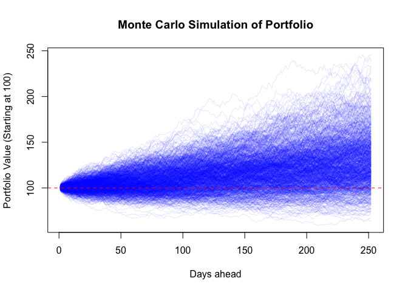
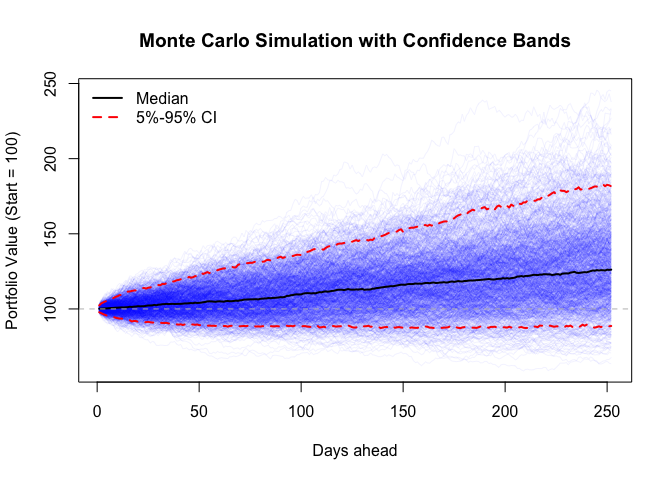
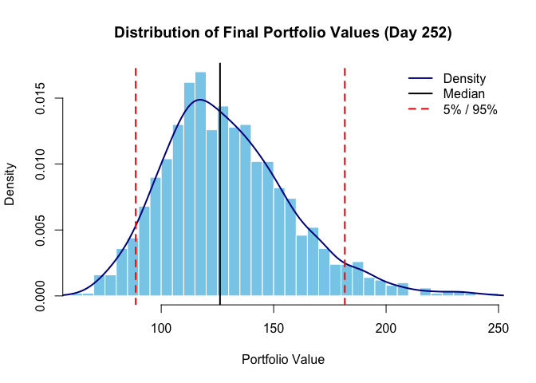

# Portfolio Returns Forcasting
Lajos Galambos

## Simulation of Portfolio Returns

-   Download Historical Prices Fetches adjusted closing prices for 10
    large-cap US stocks from Yahoo Finance covering the last 10 years.

-   Compute Log Returns Calculates daily log returns for each stock.

-   Simulate Portfolio Returns (Monte Carlo) Defines a portfolio with
    equal weights (10% per stock).

-   Computes the mean and standard deviation of the historical portfolio
    returns Simulates 1000 paths of daily portfolio returns over 252
    trading days (~1 year) Converts simulated returns to a portfolio
    value series, starting from 100.

``` r
tickers <- c("AAPL", "AMZN", "COST", "JPM", "LLY", "MCD", "META", "MSFT", "NFLX", "NVDA")
start_date <- Sys.Date() - years(10)

get_prices <- function(ticker) {
  Ad(getSymbols(ticker, src = "yahoo", from = start_date, auto.assign = FALSE))
}

prices_list <- lapply(tickers, get_prices)
prices_xts <- do.call(merge, prices_list)
colnames(prices_xts) <- tickers
```

``` r
returns_xts <- na.omit(diff(log(prices_xts)))
```

``` r
set.seed(42)
n_sim <- 1000
n_days <- 252
weights <- rep(0.1, 10)  

port_returns <- rowSums(returns_xts * weights)

mu <- mean(port_returns)
sigma <- sd(port_returns)

sim_matrix <- matrix(0, nrow = n_days, ncol = n_sim)
for (i in 1:n_sim) {
  sim_matrix[, i] <- cumsum(rnorm(n_days, mean = mu, sd = sigma))
}

sim_prices <- exp(sim_matrix) * 100
```

``` r
matplot(sim_prices, type = "l", col = rgb(0, 0, 1, 0.1), lty = 1,
        main = "Monte Carlo Simulation of Portfolio",
        xlab = "Days ahead", ylab = "Portfolio Value (Starting at 100)")
abline(h = 100, col = "red", lty = 2)
```



## Summary Statistics

``` r
ci_df <- apply(sim_prices, 1, quantile, probs = c(0.05, 0.5, 0.95)) %>% t()
colnames(ci_df) <- c("CI_5", "Median", "CI_95")

matplot(sim_prices, type = "l", col = rgb(0, 0, 1, 0.05), lty = 1,
        main = "Monte Carlo Simulation with Confidence Bands",
        xlab = "Days ahead", ylab = "Portfolio Value (Start = 100)")
lines(ci_df[, "CI_5"], col = "red", lwd = 2, lty = 2)
lines(ci_df[, "Median"], col = "black", lwd = 2)
lines(ci_df[, "CI_95"], col = "red", lwd = 2, lty = 2)
abline(h = 100, col = "gray", lty = 2)
legend("topleft", legend = c("Median", "5%-95% CI"),
       col = c("black", "red"), lty = c(1, 2), lwd = 2, bty = "n")
```



``` r
final_values <- sim_prices[n_days, ]

summary_stats <- tibble(
  Mean = mean(final_values),
  Median = median(final_values),
  SD = sd(final_values),
  CI_5 = quantile(final_values, 0.05),
  CI_95 = quantile(final_values, 0.95),
  Min = min(final_values),
  Max = max(final_values)
)

print(summary_stats)
```

    # A tibble: 1 × 7
       Mean Median    SD  CI_5 CI_95   Min   Max
      <dbl>  <dbl> <dbl> <dbl> <dbl> <dbl> <dbl>
    1  130.   126.  28.6  88.7  182.  63.5  245.

This means that based on the simulations, there’s a 90% chance your
portfolio will be between 88.65 and 181.62 by year-end, with a median
outcome around 126.14.

``` r
final_values <- sim_prices[n_days, ]

hist(final_values,
     breaks = 50,
     col = "skyblue",
     border = "white",
     main = "Distribution of Final Portfolio Values (Day 252)",
     xlab = "Portfolio Value",
     xlim = range(final_values),
     freq = FALSE)

lines(density(final_values), col = "darkblue", lwd = 2)

abline(v = quantile(final_values, c(0.05, 0.5, 0.95)), 
       col = c("red", "black", "red"), lty = c(2, 1, 2), lwd = 2)

legend("topright",
       legend = c("Density", "Median", "5% / 95%"),
       col = c("darkblue", "black", "red"),
       lty = c(1, 1, 2),
       lwd = 2,
       bty = "n")
```



## Histogram

-   The distribution is right-skewed, meaning some high-end outcomes
    stretch the tail — a common feature when returns are compounded over
    time.

-   The median is above 100, suggesting a positive expected drift in
    your portfolio under historical conditions.

-   The 5%–95% range gives a useful sense of expected variability (but
    not a prediction interval in a strict probabilistic sense — as
    discussed earlier).
