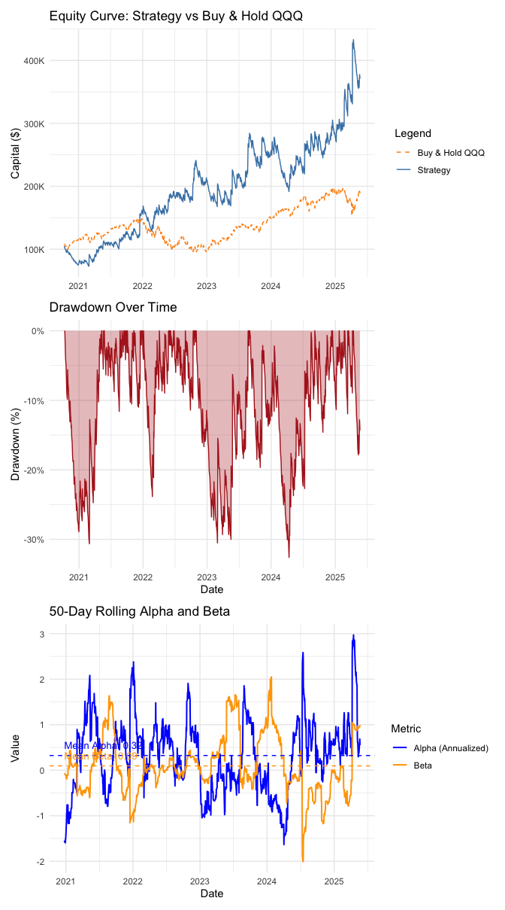
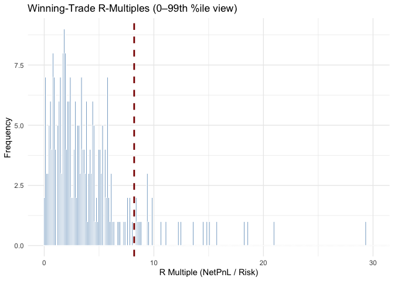
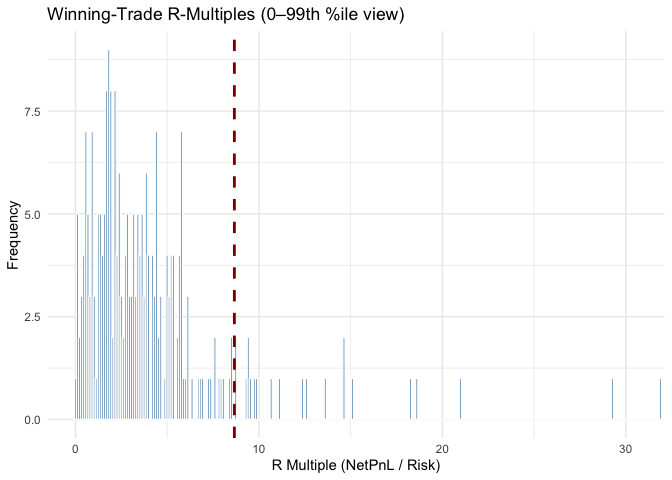

# ORB_NASDAQ_5min
Lajos Galambos

## Introduction

This document outlines the implementation of an Opening Range Breakout
(ORB) strategy using 5-minute intraday data for the NASDAQ-100 ETF
(QQQ). The strategy is designed to capture price movements based on the
opening range of the first two 5-minute candles after market open and
take position with a dynamic risk related sizing method.

The idea to test such approach comes from [a study by Carlo Zarattini,
Andrea Barbon, Andrew Aziz
(2024)](https://papers.ssrn.com/sol3/papers.cfm?abstract_id=4416622).

## Data

Data has been gathered from the EOD API and saved as a Parquet file. The
data set contains **5-minute OHLCV** data for **QQQ** (a Nasdaq ETF),
including datetime, open, high, low, close, volume, and ticker
information.

**London trading hours** UTC time code were provided as default.

The time span goes from **2020-10-09 to 2025-05-21**.

## Returns on the NASDAQ ETF is taken as a benchmark for the strategy performance evaluation

## Applying the Strategy

1.  The direction of each trade (long or short) was determined by the
    **initial movement of the opening range**.
2.  The stop loss was placed at the low of the day (which was the low of
    the first 5-minute candle) for a long trade, and at the high of the
    day (which was the high of the first 5-minute candle) for a short
    trade.
3.  The distance between the entry price and the stop is labeled as
    **Risk($R)**. Returns are also evaluated based on their multiple of
    this.
4.  We set the profit to the end of the day **(EoD)** (although later in
    this analysis we might relax that and explore potential different
    timinig for closing profiatble positions), we liquidate the position
    at market closure.
5.  We assumed a starting capital of $100,000, a maximum leverage of
    **10x**, and a commission of $0.0010/share traded.

## Position Sizing

Position sizing proved to be a choke point of the strategy, as it is
crucial to determine how many shares to buy or sell based on the
available capital and risk per trade.

The position size is calculated using the following formula (same as in
the paper):

-   `A` – current account equity (`current_capital`)  
-   `p` – `risk_per_trade_pct` (here 0.01 = 1 %)  
-   `L` – `max_leverage` (here 10)  
-   `P` – entry price  
-   `R` – `risk_per_share`

`R` is derived from a volatility proxy. Defined as the distance between
entry and stop; we set the stop a fixed multiple of the recent range, so
`R` automatically grows when the market is more volatile and shrinks
when it’s quieter. This implements classic volatility scaling: higher
range ⇒ smaller size, lower range ⇒ larger size.

**Key properties**

-   Fixed-fractional: each position risks exactly **1 % of equity**.  
-   Hard leverage ceiling: total exposure never exceeds **10 ×
    equity**.  
-   Whole-share only: `floor()` ensures no fractional shares.  
-   Adaptive: position size automatically shrinks when the stop is wide
    and grows when the stop is tight, but never breaches either risk or
    leverage limits.

<!-- -->

    # A tibble: 17 × 2
       Metric                    Value      
       <chr>                     <chr>      
     1 Total Return (%)          183.2301   
     2 Annualized Return (%)     16.8487    
     3 Annualized Volatility (%) 45.7234    
     4 Annualized Sharpe Ratio   0.6004     
     5 Max Drawdown (%)          -34.7358   
     6 CAPM Alpha (%)            29.5902    
     7 Beta                      0.1192     
     8 Total Trades              1149.0000  
     9 Winning Trades            271.0000   
    10 Losing Trades             878.0000   
    11 Breakeven Trades          0.0000     
    12 Win Rate (%)              23.5857    
    13 Avg Net PnL               159.4692   
    14 Profit Factor             1.1189     
    15 Total Commission Paid     48387.9400 
    16 Avg Position Notional     810961.9522
    17 Avg Leverage Used         4.8975     

### Strategy Equity Curve vs. Buy & Hold Benchmark

The top panel shows the evolution of capital for:

-   **Strategy** (blue line): performance of the active trading system.
-   **Buy & Hold QQQ** (orange dashed line): a passive benchmark for
    comparison.

The active strategy significantly outperforms the benchmark, especially
from 2023 onward, although it shows more volatility and deeper
pullbacks.

### Drawdown Over Time

The second panel displays the strategy’s **drawdowns** — the percentage
decline from peak equity:

-   Red shaded areas indicate capital drawdowns.
-   The strategy experienced several deep drawdowns (as much as
    **-30%**), especially in 2021 and 2023.
-   The drawdowns appear to stabilize somewhat toward 2025, reflecting
    improved robustness.

### 50-Day Rolling Alpha and Beta

The bottom panel plots **rolling 50-day CAPM alpha and beta**:

-   **Alpha (blue line)**: Measures excess return beyond what is
    explained by exposure to the QQQ index.
    -   It is annualized (×252) and fluctuates meaningfully around the
        global mean (dashed blue line).
-   **Beta (orange line)**: Measures sensitivity to the benchmark.
    -   A beta above 1 implies high exposure to market risk. A beta near
        0 indicates market neutrality.
-   Both alpha and beta are volatile, but the average alpha is slightly
    positive, and beta remains relatively low, suggesting consistent
    **market-independent outperformance**.

These rolling measures provide insight into how the strategy’s
**exposures and return premiums change over time**.

<figure>

<figcaption aria-hidden="true">Rolling Sharpe Ratio, Net Monthly PnL,
and Rolling Win Rate</figcaption>
</figure>

### 1. 50-Day Rolling Sharpe Ratio

This plot shows the strategy’s Sharpe ratio over a 50-day rolling
window.

-   Values above 0 indicate positive risk-adjusted returns.
-   Dips below 0 reflect periods of poor performance relative to
    volatility.
-   Sharpe falls sharply in 2021 and mid-2023 but stabilizes by 2025.
-   Useful for tracking how consistently the strategy rewards risk over
    time.

### 2. Net Monthly PnL

This bar chart shows the net profit or loss for each calendar month.

-   Positive bars show profitable months; negative bars show losses.
-   Profits spike in some months (e.g. late 2022 and 2024), reaching
    ~$60,000.
-   Losses are also present, occasionally exceeding -$20,000.
-   Reveals the cyclical nature of the strategy’s performance.

### 3. 50-Day Rolling Win Rate

This plot tracks the percentage of winning trades in a 50-day window.

-   The dashed line at 50% is the breakeven level.
-   The win rate mostly stays between 15% and 40%.
-   Indicates a strategy that wins less often but may have favorable
    risk/reward.
-   Useful for understanding trade structure and consistency.

## The model’s accuracy in directional term (initial direction is accurate for day’s direction)

The following metric shows the overall directional accuracy of the
model. If, in a certain trading day the model went short, we can expect
the closing candle’s closing price level to be smaller than the first
candle’s closing price level (conversely in a long-case).

    Directional success count: 365 out of 723 trading days

    Directional accuracy rate: 50.48 %

The histogram chart shows the mean and the distribution of **winning**
returns (in terms of R) on the trades over time.

It looks like that the distribution has a long right tail, which is a
good sign for the strategy. The mean of the winning trades is around 9R,
which means that the average winning trade returns 9 times the risk
taken.

## Example of a valid trades

<figure>

<figcaption aria-hidden="true">Example Trades (2 × 2) with Unified
Legend</figcaption>
</figure>

### Selected Trade Case Studies

This panel showcases four notable individual trades from the backtest,
with price action annotated by:

-   **Entry point**
-   **Exit point**
-   **Stop level** (horizontal dashed line)

Each subplot highlights a different performance scenario:

**Biggest Loser — 2025-04-21**  
- A long trade that quickly moved against the entry. - The stop loss was
hit early in the session, leading to the largest dollar loss in the
dataset.

**Long Winner — 2025-04-09**  
- A long breakout trade that trended upward for the rest of the day. -
Captured strong upside momentum, exiting with a large gain.

**Short Winner — 2025-03-13**  
- A short trade executed after a bearish ORB setup. - Price continued to
decline, producing one of the most profitable short-side trades.

**Top R (1137.14) — 2021-12-16**  
- This trade had the **highest R-multiple** (return relative to risk
taken). - The tight stop enabled a very high return with relatively
small capital exposure. - A textbook example of **asymmetric payoff**.

These visualizations provide intuitive insight into trade dynamics —
showcasing how both risk and reward evolve intraday.

## Exploring Hypothetical Profit Taking Moments, Optimal Holding Period

### Is it relly rational to hold it untio the end of the day?

Let’s explore the hypothetical profit-taking moments in the trades,
assuming we could exit at any 5-minute interval after entry. This will
help us understand how holding time affects the R-multiple and whether
it is rational to hold until the end of the day.

There is an apparent trade off between the number of trades that make it
until the EoD vs the R multiple achieved. The longer the trades are
held, the more likely they are to be closed at a loss. This is being
shown in the next section, where the trades are bucketed into 5-minute
bands and the R-multiple is shown as a box-plot. The bottom panel shows
the number of trades in each bucket.

Analytically, we can check for optimal holding period based on the
backtest results by calculating the first derivative of the LOESS fit.
This will help us identify the point where the R-multiple starts to
decrease over holding period, indicating that holding longer is not
beneficial. However, even visually, we can see that the R-multiple is
strictly increasing.

We aslo look at the R-multiple per minute held, which is a measure of
“efficiency” (in terms of time). The higher the R-multiple per minute,
the more efficient the trade is. This is shown in the next plot, where
we filter out trades that were held for 0 minutes (to avoid division by
zero) and calculate the R-multiple per minute held.

## Conclusion

The Opening Range Breakout strategy applied to the NASDAQ-100 ETF (QQQ)
using 5-minute intraday data has shown potential for generating alpha
returns. However, the overall performance, as measured by the Sharpe
ratio and other metrics, indicates that the strategy may require
improvements in terms of risk management and position sizing. The
strategy’s reliance on the opening range and the subsequent price action
has yielded some profitable trades, but the volatility and drawdowns
suggest that further refinement is needed to enhance its robustness and
consistency.

We noticed during the real-life testing period, that the strategy’s
performance and win-rate was significantly (positively) affected by the
fact that we eventually still deviate from the original strategy by not
strictly adhering to the “End of the Day” holding rule.
