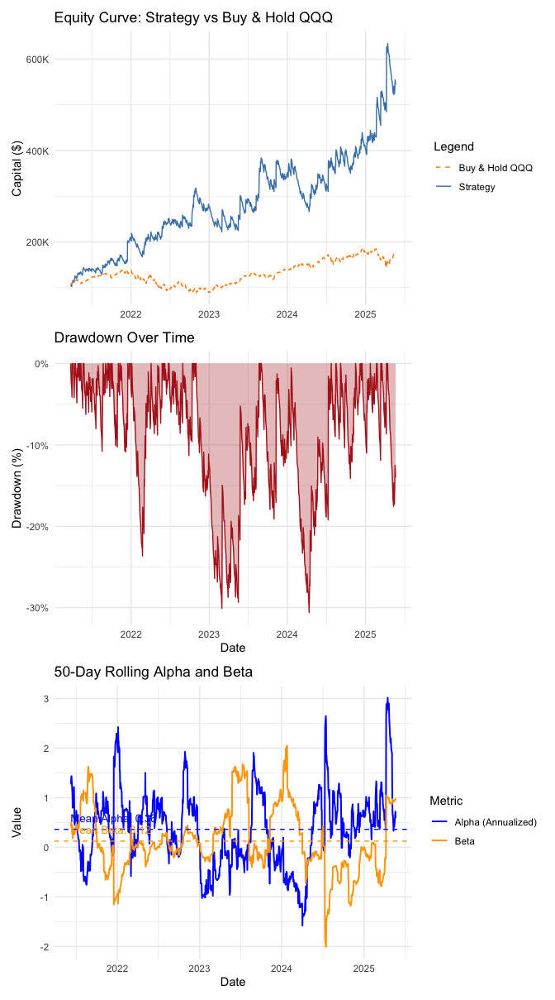
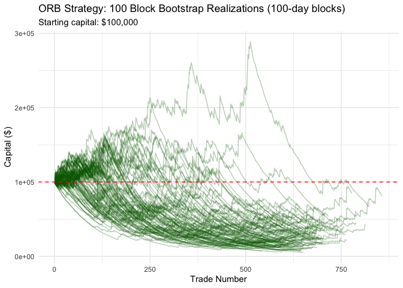

# ORB_NASDAQ_5min
Lajos Galambos

## Introduction

This document outlines the implementation of an Opening Range Breakout
(ORB) strategy using 5-minute intraday data for the NASDAQ-100 ETF
(QQQ). The strategy is designed to capture price movements based on the
opening range of the first two 5-minute candles after market open.

The idea to test such approach comes from [a study by Carlo Zarattini,
Andrea Barbon, Andrew Aziz
(2024)](https://papers.ssrn.com/sol3/papers.cfm?abstract_id=4729284).

## Data

Data has been gethered from the EOD API and saved as a Parquet file. The
dataset contains 5-minute OHLCV data for QQQ, including datetime, open,
high, low, close, volume, and ticker information.

The timezone is set to “America/New_York” to align with the NASDAQ
trading hours.

The time span goes from 2020-10-09 to 2025-05-21.

## Returns on the NASDAQ ETF is taken as a benchmark for the strategy performance evaluation

## Applying the Strategy

1.  The direction of each trade (long or short) was determined by the
    initial movement of the opening range.
2.  The stop loss was placed at the low of the day (which was the low of
    the first 5-minute candle) for a long trade, and at the high of the
    day (which was the high of the first 5-minute candle) for a short
    trade.
3.  The distance between the entry price and the stop is labeled as
    Risk($R). Returns are also evaluated based on their multiple of
    this.
4.  We set the profit target at 10x the $R. Should the target not have
    been reached by the end of the day (EoD), we liquidated the position
    at market closure.
5.  We assumed a starting capital of $100,000, a maximum leverage of 4x,
    and a commission of $0.0005/share traded.
6.  Contrary to the authors, we assumed that that entire balance on the
    account can be used for all the trades every trading day.

<!-- -->

    # A tibble: 17 × 2
       Metric                    Value      
       <chr>                     <chr>      
     1 Total Return (%)          184.0835   
     2 Annualized Return (%)     16.9013    
     3 Annualized Volatility (%) 42.2569    
     4 Annualized Sharpe Ratio   0.6182     
     5 Max Drawdown (%)          -40.9656   
     6 CAPM Alpha (%)            29.5743    
     7 Beta                      0.0671     
     8 Total Trades              1151.0000  
     9 Winning Trades            278.0000   
    10 Losing Trades             873.0000   
    11 Breakeven Trades          0.0000     
    12 Win Rate (%)              24.1529    
    13 Avg Net PnL               159.9336   
    14 Profit Factor             1.1135     
    15 Total Commission Paid     2198.8240  
    16 Avg Position Notional     716671.4618
    17 Avg Leverage Used         3.9988     

Despite the returns look attractive, the performance is still far behind
the one outlined by the paper, which is problematic since the identical
strategy was applied.

Although the strategy produced mostly alpha returns, which is a key
feature of successful trading strategies, the Sharp-ratio remained poor
(4.5% risk free was assumed).

The line chart shows the mean returns (in terms of R) of the trades over
time. The horizontal dashed line represents the average R multiple
across all trades, while the dotted lines indicate the average R
multiples for winning, losing and overall trades.

## Conclusion

The Opening Range Breakout strategy applied to the NASDAQ-100 ETF (QQQ)
using 5-minute intraday data has shown potential for generating alpha
returns. However, the overall performance, as measured by the Sharpe
ratio and other metrics, indicates that the strategy may not be robust
enough for consistent profitability.

Moreover, the performance lacks behind the results outlined in the
referenced paper, suggesting that further refinement and optimization of
the strategy parameters may be necessary.
