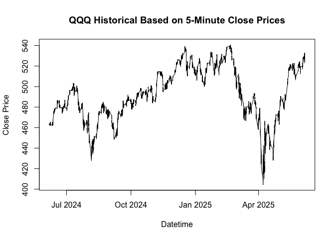
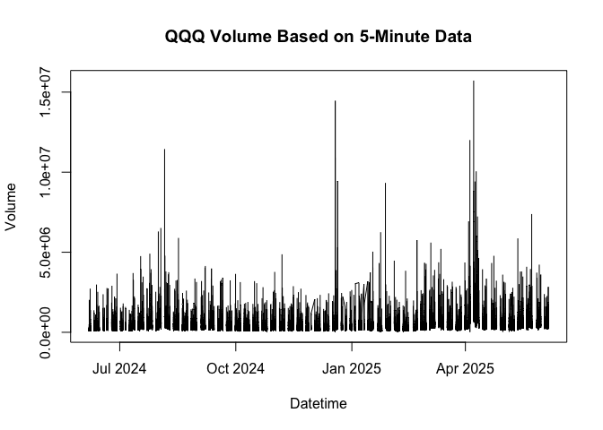
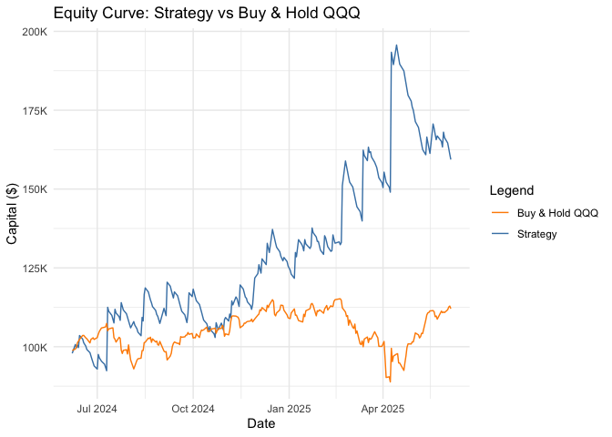
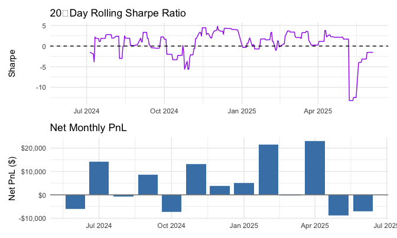
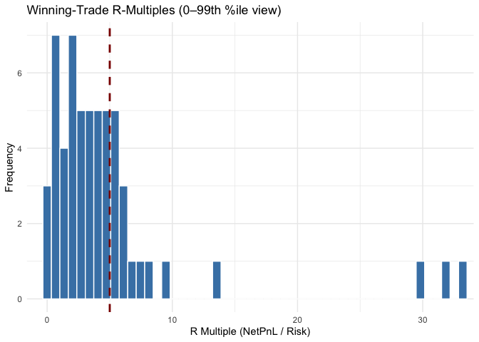
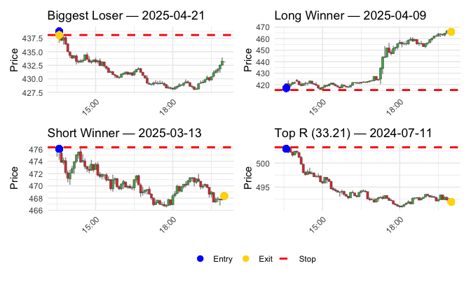
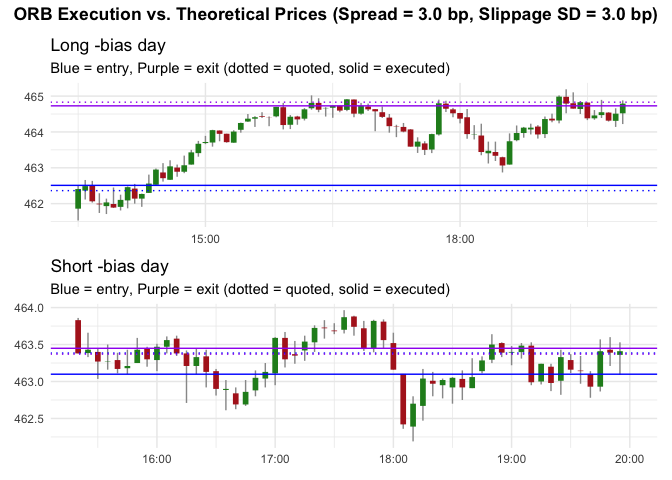

# ORB_NASDAQ_5min_last_year
Lajos Galambos

## Introduction

This document outlines the implementation of an Opening Range Breakout
(ORB) strategy using 5-minute intraday data for the NASDAQ-100 ETF
(QQQ). The strategy is designed to capture price movements based on the
opening range of the first two 5-minute candles after market open.

The idea to test such approach comes from [a study by Carlo Zarattini,
Andrea Barbon, Andrew Aziz
(2024)](https://papers.ssrn.com/sol3/papers.cfm?abstract_id=4729284).

## Data

Data has been gethered from the EOD API and saved as a Parquet file. The
dataset contains 5-minute OHLCV data for QQQ, including datetime, open,
high, low, close, volume, and ticker information.

The timezone is set to “America/New_York” to align with the NASDAQ
trading hours.

The time span goes from 2020-10-09 to 2025-05-21.

## Returns on the NASDAQ ETF is taken as a benchmark for the strategy performance evaluation

## Applying the Strategy

1.  The direction of each trade (long or short) was determined by the
    initial movement of the opening range.
2.  The stop loss was placed at the low of the day (which was the low of
    the first 5-minute candle) for a long trade, and at the high of the
    day (which was the high of the first 5-minute candle) for a short
    trade.
3.  The distance between the entry price and the stop is labeled as
    Risk($R). Returns are also evaluated based on their multiple of
    this.
4.  We set the profit to the end of the day **(EoD)**, we liquidated the
    position at market closure.
5.  We assumed a starting capital of $100,000, a maximum leverage of
    **10x**, and a commission of $0.0005/share traded.

## Position Sizing

Position sizing proved to be a choke point of the strategy, as it is
crucial to determine how many shares to buy or sell based on the
available capital and risk per trade.

The position size is calculated using the following formula (same as in
the paper):

-   `A` – current account equity (`current_capital`)  
-   `p` – `risk_per_trade_pct` (here 0.01 = 1 %)  
-   `L` – `max_leverage` (here 10)  
-   `P` – entry price  
-   `R` – `risk_per_share`

**Key properties**

-   Fixed-fractional: each position risks exactly **1 % of equity**.  
-   Hard leverage ceiling: total exposure never exceeds **10 ×
    equity**.  
-   Whole-share only: `floor()` ensures no fractional shares.  
-   Adaptive: position size automatically shrinks when the stop is wide
    and grows when the stop is tight, but never breaches either risk or
    leverage limits.

<!-- -->

    # A tibble: 17 × 2
       Metric                    Value      
       <chr>                     <chr>      
     1 Total Return (%)          159.3589   
     2 Annualized Return (%)     93.4829    
     3 Annualized Volatility (%) 53.8173    
     4 Annualized Sharpe Ratio   1.0730     
     5 Max Drawdown (%)          -18.5629   
     6 CAPM Alpha (%)            56.7427    
     7 Beta                      0.3142     
     8 Total Trades              248.0000   
     9 Winning Trades            57.0000    
    10 Losing Trades             191.0000   
    11 Breakeven Trades          0.0000     
    12 Win Rate (%)              22.9839    
    13 Avg Net PnL               239.3503   
    14 Profit Factor             1.2297     
    15 Total Commission Paid     335.9790   
    16 Avg Position Notional     669948.3829
    17 Avg Leverage Used         5.2875     

Although the strategy produced mostly alpha returns, which is a key
feature of successful trading strategies, the Sharp-ratio remained lower
than the stats of the paper (4.5% risk free was assumed).

<figure>

<figcaption aria-hidden="true">Rolling Sharpe Ratio and Net Monthly
PnL</figcaption>
</figure>

The histogram chart shows the mean and the distribution of **winning**
returns (in terms of R) on the trades over time.

It looks like that the distribution has a long right tail, which is a
good sign for the strategy. The mean of the winning trades is around 9R,
which means that the average winning trade returns 9 times the risk
taken.

## Example of a valid trades

<figure>

<figcaption aria-hidden="true">Example Trades (2 × 2) with Unified
Legend</figcaption>
</figure>

To demonstrate some of the real life execution related “noise” and
“imperfections” of trades the following graphs demonstrate the
difference between the theoretical entry/exit prices and the actual
executed prices, which are affected by the bid-ask spread and slippage.

They might be smaller or larger, but all in all, slippage and spread are
the two main factors that can affect the profitablity of trades in real
life.

## Conclusion

The Opening Range Breakout strategy applied to the NASDAQ-100 ETF (QQQ)
using 5-minute intraday data has shown potential for generating alpha
returns. However, the overall performance, as measured by the Sharpe
ratio and other metrics, indicates that the strategy may require
improvements in terms of risk management and position sizing. The
strategy’s reliance on the opening range and the subsequent price action
has yielded some profitable trades, but the volatility and drawdowns
suggest that further refinement is needed to enhance its robustness and
consistency.
