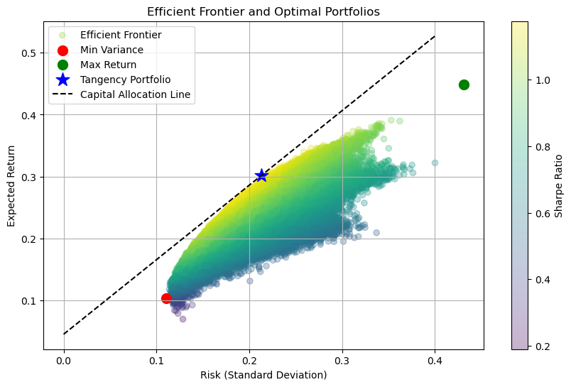

# Portfolio Optimization for selected assets

## Project Overview
This project conducts an **advanced portfolio optimization** for a selection of **equities and gold (XAUUSD)**. The primary focus is on constructing an **efficient frontier**, evaluating key portfolio metrics, and optimizing allocation strategies under a **no short-selling constraint**.

## Objectives
- **Analyze historical performance** of selected assets over a long-term horizon.  
- **Compute risk-return metrics** and construct an **efficient frontier**.  
- **Optimize portfolio allocation** for **minimum variance, maximum return, and tangency portfolios**.  
- **Visualize the Capital Allocation Line (CAL)** to compare optimal portfolios.

## Methodology
- **Data Collection:** Fetch **20 years** of adjusted close price data using `yfinance`.  
- **Returns Calculation:** Compute **daily log returns** and annualize returns & risks.  
- **Optimization Techniques:**  
  - **Minimum Variance Portfolio** → Focuses on the lowest possible risk.  
  - **Maximum Return Portfolio** → Aims for the highest return.  
  - **Tangency Portfolio** → Maximizes the **Sharpe Ratio** under a **4.5% risk-free rate**.  
- **Efficient Frontier Visualization:** Monte Carlo simulations generate **1 000 000 portfolios** to map out diversification benefits.  

## Optimal Portfolios
- **Min Variance Portfolio**: Prioritizes stability with a **low standard deviation**.  
- **Max Return Portfolio**: Highly aggressive, often concentrated in **high-yielding assets**.  
- **Tangency Portfolio**: **Best risk-adjusted return**, balancing performance and risk.  
- **Gold (XAUUSD)** plays a crucial role in **hedging risk** in certain portfolios.


```python
import yfinance as yf
import numpy as np
import pandas as pd
import matplotlib.pyplot as plt
import scipy.optimize as sco
```


```python
assets = ['AMZN', 'AAPL', 'MCD', 'COST', 'LLY', 'NVDA', 'NFLX', 'MSFT', 'JPM', 'META', 'GC=F'] 

# Define time period (last 20 years)
start_date = '2004-01-30'
end_date = '2024-01-30'

data = yf.download(assets, start=start_date, end=end_date)['Adj Close']

returns = np.log(data / data.shift(1)).dropna()

annual_returns = returns.mean() * 252
annual_cov_matrix = returns.cov() * 252

# Risk-free rate
rf = 0.045

def portfolio_performance(weights, mean_returns, cov_matrix):
    port_return = np.dot(weights, mean_returns)
    port_volatility = np.sqrt(np.dot(weights.T, np.dot(cov_matrix, weights)))
    sharpe_ratio = (port_return - rf) / port_volatility
    return port_return, port_volatility, sharpe_ratio

def min_variance_portfolio(mean_returns, cov_matrix):
    num_assets = len(mean_returns)
    args = (mean_returns, cov_matrix)
    constraints = ({'type': 'eq', 'fun': lambda x: np.sum(x) - 1})
    bounds = tuple((0, 1) for _ in range(num_assets))
    result = sco.minimize(lambda x: portfolio_performance(x, *args)[1], num_assets * [1./num_assets],
                          method='SLSQP', bounds=bounds, constraints=constraints)
    return result

def max_return_portfolio(mean_returns, cov_matrix):
    num_assets = len(mean_returns)
    args = (mean_returns, cov_matrix)
    constraints = ({'type': 'eq', 'fun': lambda x: np.sum(x) - 1})
    bounds = tuple((0, 1) for _ in range(num_assets))
    result = sco.minimize(lambda x: -portfolio_performance(x, *args)[0], num_assets * [1./num_assets],
                          method='SLSQP', bounds=bounds, constraints=constraints)
    return result

def tangency_portfolio(mean_returns, cov_matrix, rf):
    num_assets = len(mean_returns)
    args = (mean_returns, cov_matrix)
    constraints = ({'type': 'eq', 'fun': lambda x: np.sum(x) - 1})
    bounds = tuple((0, 1) for _ in range(num_assets))
    result = sco.minimize(lambda x: -portfolio_performance(x, *args)[2], num_assets * [1./num_assets],
                          method='SLSQP', bounds=bounds, constraints=constraints)
    return result

min_var_result = min_variance_portfolio(annual_returns, annual_cov_matrix)
max_ret_result = max_return_portfolio(annual_returns, annual_cov_matrix)
tangency_result = tangency_portfolio(annual_returns, annual_cov_matrix, rf)

def extract_results(result):
    weights = np.round(result.x, 4)
    ret, risk, sharpe = portfolio_performance(weights, annual_returns, annual_cov_matrix)
    return [ret, risk, sharpe] + list(weights)

columns = ['Return', 'Risk', 'Sharpe Ratio'] + assets
results_df = pd.DataFrame(
    [extract_results(min_var_result),
     extract_results(max_ret_result),
     extract_results(tangency_result)],
    index=["Min Variance", "Max Return", "Tangency"],
    columns=columns
)


# Monte Carlo simulation for efficient frontier
num_portfolios = 1000000
results = np.zeros((3, num_portfolios))
weights_record = []

for i in range(num_portfolios):
    weights = np.random.dirichlet(np.ones(len(assets)), size=1).flatten()
    weights_record.append(weights)
    ret, risk, sharpe = portfolio_performance(weights, annual_returns, annual_cov_matrix)
    results[0, i] = ret
    results[1, i] = risk
    results[2, i] = sharpe

# Efficiency Frontier
plt.figure(figsize=(10, 6))
plt.scatter(results[1], results[0], c=results[2], cmap='viridis', alpha=0.3, label="Efficient Frontier")
plt.colorbar(label='Sharpe Ratio')
plt.scatter(results_df['Risk']["Min Variance"], results_df['Return']["Min Variance"], c='red', marker='o', s=100, label="Min Variance")
plt.scatter(results_df['Risk']["Max Return"], results_df['Return']["Max Return"], c='green', marker='o', s=100, label="Max Return")
plt.scatter(results_df['Risk']["Tangency"], results_df['Return']["Tangency"], c='blue', marker='*', s=200, label="Tangency Portfolio")

# Capital Allocation Line (CAL)
x = np.linspace(0, max(results[1]), 100)
y = rf + (results_df['Return']["Tangency"] - rf) / results_df['Risk']["Tangency"] * x
plt.plot(x, y, linestyle='dashed', color='black', label='Capital Allocation Line')

plt.xlabel("Risk (Standard Deviation)")
plt.ylabel("Expected Return")
plt.title("Efficient Frontier and Optimal Portfolios")
plt.legend()
plt.grid()
plt.show()
```

    

    


## Visual Insights
- **Efficient Frontier Plot**: Maps out the **risk-return tradeoff** for optimal portfolios.  
- **Portfolio Allocation**: Displays asset weight distributions in each strategy.  
- **Capital Allocation Line (CAL)**: Illustrates the relationship between risk-free returns and optimal portfolio choices.


```python
columns = ["Min Variance", "Max Return", "Tangency"]
results_df = pd.DataFrame(
    [extract_results(min_var_result),
     extract_results(max_ret_result),
     extract_results(tangency_result)],
    columns=['Return', 'Risk', 'Sharpe Ratio'] + assets
)

results_df = results_df.T
results_df.columns = columns

metrics_df = results_df.loc[['Return', 'Risk', 'Sharpe Ratio']]
assets_df = results_df.drop(['Return', 'Risk', 'Sharpe Ratio'])

display(assets_df.style.set_caption("Asset Weights"))

display(metrics_df.style.set_caption("Key Metrics"))
```


<style type="text/css">
</style>
<table id="T_7da36">
  <caption>Asset Weights</caption>
  <thead>
    <tr>
      <th class="blank level0" >&nbsp;</th>
      <th id="T_7da36_level0_col0" class="col_heading level0 col0" >Min Variance</th>
      <th id="T_7da36_level0_col1" class="col_heading level0 col1" >Max Return</th>
      <th id="T_7da36_level0_col2" class="col_heading level0 col2" >Tangency</th>
    </tr>
  </thead>
  <tbody>
    <tr>
      <th id="T_7da36_level0_row0" class="row_heading level0 row0" >AMZN</th>
      <td id="T_7da36_row0_col0" class="data row0 col0" >0.000000</td>
      <td id="T_7da36_row0_col1" class="data row0 col1" >0.000000</td>
      <td id="T_7da36_row0_col2" class="data row0 col2" >0.000000</td>
    </tr>
    <tr>
      <th id="T_7da36_level0_row1" class="row_heading level0 row1" >AAPL</th>
      <td id="T_7da36_row1_col0" class="data row1 col0" >0.011400</td>
      <td id="T_7da36_row1_col1" class="data row1 col1" >0.000000</td>
      <td id="T_7da36_row1_col2" class="data row1 col2" >0.000000</td>
    </tr>
    <tr>
      <th id="T_7da36_level0_row2" class="row_heading level0 row2" >MCD</th>
      <td id="T_7da36_row2_col0" class="data row2 col0" >0.134400</td>
      <td id="T_7da36_row2_col1" class="data row2 col1" >0.000000</td>
      <td id="T_7da36_row2_col2" class="data row2 col2" >0.261400</td>
    </tr>
    <tr>
      <th id="T_7da36_level0_row3" class="row_heading level0 row3" >COST</th>
      <td id="T_7da36_row3_col0" class="data row3 col0" >0.507500</td>
      <td id="T_7da36_row3_col1" class="data row3 col1" >0.000000</td>
      <td id="T_7da36_row3_col2" class="data row3 col2" >0.000000</td>
    </tr>
    <tr>
      <th id="T_7da36_level0_row4" class="row_heading level0 row4" >LLY</th>
      <td id="T_7da36_row4_col0" class="data row4 col0" >0.076000</td>
      <td id="T_7da36_row4_col1" class="data row4 col1" >0.000000</td>
      <td id="T_7da36_row4_col2" class="data row4 col2" >0.000000</td>
    </tr>
    <tr>
      <th id="T_7da36_level0_row5" class="row_heading level0 row5" >NVDA</th>
      <td id="T_7da36_row5_col0" class="data row5 col0" >0.092200</td>
      <td id="T_7da36_row5_col1" class="data row5 col1" >0.000000</td>
      <td id="T_7da36_row5_col2" class="data row5 col2" >0.409200</td>
    </tr>
    <tr>
      <th id="T_7da36_level0_row6" class="row_heading level0 row6" >NFLX</th>
      <td id="T_7da36_row6_col0" class="data row6 col0" >0.176400</td>
      <td id="T_7da36_row6_col1" class="data row6 col1" >0.000000</td>
      <td id="T_7da36_row6_col2" class="data row6 col2" >0.000000</td>
    </tr>
    <tr>
      <th id="T_7da36_level0_row7" class="row_heading level0 row7" >MSFT</th>
      <td id="T_7da36_row7_col0" class="data row7 col0" >0.000000</td>
      <td id="T_7da36_row7_col1" class="data row7 col1" >0.000000</td>
      <td id="T_7da36_row7_col2" class="data row7 col2" >0.000000</td>
    </tr>
    <tr>
      <th id="T_7da36_level0_row8" class="row_heading level0 row8" >JPM</th>
      <td id="T_7da36_row8_col0" class="data row8 col0" >0.000000</td>
      <td id="T_7da36_row8_col1" class="data row8 col1" >0.000000</td>
      <td id="T_7da36_row8_col2" class="data row8 col2" >0.000000</td>
    </tr>
    <tr>
      <th id="T_7da36_level0_row9" class="row_heading level0 row9" >META</th>
      <td id="T_7da36_row9_col0" class="data row9 col0" >0.002100</td>
      <td id="T_7da36_row9_col1" class="data row9 col1" >0.000000</td>
      <td id="T_7da36_row9_col2" class="data row9 col2" >0.084300</td>
    </tr>
    <tr>
      <th id="T_7da36_level0_row10" class="row_heading level0 row10" >GC=F</th>
      <td id="T_7da36_row10_col0" class="data row10 col0" >0.000000</td>
      <td id="T_7da36_row10_col1" class="data row10 col1" >1.000000</td>
      <td id="T_7da36_row10_col2" class="data row10 col2" >0.245100</td>
    </tr>
  </tbody>
</table>


<style type="text/css">
</style>
<table id="T_21f99">
  <caption>Key Metrics</caption>
  <thead>
    <tr>
      <th class="blank level0" >&nbsp;</th>
      <th id="T_21f99_level0_col0" class="col_heading level0 col0" >Min Variance</th>
      <th id="T_21f99_level0_col1" class="col_heading level0 col1" >Max Return</th>
      <th id="T_21f99_level0_col2" class="col_heading level0 col2" >Tangency</th>
    </tr>
  </thead>
  <tbody>
    <tr>
      <th id="T_21f99_level0_row0" class="row_heading level0 row0" >Return</th>
      <td id="T_21f99_row0_col0" class="data row0 col0" >0.103219</td>
      <td id="T_21f99_row0_col1" class="data row0 col1" >0.448289</td>
      <td id="T_21f99_row0_col2" class="data row0 col2" >0.301281</td>
    </tr>
    <tr>
      <th id="T_21f99_level0_row1" class="row_heading level0 row1" >Risk</th>
      <td id="T_21f99_row1_col0" class="data row1 col0" >0.110406</td>
      <td id="T_21f99_row1_col1" class="data row1 col1" >0.431252</td>
      <td id="T_21f99_row1_col2" class="data row1 col2" >0.212693</td>
    </tr>
    <tr>
      <th id="T_21f99_level0_row2" class="row_heading level0 row2" >Sharpe Ratio</th>
      <td id="T_21f99_row2_col0" class="data row2 col0" >0.527318</td>
      <td id="T_21f99_row2_col1" class="data row2 col1" >0.935158</td>
      <td id="T_21f99_row2_col2" class="data row2 col2" >1.204933</td>
    </tr>
  </tbody>
</table>


## Conclusion
This project demonstrates how **portfolio optimization techniques** can improve investment decisions using **scientific risk-return tradeoffs**. The results highlight the **importance of diversification and strategic asset allocation** in portfolio construction.


```python

```
