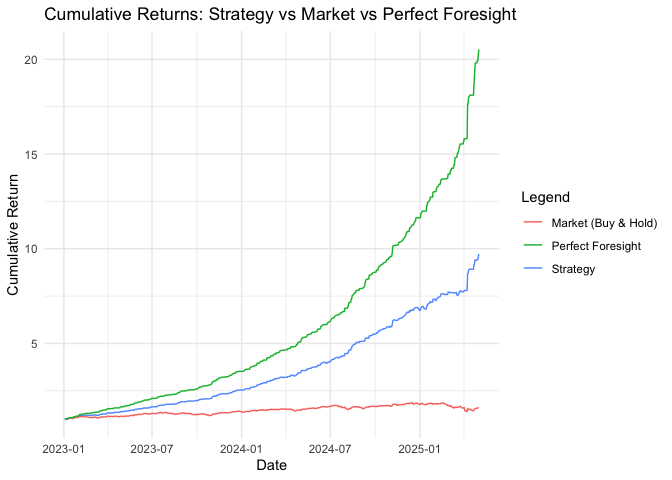

# Prediction_Automated
Lajos Galambos

# Description

In a [previous
file](https://github.com/galamboslajos/Finance-Working-Files/blob/main/Investment_2025/Index_Modelling.md),
we tried out multiple methods to come up with precise prediction results
for Nasdaq 100 daily returns (direction: +/-). This time we want to
implement those results form the most accurate Logistic Regression model
to a more automated process. We will work with code that feeds the model
with new data and returns the predictions.


    ### Sample of Feature Set:


    |   |date       |     return|     r_lag1|     r_lag2|     r_lag3| abs_r_lag1| roll_mean5|  roll_sd5| target|
    |:--|:----------|----------:|----------:|----------:|----------:|----------:|----------:|---------:|------:|
    |5  |2015-05-13 |  0.0011047| -0.0034865| -0.0019966|  0.0116615|  0.0034865|  0.0014566| 0.0059738|      1|
    |6  |2015-05-14 |  0.0137774|  0.0011047| -0.0034865| -0.0019966|  0.0011047|  0.0042121| 0.0079759|      1|
    |7  |2015-05-15 | -0.0004970|  0.0137774|  0.0011047| -0.0034865|  0.0137774|  0.0017804| 0.0069206|      0|
    |8  |2015-05-18 |  0.0059545| -0.0004970|  0.0137774|  0.0011047|  0.0004970|  0.0033706| 0.0067471|      1|
    |9  |2015-05-19 | -0.0016574|  0.0059545| -0.0004970|  0.0137774|  0.0059545|  0.0037364| 0.0063183|      0|


    ### Logistic Regression Model Summary:

    ```

    Call:
    glm(formula = target ~ ., family = binomial(link = "logit"), 
        data = model_data)

    Coefficients:
                  Estimate Std. Error z value Pr(>|z|)    
    (Intercept)  -0.007234   0.097771  -0.074   0.9410    
    r_lag1      -93.679605   6.656960 -14.072   <2e-16 ***
    r_lag2      -85.759388   6.546176 -13.101   <2e-16 ***
    r_lag3      -87.738715   6.431728 -13.642   <2e-16 ***
    abs_r_lag1  -15.808404   7.853509  -2.013   0.0441 *  
    roll_mean5  452.579630  24.826041  18.230   <2e-16 ***
    roll_sd5     29.176096  10.554216   2.764   0.0057 ** 
    ---
    Signif. codes:  0 '***' 0.001 '**' 0.01 '*' 0.05 '.' 0.1 ' ' 1

    (Dispersion parameter for binomial family taken to be 1)

        Null deviance: 2647.6  on 1923  degrees of freedom
    Residual deviance: 2044.0  on 1917  degrees of freedom
    AIC: 2058

    Number of Fisher Scoring iterations: 5

    ```

Coefficients:

r_lag1, r_lag2, and r_lag3 have highly significant negative coefficients
(p-values \< 2e-16), indicating that lagged returns are strong
predictors of the target variable. roll_mean5 has a highly significant
positive coefficient, suggesting that the 5-day rolling mean is also a
strong predictor. abs_r_lag1 and roll_sd5 are not statistically
significant (p-values \> 0.05), meaning they may not contribute much to
the model.

Variables with \*\*\* are highly significant, meaning they strongly
influence the target variable.


    ### Confusion Matrix (Training Data):


    |   |   0|   1|
    |:--|---:|---:|
    |0  | 579| 180|
    |1  | 286| 879|


    ### Accuracy (Training Data):

     Accuracy 
    0.7577963 


    ### Confusion Matrix (Testing Data):


    |   |   0|   1|
    |:--|---:|---:|
    |0  | 166|  58|
    |1  |  89| 272|


    ### Accuracy (Testing Data):

     Accuracy 
    0.7487179 


    ### AUC (Training Data):

    Area under the curve: 0.8147


    ### AUC (Testing Data):

    Area under the curve: 0.8091


    ### Root Mean Squared Error (RMSE) - Training Data:

    [1] 0.4186933


    ### Root Mean Squared Error (RMSE) - Testing Data:

    [1] 0.4190402


    ### Akaike Information Criterion (AIC):

    [1] 2058.017


    ### Feature Importance:


    ### Trading Suggestion for Today:

    - Date: 2025-05-04

    - Probability market goes UP: 61.97%

    - Suggested action: **BUY NASDAQ**

    ### Features Used for Today’s Prediction:


    |    r_lag1|    r_lag2|     r_lag3| abs_r_lag1| roll_mean5|  roll_sd5|
    |---------:|---------:|----------:|----------:|----------:|---------:|
    | 0.0149625| 0.0150414| -0.0008583|  0.0149625|  0.0067289| 0.0079888|


    ### Last 5 NASDAQ Closing Prices:


    |Date       |    Close|
    |:----------|--------:|
    |2025-04-28 | 17366.13|
    |2025-04-29 | 17461.32|
    |2025-04-30 | 17446.34|
    |2025-05-01 | 17710.74|
    |2025-05-02 | 17977.73|


    ### Model Sanity Check (Last Trading Day):

    - Return on 2025-05-02 was: 0.0150 → Market actually went UP

    - Model suggests **BUY (1)** today based on that.

## Backtested Strategy in the test set

    # A tibble: 3 × 2
       year number_of_trades
      <dbl>            <dbl>
    1  2023               61
    2  2024               62
    3  2025               26


