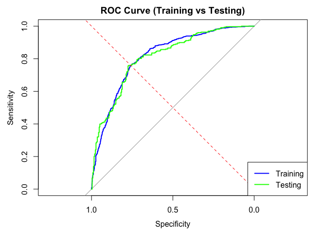

# Prediction_Automated
Lajos Galambos

# Description

In a [previous
file](https://github.com/galamboslajos/Finance-Working-Files/blob/main/Investment_2025/Index_Modelling.md),
we tried out multiple methods to come up with precise prediction results
for Nasdaq 100 daily returns (direction: +/-). This time we want to
implement those results form the most accurate Logistic Regression model
to a more automated process. We will work with code that feeds the model
with new data and returns the predictions.

``` r
# ================================
# Logistic Regression Model with Sanity Checks
# ================================

library(quantmod)
library(dplyr)
library(zoo)

nasdaq_data <- getSymbols("^IXIC", src = "yahoo",
                          from = Sys.Date() - (365 * 10),
                          to = Sys.Date(), 
                          auto.assign = FALSE)

nasdaq_returns <- dailyReturn(Cl(nasdaq_data), type = "log")

full_data <- data.frame(
  date = index(nasdaq_returns),
  return = as.numeric(nasdaq_returns)
) %>%
  mutate(
    r_lag1 = lag(return, 1),
    r_lag2 = lag(return, 2),
    r_lag3 = lag(return, 3),
    abs_r_lag1 = abs(lag(return, 1)),
    roll_mean5 = rollapply(return, width = 5, FUN = mean, align = "right", fill = NA),
    roll_sd5 = rollapply(return, width = 5, FUN = sd, align = "right", fill = NA),
    target = ifelse(return > 0, 1, 0)  # Binary target: 1 if return > 0, else 0
  ) %>%
  na.omit()

cat("\n### Sample of Feature Set:\n")
```


    ### Sample of Feature Set:

``` r
print(knitr::kable(head(full_data, 5), format = "markdown"))
```


    |   |date       |     return|     r_lag1|     r_lag2|     r_lag3| abs_r_lag1| roll_mean5|  roll_sd5| target|
    |:--|:----------|----------:|----------:|----------:|----------:|----------:|----------:|---------:|------:|
    |5  |2015-05-13 |  0.0011047| -0.0034865| -0.0019966|  0.0116615|  0.0034865|  0.0014566| 0.0059738|      1|
    |6  |2015-05-14 |  0.0137774|  0.0011047| -0.0034865| -0.0019966|  0.0011047|  0.0042121| 0.0079759|      1|
    |7  |2015-05-15 | -0.0004970|  0.0137774|  0.0011047| -0.0034865|  0.0137774|  0.0017804| 0.0069206|      0|
    |8  |2015-05-18 |  0.0059545| -0.0004970|  0.0137774|  0.0011047|  0.0004970|  0.0033706| 0.0067471|      1|
    |9  |2015-05-19 | -0.0016574|  0.0059545| -0.0004970|  0.0137774|  0.0059545|  0.0037364| 0.0063183|      0|

``` r
split_date <- as.Date("2023-01-01")  # split date
train_data <- full_data %>% filter(date < split_date)
test_data <- full_data %>% filter(date >= split_date)

X_train <- train_data %>% select(r_lag1, r_lag2, r_lag3, abs_r_lag1, roll_mean5, roll_sd5)
y_train <- train_data$target
model_data <- cbind(X_train, target = y_train)

logistic_model <- glm(target ~ ., data = model_data, family = binomial(link = "logit"))

cat("\n### Logistic Regression Model Summary:\n")
```


    ### Logistic Regression Model Summary:

``` r
summary_output <- capture.output(summary(logistic_model))
cat(paste("```\n", paste(summary_output, collapse = "\n"), "\n```", sep = ""))
```

    ```

    Call:
    glm(formula = target ~ ., family = binomial(link = "logit"), 
        data = model_data)

    Coefficients:
                  Estimate Std. Error z value Pr(>|z|)    
    (Intercept)  -0.007234   0.097771  -0.074   0.9410    
    r_lag1      -93.679605   6.656960 -14.072   <2e-16 ***
    r_lag2      -85.759388   6.546176 -13.101   <2e-16 ***
    r_lag3      -87.738715   6.431728 -13.642   <2e-16 ***
    abs_r_lag1  -15.808404   7.853509  -2.013   0.0441 *  
    roll_mean5  452.579630  24.826041  18.230   <2e-16 ***
    roll_sd5     29.176096  10.554216   2.764   0.0057 ** 
    ---
    Signif. codes:  0 '***' 0.001 '**' 0.01 '*' 0.05 '.' 0.1 ' ' 1

    (Dispersion parameter for binomial family taken to be 1)

        Null deviance: 2647.6  on 1923  degrees of freedom
    Residual deviance: 2044.0  on 1917  degrees of freedom
    AIC: 2058

    Number of Fisher Scoring iterations: 5

    ```

Coefficients:

r_lag1, r_lag2, and r_lag3 have highly significant negative coefficients
(p-values \< 2e-16), indicating that lagged returns are strong
predictors of the target variable. roll_mean5 has a highly significant
positive coefficient, suggesting that the 5-day rolling mean is also a
strong predictor. abs_r_lag1 and roll_sd5 are not statistically
significant (p-values \> 0.05), meaning they may not contribute much to
the model.

Variables with \*\*\* are highly significant, meaning they strongly
influence the target variable.

``` r
# ================================
# Model Evaluation: Accuracy, Confusion Matrix, ROC Curve, and Metrics
# ================================

# Required libraries
#install.packages("caret")
# install.packages("pROC")
library(caret)  
library(pROC)   
library(ggplot2) 

train_data$predicted_prob <- predict(logistic_model, newdata = X_train, type = "response")
train_data$predicted_class <- ifelse(train_data$predicted_prob > 0.5, 1, 0)

X_test <- test_data %>% select(r_lag1, r_lag2, r_lag3, abs_r_lag1, roll_mean5, roll_sd5)
test_data$predicted_prob <- predict(logistic_model, newdata = X_test, type = "response")
test_data$predicted_class <- ifelse(test_data$predicted_prob > 0.5, 1, 0)

cat("\n### Confusion Matrix (Training Data):\n")
```


    ### Confusion Matrix (Training Data):

``` r
conf_matrix_train <- confusionMatrix(
  factor(train_data$predicted_class),
  factor(train_data$target),
  positive = "1"
)
print(knitr::kable(conf_matrix_train$table, format = "markdown"))
```


    |   |   0|   1|
    |:--|---:|---:|
    |0  | 579| 180|
    |1  | 286| 879|

``` r
cat("\n### Accuracy (Training Data):\n")
```


    ### Accuracy (Training Data):

``` r
print(conf_matrix_train$overall["Accuracy"])
```

     Accuracy 
    0.7577963 

``` r
cat("\n### Confusion Matrix (Testing Data):\n")
```


    ### Confusion Matrix (Testing Data):

``` r
conf_matrix_test <- confusionMatrix(
  factor(test_data$predicted_class),
  factor(test_data$target),
  positive = "1"
)
print(knitr::kable(conf_matrix_test$table, format = "markdown"))
```


    |   |   0|   1|
    |:--|---:|---:|
    |0  | 166|  58|
    |1  |  89| 272|

``` r
cat("\n### Accuracy (Testing Data):\n")
```


    ### Accuracy (Testing Data):

``` r
print(conf_matrix_test$overall["Accuracy"])
```

     Accuracy 
    0.7487179 

``` r
roc_curve_train <- roc(train_data$target, train_data$predicted_prob)
roc_curve_test <- roc(test_data$target, test_data$predicted_prob)

cat("\n### AUC (Training Data):\n")
```


    ### AUC (Training Data):

``` r
print(auc(roc_curve_train))
```

    Area under the curve: 0.8147

``` r
cat("\n### AUC (Testing Data):\n")
```


    ### AUC (Testing Data):

``` r
print(auc(roc_curve_test))
```

    Area under the curve: 0.8091

``` r
plot(roc_curve_train, col = "blue", main = "ROC Curve (Training vs Testing)", lwd = 2)
lines(roc_curve_test, col = "green", lwd = 2)
abline(a = 0, b = 1, lty = 2, col = "red")  # Diagonal line for random guessing
legend("bottomright", legend = c("Training", "Testing"), col = c("blue", "green"), lwd = 2)
```



``` r
rmse_train <- sqrt(mean((train_data$predicted_prob - train_data$target)^2))
cat("\n### Root Mean Squared Error (RMSE) - Training Data:\n")
```


    ### Root Mean Squared Error (RMSE) - Training Data:

``` r
print(rmse_train)
```

    [1] 0.4186933

``` r
rmse_test <- sqrt(mean((test_data$predicted_prob - test_data$target)^2))
cat("\n### Root Mean Squared Error (RMSE) - Testing Data:\n")
```


    ### Root Mean Squared Error (RMSE) - Testing Data:

``` r
print(rmse_test)
```

    [1] 0.4190402

``` r
cat("\n### Akaike Information Criterion (AIC):\n")
```


    ### Akaike Information Criterion (AIC):

``` r
print(AIC(logistic_model))
```

    [1] 2058.017

``` r
coefficients <- summary(logistic_model)$coefficients
feature_importance <- data.frame(
  Feature = rownames(coefficients)[-1],  
  Importance = abs(coefficients[-1, "Estimate"])  
)

cat("\n### Feature Importance:\n")
```


    ### Feature Importance:

``` r
ggplot(feature_importance, aes(x = reorder(Feature, Importance), y = Importance)) +
  geom_bar(stat = "identity", fill = "steelblue") +
  coord_flip() +
  labs(title = "Feature Importance", x = "Features", y = "Importance") +
  theme_minimal()
```


``` r
# ================================
# Daily NASDAQ Trading Suggestion (with recent data + model sanity check)
# ================================

library(quantmod)
library(dplyr)
library(zoo)
library(knitr)

nasdaq_data <- getSymbols("^IXIC", src = "yahoo",
                          from = Sys.Date() - 365*10,
                          to = Sys.Date(),
                          auto.assign = FALSE)

nasdaq_returns <- dailyReturn(Cl(nasdaq_data), type = "log")
returns_df <- data.frame(
  date = index(nasdaq_returns),
  return = as.numeric(nasdaq_returns)
)

full_data <- returns_df %>%
  mutate(
    r_lag1 = lag(return, 1),
    r_lag2 = lag(return, 2),
    r_lag3 = lag(return, 3),
    abs_r_lag1 = abs(lag(return, 1)),
    roll_mean5 = rollapply(return, 5, mean, align = "right", fill = NA),
    roll_sd5 = rollapply(return, 5, sd, align = "right", fill = NA),
    target = ifelse(return > 0, 1, 0)
  ) %>%
  na.omit()

X_train <- full_data %>% select(r_lag1, r_lag2, r_lag3, abs_r_lag1, roll_mean5, roll_sd5)
y_train <- full_data$target
logistic_model <- glm(y_train ~ ., data = X_train, family = binomial(link = "logit"))

recent_returns <- tail(returns_df, 5)

r_lag1 <- recent_returns$return[5]  # last return
r_lag2 <- recent_returns$return[4]
r_lag3 <- recent_returns$return[3]
abs_r_lag1 <- abs(r_lag1)
roll_mean5 <- mean(recent_returns$return)
roll_sd5 <- sd(recent_returns$return)

today_features <- data.frame(
  r_lag1 = r_lag1,
  r_lag2 = r_lag2,
  r_lag3 = r_lag3,
  abs_r_lag1 = abs_r_lag1,
  roll_mean5 = roll_mean5,
  roll_sd5 = roll_sd5
)

prob_up <- predict(logistic_model, newdata = today_features, type = "response")
decision <- ifelse(prob_up > 0.5, 1, 0)

cat("### Trading Suggestion for Today:\n")
```

    ### Trading Suggestion for Today:

``` r
cat(sprintf("- Date: %s\n", Sys.Date()))
```

    - Date: 2025-05-04

``` r
cat(sprintf("- Probability market goes UP: %.2f%%\n", prob_up * 100))
```

    - Probability market goes UP: 61.97%

``` r
cat(sprintf("- Suggested action: **%s**\n\n", ifelse(decision == 1, "BUY NASDAQ", "STAY IN CASH")))
```

    - Suggested action: **BUY NASDAQ**

``` r
cat("### Features Used for Today’s Prediction:\n")
```

    ### Features Used for Today’s Prediction:

``` r
print(kable(today_features, format = "markdown"))
```


    |    r_lag1|    r_lag2|     r_lag3| abs_r_lag1| roll_mean5|  roll_sd5|
    |---------:|---------:|----------:|----------:|----------:|---------:|
    | 0.0149625| 0.0150414| -0.0008583|  0.0149625|  0.0067289| 0.0079888|

``` r
cat("\n### Last 5 NASDAQ Closing Prices:\n")
```


    ### Last 5 NASDAQ Closing Prices:

``` r
closing_prices <- Cl(nasdaq_data)
print(kable(
  data.frame(Date = index(tail(closing_prices, 5)),
             Close = round(as.numeric(tail(closing_prices, 5)), 2)),
  format = "markdown"))
```


    |Date       |    Close|
    |:----------|--------:|
    |2025-04-28 | 17366.13|
    |2025-04-29 | 17461.32|
    |2025-04-30 | 17446.34|
    |2025-05-01 | 17710.74|
    |2025-05-02 | 17977.73|

``` r
yesterday_return <- recent_returns$return[5]
actual_movement <- ifelse(yesterday_return > 0, 1, 0)

cat("\n### Model Sanity Check (Last Trading Day):\n")
```


    ### Model Sanity Check (Last Trading Day):

``` r
cat(sprintf("- Return on %s was: %.4f → Market actually went %s\n",
            recent_returns$date[5],
            yesterday_return,
            ifelse(actual_movement == 1, "UP", "DOWN")))
```

    - Return on 2025-05-02 was: 0.0150 → Market actually went UP

``` r
cat(sprintf("- Model suggests **%s** today based on that.\n\n",
            ifelse(decision == 1, "BUY (1)", "STAY IN CASH (0)")))
```

    - Model suggests **BUY (1)** today based on that.
