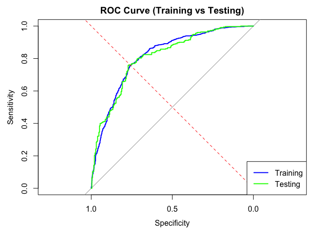
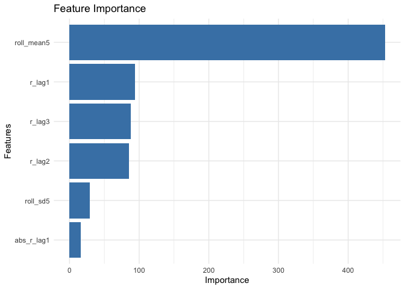
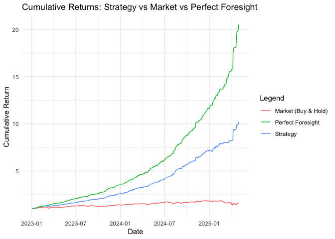

# Prediction_Automated
Lajos Galambos

# Simplistic Return (Direction) Prediction with Logistic Regression

In a [previous
file](https://github.com/galamboslajos/Finance-Working-Files/blob/main/Investment_2025/Index_Modelling.md),
we tried out multiple methods to come up with precise prediction results
for Nasdaq 100 daily returns (direction: +/-).

This time we want to implement those results form a simplistic Logistic
Regression model to a more automated process. We will work with code
that feeds the model with new data and returns the up to date
predictions for the coming trading day.

## Variables, Data

We retrieve the NASDAQ Composite Index (`^IXIC`) from Yahoo Finance and
calculate **daily log returns**. We split the data into a **larger
training set** (10 years) and a **testing set** (last 3 years).

``` r
# Training set
from = Sys.Date() - (365 * 10),
to = Sys.Date()

# Testing set
split_date <- as.Date("2023-01-01")  # split date
train_data <- full_data %>% filter(date < split_date)
test_data <- full_data %>% filter(date >= split_date)
```

### Independent Variables

-   `r_lag1`, `r_lag2`, `r_lag3`: 1-, 2-, and 3-day lagged returns
-   `abs_r_lag1`: absolute return 1 day ago (volatility proxy)
-   `roll_mean5`: 5-day rolling mean of returns
-   `roll_sd5`: 5-day rolling standard deviation of returns

### Dependent Variable

-   `target`: Binary variable: 1 if return on day *t* \> 0, else 0

## The Logistic Regression Model

The model estimates the **log-odds** of the outcome:

\[ () = \_0 + \_1 X_1 + \_2 X_2 + + \_k X_k \]

This can be transformed into a probability using the **logistic
function**:

\[ P(Y=1 X) = \]

The model **does not directly predict probability** of the target
variable, but after converting with the **logistic function**, we can
use it to predict the probability of the target variable being 1.


    ### Sample of Feature Set:


    |   |date       |     return|     r_lag1|     r_lag2|     r_lag3| abs_r_lag1| roll_mean5|  roll_sd5| target|
    |:--|:----------|----------:|----------:|----------:|----------:|----------:|----------:|---------:|------:|
    |5  |2015-05-14 |  0.0137774|  0.0011047| -0.0034865| -0.0019966|  0.0011047|  0.0018798| 0.0068832|      1|
    |6  |2015-05-15 | -0.0004970|  0.0137774|  0.0011047| -0.0034865|  0.0137774|  0.0017804| 0.0069206|      0|
    |7  |2015-05-18 |  0.0059545| -0.0004970|  0.0137774|  0.0011047|  0.0004970|  0.0033706| 0.0067471|      1|
    |8  |2015-05-19 | -0.0016574|  0.0059545| -0.0004970|  0.0137774|  0.0059545|  0.0037364| 0.0063183|      0|
    |9  |2015-05-20 |  0.0003373| -0.0016574|  0.0059545| -0.0004970|  0.0016574|  0.0035830| 0.0064069|      1|


    ### Logistic Regression Model Summary:

    ```

    Call:
    glm(formula = target ~ ., family = binomial(link = "logit"), 
        data = model_data)

    Coefficients:
                  Estimate Std. Error z value Pr(>|z|)    
    (Intercept)  -0.008851   0.097804  -0.091   0.9279    
    r_lag1      -93.651127   6.657686 -14.067   <2e-16 ***
    r_lag2      -85.758930   6.546948 -13.099   <2e-16 ***
    r_lag3      -87.843961   6.435653 -13.650   <2e-16 ***
    abs_r_lag1  -15.804549   7.854397  -2.012   0.0442 *  
    roll_mean5  452.643833  24.833898  18.227   <2e-16 ***
    roll_sd5     29.247910  10.556709   2.771   0.0056 ** 
    ---
    Signif. codes:  0 '***' 0.001 '**' 0.01 '*' 0.05 '.' 0.1 ' ' 1

    (Dispersion parameter for binomial family taken to be 1)

        Null deviance: 2646.4  on 1922  degrees of freedom
    Residual deviance: 2043.1  on 1916  degrees of freedom
    AIC: 2057.1

    Number of Fisher Scoring iterations: 5

    ```

The logistic regression model estimates the probability that the NASDAQ
return is **positive on day *t***, based on lagged return features.

## Results:

-   **Strongly significant predictors:**
    -   `r_lag1`, `r_lag2`, and `r_lag3` have **large negative
        coefficients**, suggesting that strong recent returns are
        associated with a **lower** probability of another up day —
        possibly a **mean-reverting** behavior.
    -   `roll_mean5` has a **very strong positive** coefficient,
        indicating that short-term upward momentum increases the
        likelihood of another positive return.
    -   `roll_sd5` (volatility) is also positively associated with up
        moves — which may reflect **risk-on periods**.
    -   `abs_r_lag1` is significant at the 5% level, indicating that
        large moves yesterday (regardless of direction) modestly lower
        today’s up probability.

## Statistical Fit:

-   **AIC:** 2057.1 — useful for model comparison
-   **Residual deviance** is substantially lower than the null deviance,
    indicating a better fit than the intercept-only model.
-   All features are statistically significant at conventional levels.

This model appears to be capturing both **momentum** and **reversion**
patterns.

## Diagnostics


    ### Confusion Matrix (Training Data):


    |   |   0|   1|
    |:--|---:|---:|
    |0  | 652| 252|
    |1  | 213| 806|


    ### Accuracy (Training Data):

     Accuracy 
    0.7581903 


    ### Confusion Matrix (Testing Data):


    |   |   0|   1|
    |:--|---:|---:|
    |0  | 184|  71|
    |1  |  71| 259|


    ### Accuracy (Testing Data):

    Accuracy 
    0.757265 


    ### AUC (Training Data):

    Area under the curve: 0.8147


    ### AUC (Testing Data):

    Area under the curve: 0.8092




    ### Root Mean Squared Error (RMSE) - Training Data:

    [1] 0.4186983


    ### Root Mean Squared Error (RMSE) - Testing Data:

    [1] 0.4190304


    ### Akaike Information Criterion (AIC):

    [1] 2057.142


    ### Feature Importance:



### Performance Metrics

<table>
<thead>
<tr class="header">
<th>Metric</th>
<th>Training Set</th>
<th>Testing Set</th>
</tr>
</thead>
<tbody>
<tr class="odd">
<td><strong>Accuracy</strong></td>
<td>0.758</td>
<td>0.757</td>
</tr>
<tr class="even">
<td><strong>AUC (ROC Curve)</strong></td>
<td>0.8147</td>
<td>0.8092</td>
</tr>
<tr class="odd">
<td><strong>RMSE (Error)</strong></td>
<td>0.4187</td>
<td>0.4190</td>
</tr>
<tr class="even">
<td><strong>AIC</strong></td>
<td>—</td>
<td>2057.1</td>
</tr>
</tbody>
</table>

The model demonstrates strong classification ability with **AUC values
over 0.80**, indicating good discrimination between up and down days.

------------------------------------------------------------------------

### Confusion Matrix (Testing Set)

<table>
<thead>
<tr class="header">
<th></th>
<th>Predicted Down</th>
<th>Predicted Up</th>
</tr>
</thead>
<tbody>
<tr class="odd">
<td><strong>Actual Down</strong></td>
<td>652</td>
<td>252</td>
</tr>
<tr class="even">
<td><strong>Actual Up</strong></td>
<td>213</td>
<td>806</td>
</tr>
</tbody>
</table>

-   **Sensitivity** (True Positive Rate): ~79.1%  
-   **Specificity** (True Negative Rate): ~72.1%

The model performs slightly better at predicting up days than down days.

------------------------------------------------------------------------

### ROC Curve

Both training and testing ROC curves show strong performance, with the
model maintaining good true positive rates across threshold levels.

The optimal threshold for classification is determined using Youden’s
index, which maximizes the sum of sensitivity and specificity:

``` r
opt_coords <- coords(roc_curve_train, "best", ret = "threshold", transpose = FALSE)
opt_threshold <- opt_coords["threshold"]
cat(sprintf("\n### Optimal threshold (Youden index): %.3f\n", opt_threshold))
```


    ### Optimal threshold (Youden index): 0.546

### Feature Importance

The most influential predictors in the model (based on absolute
coefficient magnitude) are:

-   **`roll_mean5`**: Short-term average return — strongest positive
    signal
-   **`r_lag1`, `r_lag2`, `r_lag3`**: Recent lagged returns — strong
    negative coefficients indicate potential mean reversion
-   **`roll_sd5`**: Short-term volatility — contributes positively but
    less strongly
-   **`abs_r_lag1`**: Absolute return yesterday — small but significant

## Prediction for today

For the most recent trading day, the model calculates features based on
the previous five days of return data. These are passed into the trained
logistic regression model to compute the **probability that today’s
return will be positive**.

    ### Trading Suggestion for Today:

    - Date: 2025-05-05

    - Probability market goes UP: 61.97%

    - Suggested action: **BUY NASDAQ**

    ### Features Used for Today’s Prediction:


    |    r_lag1|    r_lag2|     r_lag3| abs_r_lag1| roll_mean5|  roll_sd5|
    |---------:|---------:|----------:|----------:|----------:|---------:|
    | 0.0149625| 0.0150414| -0.0008583|  0.0149625|  0.0067289| 0.0079888|


    ### Last 5 NASDAQ Closing Prices:


    |Date       |    Close|
    |:----------|--------:|
    |2025-04-28 | 17366.13|
    |2025-04-29 | 17461.32|
    |2025-04-30 | 17446.34|
    |2025-05-01 | 17710.74|
    |2025-05-02 | 17977.73|


    ### Model Sanity Check (Last Trading Day):

    - Return on 2025-05-02 was: 0.0150 → Market actually went UP

    - Model suggests **BUY (1)** today based on that.

## Backtested Strategy in the test set

First, I am curious about the number of trades per year in the test set.
I will count the number of trades per year based on the predicted class.

    # A tibble: 3 × 2
       year number_of_trades
      <dbl>            <dbl>
    1  2023               64
    2  2024               66
    3  2025               25

Now let’s observe the cumulative returns of the **strategy** (when the
model tells us to buy) compared to the **market** and a **perfect
foresight** strategy. The perfect foresight strategy assumes that we
know the actual return for the next day (assuming that we always bought
the positive days) in advance (no short selling).

## Cummulative performance in the test set


