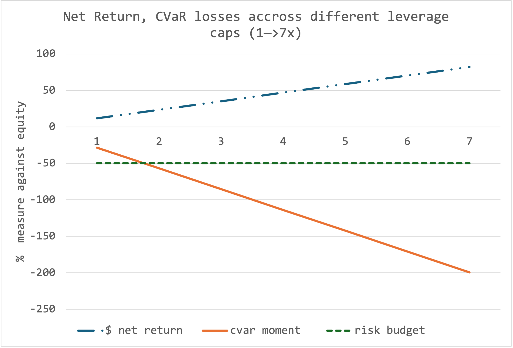

# State-Aware Strategic Asset Allocation Model

This project implements a quantitative portfolio construction framework from Kristensen and Vorobets. Unlike traditional static optimizers, this model uses a dynamic, regime-aware approach to build tactical portfolios.

The core objective is to generate an optimal portfolio that is **conditioned on the current market state** (defined by the VIX) and **robust to parameter uncertainty** (managed via a regime-based bootstrap). The model uses modern techniques, including Entropy Pooling and Conditional Value-at-Risk (CVaR), to build high-conviction, risk-managed portfolios.

## Theoretical Framework & Key Assumptions

This model is built on several key hypotheses about the nature of financial markets.

### 1. Markets are Not Stationary (Regime-Switching)
* **Hypothesis:** The statistical properties of asset returns (mean, volatility, correlation) are not constant over time. They are functions of the underlying market regime.
* **Implication:** A static "long-term optimal" portfolio is suboptimal. The "best" portfolio is tactical and must adapt to the current regime. This model explicitly uses the VIX to identify the regime and condition the portfolio accordingly.

### 2. The Future is Uncertain (Parameter Uncertainty)
* **Hypothesis:** Even if we correctly identify the regime, the *true* expected returns for the next period are unknowable. Using a single historical average ("point estimate") is brittle and leads to "noise-mining."
* **Implication:** We must model our uncertainty. The model uses a Monte Carlo bootstrap to generate a *distribution* of plausible future return scenarios, building a portfolio that is robust across many of those futures, not just one.

### 3. History is Biased (Time-Weighting)
* **Hypothesis:** The recent past is more relevant for forecasting the near-term future than the distant past.
* **Implication:** We use an exponentially-weighted time-decay prior (`p_exp`) as our baseline, making the model more responsive to recent market dynamics.

### 4. Risk is in the Tail (CVaR, not Variance)
* **Hypothesis:** Volatility (variance) is an incomplete measure of risk. It treats upside and downside deviation equally and, by assuming a normal distribution, fails to capture the true risk of extreme, non-normal losses.
* **Implication:** We use **CVaR (Expected Shortfall)** as the core risk measure. CVaR focuses on the *average magnitude of losses in the tail*, providing a more coherent and realistic measure of true risk.

---

## Investment Mandate: The Risk-Based Leverage Cap

The primary mandate of this strategy is not to just maximize returns, but to do so within a **strictly defined tail-risk budget.**

The portfolio's **maximum acceptable loss** is defined as a **-50% loss to equity** in a "worst 5%" (CVaR 95%) annual scenario. This non-negotiable risk budget is the ultimate constraint that determines the strategy's leverage cap.

The chart below shows the trade-off between the strategy's Net Return and its CVaR 95% tail risk as leverage increases.

As shown, while returns (blue line) increase with leverage, the tail risk (orange line) accelerates. The mandate's **-50% budget (green line)** is breached at approximately **2.2x leverage**.

Therefore, any leveraged implementation of this strategy must operate at or below this 2.2x cap to remain compliant with the core risk mandate.

## Practical Roadmap to Narrow Down Portfolio Size

We want to achive proper diversification in the portfolio, but also, we do not want over diversification. To tackle this we would select single best (Mean-CVaR optimum on resmapled data) allocations sector-by-sector. That leaves us with a feasible amount of participants for the final portfolio optimisation, stress testings.
 # Sectors
    'Technology': # Active tech stocks
    'AAPL', 'MSFT', 'NVDA', 'AMD', 'INTC', 'CSCO', 'ORCL', 'IBM', 'ADBE', 'CRM', 
    'NOW', 'INTU', 'AMAT', 'LRCX', 'KLAC', 'MCHP', 'TXN', 'ADI', 'QCOM', 'AVGO',
    'NXPI', 'MU', 'STX', 'WDC', 'HPQ', 'HPE', 'DELL', 'ANET', 'FFIV', 'JNPR',
    'CTSH', 'IT', 'ACN', 'EPAM', 'FTNT', 'PANW', 'CRWD', 'SNPS', 'CDNS', 'ANSS',
    'KEYS', 'TER', 'IPGP', 'GLW', 'APH', 'TEL', 'AKAM', 'ADSK', 'CIEN', 'SMCI',
    'APP', 'DDOG', 'PLTR', 'FICO', 'GEN', 'BR', 'JKHY', 'FIS', 'FI', 'CSGP',
    'TYL', 'MPWR', 'ON', 'SWKS'
]

Removed (delisted/acquired):
MXIM - acquired by ADI (2021)
XLNX - acquired by AMD (2022)
ALTR - acquired by Intel (2015)
LLTC - acquired by ADI (2017)
BRCM - acquired by Avago/Broadcom (2016)
CA - acquired by Broadcom (2018)
EMC - acquired by Dell (2016)
NVLS - acquired by Lam Research (2012)
LSI - acquired by Avago (2014)  
    
    # Health Care
    'Health Care': ['JNJ', 'UNH', 'PFE', 'MRK', 'ABBV', 'LLY', 'BMY', 'AMGN', 'GILD', 'BIIB',
    'REGN', 'VRTX', 'MRNA', 'ABT', 'MDT', 'SYK', 'BSX', 'EW', 'ISRG', 'DHR',
    'TMO', 'A', 'IDXX', 'IQV', 'CRL', 'BIO', 'HOLX', 'DXCM', 'PODD', 'ALGN',
    'ZBH', 'BAX', 'BDX', 'COO', 'XRAY', 'HSIC', 'CAH', 'MCK', 'CVS', 'CI',
    'HUM', 'CNC', 'MOH', 'DVA', 'HCA', 'UHS', 'THC', 'DGX', 'LH', 'TECH',
    'RVTY', 'MTD', 'WAT', 'ILMN', 'INCY', 'PRGO', 'NKTR', 'ELV', 'COR', 
    'VTRS', 'CTLT', 'OGN', 'GEHC', 'KVUE', 'SOLV'
]

Removed (delisted/acquired):
ALXN - acquired by AstraZeneca (2021)
CELG - acquired by Bristol-Myers Squibb (2019)
CERN - acquired by Oracle (2022)
AET - acquired by CVS Health (2018)
ESRX - acquired by Cigna (2018)
BCR - acquired by Becton Dickinson (2017)
STJ - acquired by Abbott (2017)
VAR - acquired by Siemens Healthineers (2021)
LIFE - acquired by Thermo Fisher (2014)
FRX - acquired by Actavis (2014)
BEAM - acquired by Daiichi Sankyo (2019)
ABMD - acquired by Johnson & Johnson (2023)
ENDP - bankruptcy (2022)
    
    # Financials
    'Financials': ['JPM', 'BAC', 'WFC', 'C', 'GS', 'MS', 'BLK', 'SCHW', 'AXP', 'COF', 'DFS',
                   'V', 'MA', 'PYPL', 'ICE', 'CME', 'CBOE', 'NDAQ', 'SPGI', 'MCO', 'MSCI',
                   'BK', 'STT', 'NTRS', 'BEN', 'IVZ', 'TROW', 'AMP', 'RJF', 'LNC', 'PRU',
                   'MET', 'AFL', 'AIG', 'ALL', 'TRV', 'CB', 'PGR', 'CINF', 'L', 'AJG',
                   'MMC', 'AON', 'BRO', 'WTW', 'BRK.B', 'USB', 'PNC', 'TFC', 'MTB', 'FITB',
                   'KEY', 'RF', 'CFG', 'HBAN', 'CMA', 'ZION', 'FHN', 'PBCT', 'ACGL', 'GL',
                   'AIZ', 'UNM', 'BHF', 'GNW', 'ETFC', 'AMG', 'JEF', 'SYF', 'ALLY', 'COIN',
                   'HOOD', 'IBKR', 'MKTX', 'FRC', 'SIVB', 'SBNY', 'FDS', 'INFO', 'WRB',
                   'ERIE', 'HIG', 'BX', 'KKR', 'APO', 'ACAS'],
    
    # Consumer Discretionary
    'Consumer Discretionary': ['AMZN', 'TSLA', 'HD', 'LOW', 'TJX', 'ROST', 'NKE', 'SBUX', 'MCD', 'YUM',
                               'DRI', 'CMG', 'DPZ', 'BKNG', 'MAR', 'HLT', 'LVS', 'WYNN', 'MGM', 'CCL',
                               'RCL', 'NCLH', 'F', 'GM', 'APTV', 'BWA', 'LKQ', 'AN', 'KMX', 'AZO',
                               'ORLY', 'BBY', 'ULTA', 'LULU', 'NVR', 'LEN', 'DHI', 'PHM', 'WHR', 'POOL',
                               'TSCO', 'DG', 'DLTR', 'TGT', 'EBAY', 'ETSY', 'EXPE', 'TRIP', 'CZR',
                               'PENN', 'GRMN', 'LEG', 'MHK', 'RL', 'PVH', 'TPR', 'VFC', 'HAS', 'MAT',
                               'DECK', 'CPRI', 'BBWI', 'GPS', 'ANF', 'URBN', 'FL', 'JWN', 'M', 'KSS',
                               'JCP', 'BBBY', 'BIG', 'GPC', 'AAP', 'FBHS', 'WSM', 'RH', 'W', 'GME',
                               'DTV', 'DISH', 'TWC', 'HOT', 'WYN', 'TIF', 'KSU', 'HOG', 'GT', 'BC',
                               'SHLD', 'ADS', 'ADT', 'ABNB', 'DASH', 'UBER', 'CPRT', 'COTY'],
    
    # Consumer Staples
    'Consumer Staples': ['PG', 'KO', 'PEP', 'COST', 'WMT', 'PM', 'MO', 'KMB', 'CL', 'CLX',
                         'CHD', 'EL', 'K', 'GIS', 'CAG', 'SJM', 'MKC', 'HSY', 'HRL', 'CPB',
                         'KHC', 'MDLZ', 'MNST', 'KR', 'SYY', 'ADM', 'BG', 'TSN', 'TAP', 'STZ',
                         'BF.B', 'KDP', 'LW', 'WBA', 'RAI', 'WFM', 'SLE', 'DF', 'AVP', 'SVU',
                         'MJN', 'RAD'],
    
    # Industrials
    'Industrials': ['CAT', 'DE', 'HON', 'GE', 'MMM', 'EMR', 'ROK', 'ETN', 'PH', 'ITW',
                    'IR', 'DOV', 'AME', 'XYL', 'GNRC', 'PCAR', 'CTAS', 'FAST', 'GWW', 'NDSN',
                    'SNA', 'SWK', 'LII', 'TT', 'CARR', 'OTIS', 'JCI', 'LHX', 'NOC', 'LMT',
                    'RTX', 'GD', 'BA', 'TXT', 'HII', 'TDG', 'HWM', 'WAB', 'CSX', 'NSC',
                    'UNP', 'UPS', 'FDX', 'EXPD', 'CHRW', 'JBHT', 'ODFL', 'UAL', 'DAL', 'LUV',
                    'ALK', 'AAL', 'WM', 'RSG', 'ROL', 'VRSK', 'EFX', 'AOS', 'ALLE', 'CMI',
                    'FTV', 'IEX', 'RHI', 'MAS', 'LDOS', 'J', 'BAH', 'AXON', 'PWR', 'EME',
                    'FLR', 'JBL', 'MLM', 'VMC', 'URI', 'BLDR', 'HUBB', 'AYI', 'TRMB', 'TDY',
                    'COL', 'RTN', 'UTX', 'LLL', 'FLS', 'PNR', 'NLSN', 'DNB', 'RRD', 'JOY',
                    'CAM', 'FDC', 'LM', 'SRCL', 'MIL', 'ITT', 'GEV', 'DAY', 'GRN', 'CPAY'],
    
    # Energy
    'Energy': ['XOM', 'CVX', 'COP', 'EOG', 'PXD', 'DVN', 'MRO', 'APA', 'OXY', 'HES',
               'FANG', 'CTRA', 'MPC', 'VLO', 'PSX', 'HAL', 'SLB', 'BKR', 'NOV', 'FTI',
               'WMB', 'KMI', 'OKE', 'TRGP', 'EQT', 'RRC', 'SWN', 'CNX', 'BTU', 'CLF',
               'X', 'APC', 'EP', 'NBL', 'NFX', 'CXO', 'WPX', 'QEP', 'MUR', 'DNR',
               'RIG', 'DO', 'ESV', 'NE', 'RDC', 'HP', 'NBR', 'HFC', 'ANDV', 'TSO',
               'DYN', 'SUN', 'BHI', 'CEG'],
    
    # Materials
    'Materials': ['LIN', 'APD', 'SHW', 'ECL', 'DD', 'DOW', 'PPG', 'NEM', 'FCX', 'NUE',
                  'STLD', 'VMC', 'MLM', 'BALL', 'PKG', 'IP', 'AVY', 'SEE', 'CE', 'EMN',
                  'ALB', 'FMC', 'MOS', 'CF', 'IFF', 'CTVA', 'CCK', 'WRK', 'ATI', 'AA',
                  'AKS', 'OI', 'ARG', 'ARNC', 'GRA', 'LYB', 'MON'],
    
    # Utilities
    'Utilities': ['NEE', 'DUK', 'SO', 'D', 'AEP', 'EXC', 'SRE', 'XEL', 'PEG', 'ED',
                  'WEC', 'ES', 'AEE', 'CMS', 'CNP', 'NI', 'DTE', 'ETR', 'FE', 'PPL',
                  'ATO', 'NRG', 'EVRG', 'AWK', 'LNT', 'PNW', 'DRE', 'PCG', 'EIX', 'VST',
                  'GAS', 'AES', 'POM', 'TE', 'SCG', 'FTR', 'WIN', 'LUMN', 'LVLT', 'CTX'],
    
    # Communication Services
    'Communication Services': ['META', 'GOOGL', 'GOOG', 'NFLX', 'DIS', 'CMCSA', 'T', 'VZ', 'TMUS', 'CHTR',
                               'WBD', 'FOX', 'FOXA', 'OMC', 'IPG', 'EA', 'TTWO', 'ATVI', 'LYV', 'MTCH',
                               'NWSA', 'NWS', 'NYT', 'PARA', 'VIAB', 'DISCA', 'DISCK', 'SNI', 'TWX',
                               'TWTR', 'YHOO', 'TGNA', 'LSXMA', 'TKO'],
    
    # Real Estate
    'Real Estate': ['AMT', 'PLD', 'CCI', 'EQIX', 'DLR', 'PSA', 'SPG', 'O', 'WELL', 'AVB',
                    'EQR', 'ESS', 'MAA', 'UDR', 'VTR', 'VNO', 'SLG', 'BXP', 'ARE', 'CBRE',
                    'VICI', 'INVH', 'DOC', 'KIM', 'REG', 'FRT', 'HST', 'AIV', 'CPT', 'IRM',
                    'EXR', 'SBAC', 'MAC', 'GGP', 'WY', 'PCL'],
    
    # Commodities (your non-stock assets)
    'Commodities': ['GC=F', 'SI=F', 'CL=F', 'NG=F'],
    
    # Currencies
    'Currencies': ['EUR=X', 'JPY=X', 'GBP=X', 'AUD=X', 'CHF=X'],
    
    # Indices
    'Indices': ['^GSPC', '^NDX', '^GDAXI']

## Dependencies
* `numpy`
* `pandas`
* `yfinance`
* `cvxopt`
* `matplotlib`
* `fortitudo.tech` (Custom library for Entropy Pooling & Mean-CVaR)
