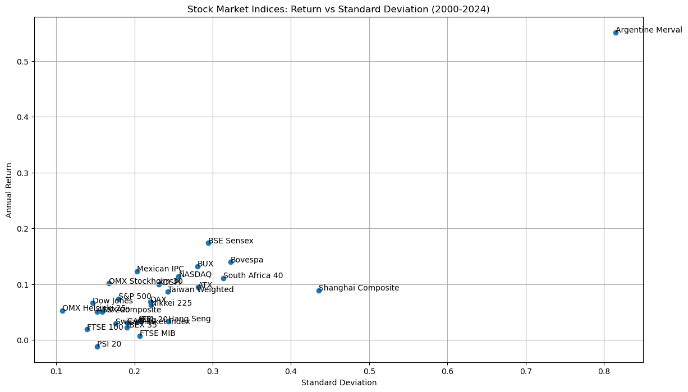
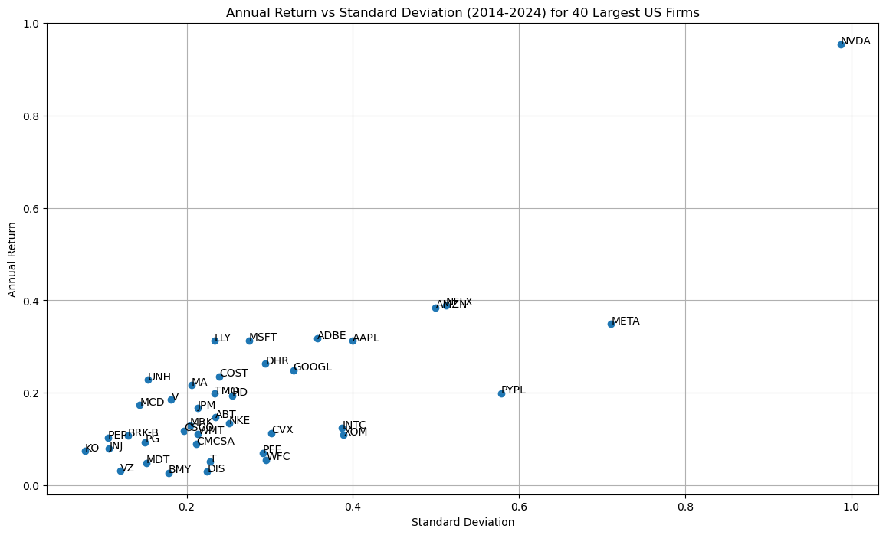
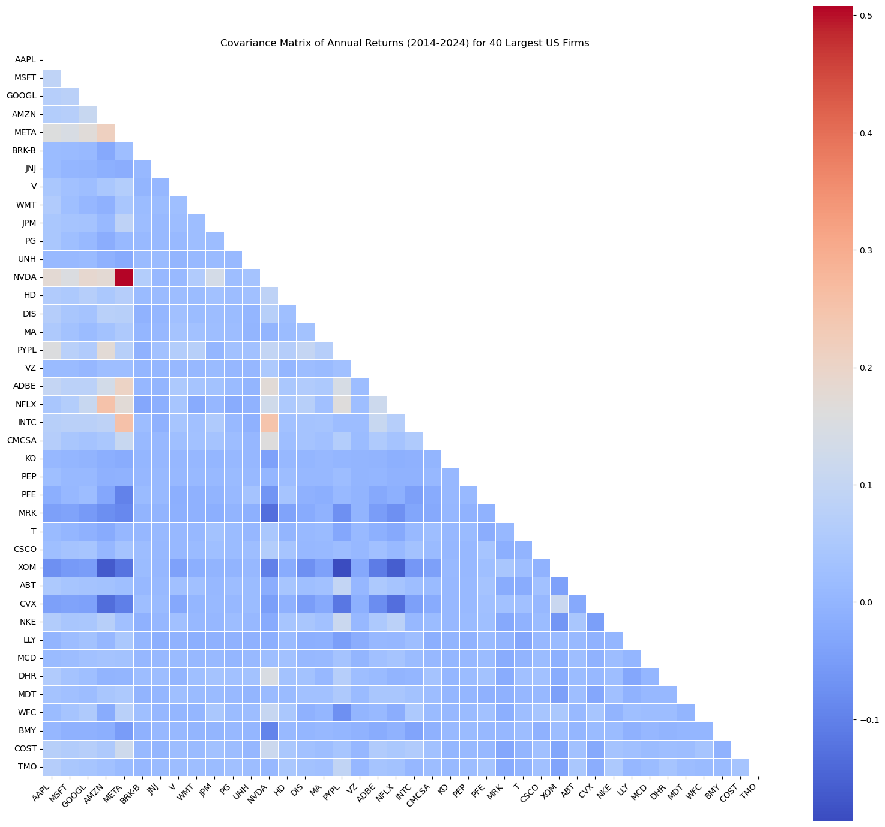
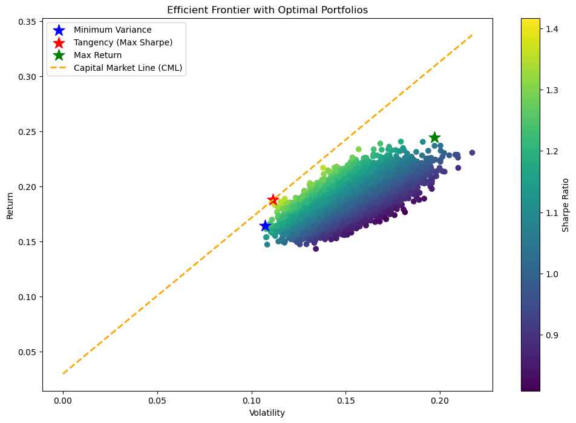
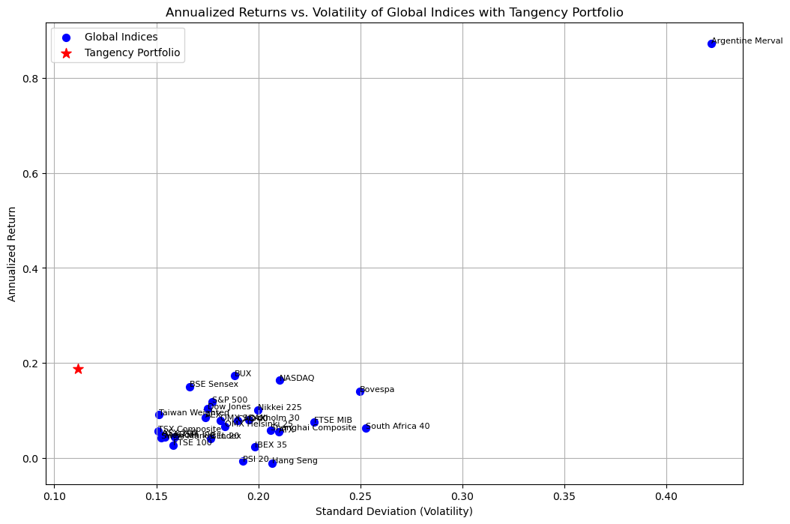
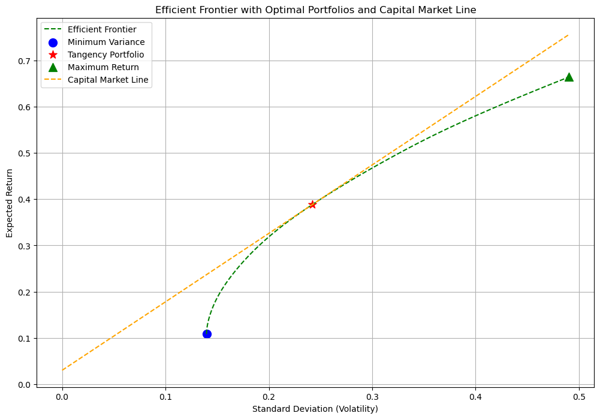
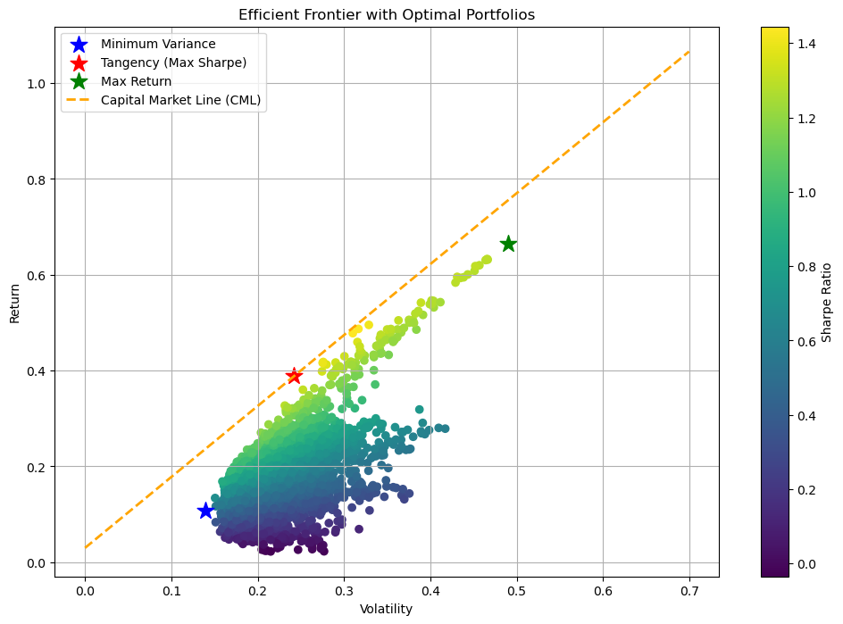

# Portfolio Optimization 

In this project, I take a general overview of global stock market indices, and I attempt to optimize a US stock portfolio among the theoretical framework of Modern Portfolio Theory. First, I begin by taking a sample of the more well-known stock market indicies of different countries'. In a longer historical snapshot, I observe their overall risk and return profiles. Second, I select the US for my broader portfolio allocation. I fetch data from https://finance.yahoo.com, I take a sample of 40 stocks. I take returns, volatilty and covariance of these equities, and I create optimised portfolios to get: the Minimum Variance Portfolio; the Max Return Portfolio; and the Tangetial Portfolio (the one that maximizes the Sharpe Ratio). Third, I add an additional contstraint: I want to create optimised portfolios that have maximum 15 assets (thy shrink down the selected assets). 


```python
# !pip install yfinance
```


```python
import yfinance as yf
import pandas as pd
import numpy as np
import matplotlib.pyplot as plt
from scipy.optimize import minimize
```

## Overview of Global Stock Market Indicies 

I take an overview of well-known stockmarket indicies from different countries. I want to see the overall risk-return pattern of major stockmarkets. I take data from the year 2000 up until 2024. I plot average annual returns against avarage annual volatilities. 

### Downloading the indicies with the help of y.finance (yf.download)
```python
indices = {
    'S&P 500': '^GSPC',
    'Dow Jones': '^DJI',
    'NASDAQ': '^IXIC',
    'FTSE 100': '^FTSE',
    'DAX': '^GDAXI',
    'CAC 40': '^FCHI',
    'Nikkei 225': '^N225',
    'Hang Seng': '^HSI',
    'Shanghai Composite': '000001.SS',
    'BSE Sensex': '^BSESN',
    'ASX 200': '^AXJO',
    'KOSPI': '^KS11',
    'Taiwan Weighted': '^TWII',
    'Bovespa': '^BVSP',
    'TSX Composite': '^GSPTSE',
    'Mexican IPC': '^MXX',
    'Argentine Merval': '^MERV',
    'South Africa 40': 'JSE.JO',
    'Swiss Market Index': '^SSMI',
    'AEX': '^AEX',
    'IBEX 35': '^IBEX',
    'OMX Stockholm 30': '^OMX',
    'OMX Helsinki 25': '^OMXH25',
    'BUX': '^BUX',
    'PSI 20': '^PSI20',
    'ATX': '^ATX',
    'BEL 20': '^BFX',
    'FTSE MIB': 'FTSEMIB.MI'
}
data = {}
for name, ticker in indices.items():
    data[name] = yf.download(ticker, start='2000-01-01', end='2024-01-01')['Adj Close']
```

### Computing Returns and Volatility 

First, there are two empty dictionaries created for Returns and Std_dev, which than filled with the help of a for loop (takes the computation of returns and stdev through the enterie series) and stores in new columns dedicated for Returns and Std_dev.

```python
returns = {}
std_devs = {}

for name, prices in data.items():
    annual_returns = prices.resample('Y').ffill().pct_change().dropna()
    returns[name] = annual_returns.mean()
    std_devs[name] = annual_returns.std()

returns_df = pd.DataFrame.from_dict(returns, orient='index', columns=['Return'])
std_devs_df = pd.DataFrame.from_dict(std_devs, orient='index', columns=['StdDev'])
```


```python
plt.figure(figsize=(14, 8))
plt.scatter(std_devs_df['StdDev'], returns_df['Return'])

for i in returns_df.index:
    plt.annotate(i, (std_devs_df['StdDev'][i], returns_df['Return'][i]))

plt.title('Stock Market Indices: Return vs Standard Deviation (2000-2024)')
plt.xlabel('Standard Deviation')
plt.ylabel('Annual Return')
plt.grid(True)
plt.show()
```


    

    


```python
# Combine returns and standard deviations into a single DataFrame
summary_df = pd.concat([returns_df, std_devs_df], axis=1)

summary_df.reset_index(inplace=True)
summary_df.rename(columns={'index': 'Index'}, inplace=True)
summary_df
```


<div>
<style scoped>
    .dataframe tbody tr th:only-of-type {
        vertical-align: middle;
    }

    .dataframe tbody tr th {
        vertical-align: top;
    }

    .dataframe thead th {
        text-align: right;
    }
</style>
<table border="1" class="dataframe">
  <thead>
    <tr style="text-align: right;">
      <th></th>
      <th>Index</th>
      <th>Return</th>
      <th>StdDev</th>
    </tr>
  </thead>
  <tbody>
    <tr>
      <th>0</th>
      <td>S&amp;P 500</td>
      <td>0.073943</td>
      <td>0.179858</td>
    </tr>
    <tr>
      <th>1</th>
      <td>Dow Jones</td>
      <td>0.066691</td>
      <td>0.146816</td>
    </tr>
    <tr>
      <th>2</th>
      <td>NASDAQ</td>
      <td>0.113466</td>
      <td>0.256594</td>
    </tr>
    <tr>
      <th>3</th>
      <td>FTSE 100</td>
      <td>0.019516</td>
      <td>0.139340</td>
    </tr>
    <tr>
      <th>4</th>
      <td>DAX</td>
      <td>0.068484</td>
      <td>0.220158</td>
    </tr>
    <tr>
      <th>5</th>
      <td>CAC 40</td>
      <td>0.030042</td>
      <td>0.191230</td>
    </tr>
    <tr>
      <th>6</th>
      <td>Nikkei 225</td>
      <td>0.062511</td>
      <td>0.221349</td>
    </tr>
    <tr>
      <th>7</th>
      <td>Hang Seng</td>
      <td>0.033689</td>
      <td>0.243565</td>
    </tr>
    <tr>
      <th>8</th>
      <td>Shanghai Composite</td>
      <td>0.088960</td>
      <td>0.435482</td>
    </tr>
    <tr>
      <th>9</th>
      <td>BSE Sensex</td>
      <td>0.173820</td>
      <td>0.294475</td>
    </tr>
    <tr>
      <th>10</th>
      <td>ASX 200</td>
      <td>0.050513</td>
      <td>0.152220</td>
    </tr>
    <tr>
      <th>11</th>
      <td>KOSPI</td>
      <td>0.099598</td>
      <td>0.231159</td>
    </tr>
    <tr>
      <th>12</th>
      <td>Taiwan Weighted</td>
      <td>0.086664</td>
      <td>0.242805</td>
    </tr>
    <tr>
      <th>13</th>
      <td>Bovespa</td>
      <td>0.139952</td>
      <td>0.322931</td>
    </tr>
    <tr>
      <th>14</th>
      <td>TSX Composite</td>
      <td>0.050333</td>
      <td>0.158716</td>
    </tr>
    <tr>
      <th>15</th>
      <td>Mexican IPC</td>
      <td>0.123320</td>
      <td>0.203404</td>
    </tr>
    <tr>
      <th>16</th>
      <td>Argentine Merval</td>
      <td>0.551016</td>
      <td>0.814909</td>
    </tr>
    <tr>
      <th>17</th>
      <td>South Africa 40</td>
      <td>0.111171</td>
      <td>0.313720</td>
    </tr>
    <tr>
      <th>18</th>
      <td>Swiss Market Index</td>
      <td>0.029225</td>
      <td>0.175893</td>
    </tr>
    <tr>
      <th>19</th>
      <td>AEX</td>
      <td>0.032899</td>
      <td>0.203889</td>
    </tr>
    <tr>
      <th>20</th>
      <td>IBEX 35</td>
      <td>0.022592</td>
      <td>0.190260</td>
    </tr>
    <tr>
      <th>21</th>
      <td>OMX Stockholm 30</td>
      <td>0.101565</td>
      <td>0.167679</td>
    </tr>
    <tr>
      <th>22</th>
      <td>OMX Helsinki 25</td>
      <td>0.052765</td>
      <td>0.107631</td>
    </tr>
    <tr>
      <th>23</th>
      <td>BUX</td>
      <td>0.132085</td>
      <td>0.280397</td>
    </tr>
    <tr>
      <th>24</th>
      <td>PSI 20</td>
      <td>-0.011407</td>
      <td>0.152377</td>
    </tr>
    <tr>
      <th>25</th>
      <td>ATX</td>
      <td>0.094349</td>
      <td>0.281281</td>
    </tr>
    <tr>
      <th>26</th>
      <td>BEL 20</td>
      <td>0.033193</td>
      <td>0.208045</td>
    </tr>
    <tr>
      <th>27</th>
      <td>FTSE MIB</td>
      <td>0.007548</td>
      <td>0.206600</td>
    </tr>
  </tbody>
</table>
</div>


## What is the relationship of returns and risks for the sample of stockmarkets worldwide?

Fitting a linear line to the scatter might inidcate the direction of the relationship (and the strength of it). Althought the sample size is very small, still, it can help to imagine the nature of the relationship. 


```python
from sklearn.linear_model import LinearRegression

X = std_devs_df['StdDev'].values.reshape(-1, 1)
y = returns_df['Return'].values

reg = LinearRegression().fit(X, y)

slope = reg.coef_[0]

print(f"Slope of the fitted line: {slope:.4f}")
```

    Slope of the fitted line: 0.6894


The fitted slope only serves demonstrational purposes to show the average positive relationship between risks and returns. We see that in the last 24 year, US stockmarkets experienced average annual returns of 6.6% - 7.3 % - 11.3% (depending on which market index are we talking about) with average annual volatilites of 14.6% - 17.9% - 25.6% (respectively). 

## Portfolio Optimization of US Stock Portfolio 

In this section, I take a sample of 40 stocks from the largest US public firms, I take a timeframe of the last 10 years, I take returns, volatility, which I annualize. I perform a portfolio optimisiation in the mean-variance dimension: I create Minimum Variance Portfolio, Max Return Portfolio, and Tangency Portfolio (that maximizes the Sharpe Ratio). I plot the Efficiency Frontier, the Capital Market Line and extract the weights and key statistics of each optimised portfolio.

### Methodology
First, Daily Returns are calculated as follows: 
\begin{equation}
r_{t,i} = \frac{P_{t,i} - P_{t-1,i}}{P_{t-1,i}}
\end{equation}

Using these daily returns, I computed the annualized returns and volatilities for each stock (252 represents the number of trading days in a year):

\begin{equation}
\mu_i = \bar{r_i} \times 252, \quad \sigma_i = \sigma_{\text{daily},i} \times \sqrt{252}
\end{equation}


Second, Covariance Matrix and Portfolio Performance:
The covariance matrix of the stock returns was computed to account for the relationships between stocks:

\begin{equation}
\Sigma_{ij} = \text{Cov}(r_i, r_j)
\end{equation}

Given the returns, volatilities, and covariance matrix, the portfolio's expected return and volatility were calculated as:

\begin{equation}
\mu_p = \sum_{i=1}^{n} w_i \mu_i, \quad \sigma_p = \sqrt{\mathbf{w}^T \Sigma \mathbf{w}}
\end{equation}

Third, Portfolio Optimization:
I performed optimization for three types of portfolios:

Minimum Variance Portfolio: This portfolio minimizes the overall portfolio risk (volatility) subject to the constraint that the sum of the portfolio weights equals 1. The objective is to minimize:

\begin{equation}
\text{Minimize: } \sigma_p = \sqrt{\mathbf{w}^T \Sigma \mathbf{w}}
\end{equation}

Tangency Portfolio (Maximum Sharpe Ratio Portfolio): 
The tangency portfolio maximizes the Sharpe ratio, defined as:

\begin{equation}
\text{Sharpe Ratio} = \frac{\mu_p - r_f}{\sigma_p}
\end{equation}

This portfolio represents the optimal mix of risky assets.

Maximum Return Portfolio: The portfolio that assigns all weights to the stock with the highest expected return.

Fourth, Efficient Frontier and Capital Market Line (CML): 
I generate a large number of random portfolios to visualize the efficient frontier, which represents the set of portfolios offering the maximum return for a given level of risk. The portfolios are scattered along this curve, and key portfolios such as the minimum variance and tangency portfolios are highlighted.

The Capital Market Line (CML) is the straight line that originates from the risk-free rate and is tangent to the efficient frontier at the tangency portfolio. It is calculated as:

\begin{equation}
E(R_p) = r_f + \frac{E(R_m) - r_f}{\sigma_m} \times \sigma_p
\end{equation}


```python
tickers = [
    'AAPL', 'MSFT', 'GOOGL', 'AMZN', 'META', 'BRK-B', 'JNJ', 'V', 'WMT', 'JPM',
    'PG', 'UNH', 'NVDA', 'HD', 'DIS', 'MA', 'PYPL', 'VZ', 'ADBE', 'NFLX',
    'INTC', 'CMCSA', 'KO', 'PEP', 'PFE', 'MRK', 'T', 'CSCO', 'XOM', 'ABT',
    'CVX', 'NKE', 'LLY', 'MCD', 'DHR', 'MDT', 'WFC', 'BMY', 'COST', 'TMO'
]

data = {}
for ticker in tickers:
    data[ticker] = yf.download(ticker, start='2014-01-01', end='2024-01-01')['Adj Close']
```

    [*********************100%***********************]  1 of 1 completed
    [*********************100%***********************]  1 of 1 completed
    [*********************100%***********************]  1 of 1 completed
    [*********************100%***********************]  1 of 1 completed
    [*********************100%***********************]  1 of 1 completed
    [*********************100%***********************]  1 of 1 completed
    [*********************100%***********************]  1 of 1 completed
    [*********************100%***********************]  1 of 1 completed
    [*********************100%***********************]  1 of 1 completed
    [*********************100%***********************]  1 of 1 completed
    [*********************100%***********************]  1 of 1 completed
    [*********************100%***********************]  1 of 1 completed
    [*********************100%***********************]  1 of 1 completed
    [*********************100%***********************]  1 of 1 completed
    [*********************100%***********************]  1 of 1 completed
    [*********************100%***********************]  1 of 1 completed
    [*********************100%***********************]  1 of 1 completed
    [*********************100%***********************]  1 of 1 completed
    [*********************100%***********************]  1 of 1 completed
    [*********************100%***********************]  1 of 1 completed
    [*********************100%***********************]  1 of 1 completed
    [*********************100%***********************]  1 of 1 completed
    [*********************100%***********************]  1 of 1 completed
    [*********************100%***********************]  1 of 1 completed
    [*********************100%***********************]  1 of 1 completed
    [*********************100%***********************]  1 of 1 completed
    [*********************100%***********************]  1 of 1 completed
    [*********************100%***********************]  1 of 1 completed
    [*********************100%***********************]  1 of 1 completed
    [*********************100%***********************]  1 of 1 completed
    [*********************100%***********************]  1 of 1 completed
    [*********************100%***********************]  1 of 1 completed
    [*********************100%***********************]  1 of 1 completed
    [*********************100%***********************]  1 of 1 completed
    [*********************100%***********************]  1 of 1 completed
    [*********************100%***********************]  1 of 1 completed
    [*********************100%***********************]  1 of 1 completed
    [*********************100%***********************]  1 of 1 completed
    [*********************100%***********************]  1 of 1 completed
    [*********************100%***********************]  1 of 1 completed


```python
# Create a list to store annual returns and standard deviations
returns_std_list = []

for ticker, prices in data.items():
    # Calculate annual returns
    annual_returns = prices.resample('Y').ffill().pct_change().dropna()
    
    # Calculate mean annual return and standard deviation
    mean_annual_return = annual_returns.mean()
    std_dev = annual_returns.std()
    
    # Append to list
    returns_std_list.append({
        'Ticker': ticker,
        'Annual Return': mean_annual_return,
        'Standard Deviation': std_dev
    })

# Convert list to DataFrame
returns_std_df = pd.DataFrame(returns_std_list)

# Display the DataFrame
returns_std_df
```


<div>
<style scoped>
    .dataframe tbody tr th:only-of-type {
        vertical-align: middle;
    }

    .dataframe tbody tr th {
        vertical-align: top;
    }

    .dataframe thead th {
        text-align: right;
    }
</style>
<table border="1" class="dataframe">
  <thead>
    <tr style="text-align: right;">
      <th></th>
      <th>Ticker</th>
      <th>Annual Return</th>
      <th>Standard Deviation</th>
    </tr>
  </thead>
  <tbody>
    <tr>
      <th>0</th>
      <td>AAPL</td>
      <td>0.312286</td>
      <td>0.399265</td>
    </tr>
    <tr>
      <th>1</th>
      <td>MSFT</td>
      <td>0.313368</td>
      <td>0.274847</td>
    </tr>
    <tr>
      <th>2</th>
      <td>GOOGL</td>
      <td>0.249063</td>
      <td>0.328202</td>
    </tr>
    <tr>
      <th>3</th>
      <td>AMZN</td>
      <td>0.384492</td>
      <td>0.499767</td>
    </tr>
    <tr>
      <th>4</th>
      <td>META</td>
      <td>0.349379</td>
      <td>0.710907</td>
    </tr>
    <tr>
      <th>5</th>
      <td>BRK-B</td>
      <td>0.107807</td>
      <td>0.129346</td>
    </tr>
    <tr>
      <th>6</th>
      <td>JNJ</td>
      <td>0.079604</td>
      <td>0.106610</td>
    </tr>
    <tr>
      <th>7</th>
      <td>V</td>
      <td>0.185791</td>
      <td>0.181425</td>
    </tr>
    <tr>
      <th>8</th>
      <td>WMT</td>
      <td>0.111552</td>
      <td>0.213600</td>
    </tr>
    <tr>
      <th>9</th>
      <td>JPM</td>
      <td>0.167219</td>
      <td>0.213238</td>
    </tr>
    <tr>
      <th>10</th>
      <td>PG</td>
      <td>0.093472</td>
      <td>0.149932</td>
    </tr>
    <tr>
      <th>11</th>
      <td>UNH</td>
      <td>0.228030</td>
      <td>0.152923</td>
    </tr>
    <tr>
      <th>12</th>
      <td>NVDA</td>
      <td>0.954135</td>
      <td>0.987619</td>
    </tr>
    <tr>
      <th>13</th>
      <td>HD</td>
      <td>0.194159</td>
      <td>0.254904</td>
    </tr>
    <tr>
      <th>14</th>
      <td>DIS</td>
      <td>0.029555</td>
      <td>0.224811</td>
    </tr>
    <tr>
      <th>15</th>
      <td>MA</td>
      <td>0.216630</td>
      <td>0.205938</td>
    </tr>
    <tr>
      <th>16</th>
      <td>PYPL</td>
      <td>0.199296</td>
      <td>0.578537</td>
    </tr>
    <tr>
      <th>17</th>
      <td>VZ</td>
      <td>0.031556</td>
      <td>0.119957</td>
    </tr>
    <tr>
      <th>18</th>
      <td>ADBE</td>
      <td>0.317286</td>
      <td>0.357582</td>
    </tr>
    <tr>
      <th>19</th>
      <td>NFLX</td>
      <td>0.389533</td>
      <td>0.512008</td>
    </tr>
    <tr>
      <th>20</th>
      <td>INTC</td>
      <td>0.124038</td>
      <td>0.386990</td>
    </tr>
    <tr>
      <th>21</th>
      <td>CMCSA</td>
      <td>0.088897</td>
      <td>0.211495</td>
    </tr>
    <tr>
      <th>22</th>
      <td>KO</td>
      <td>0.073949</td>
      <td>0.077387</td>
    </tr>
    <tr>
      <th>23</th>
      <td>PEP</td>
      <td>0.102941</td>
      <td>0.105435</td>
    </tr>
    <tr>
      <th>24</th>
      <td>PFE</td>
      <td>0.070465</td>
      <td>0.291724</td>
    </tr>
    <tr>
      <th>25</th>
      <td>MRK</td>
      <td>0.129874</td>
      <td>0.203615</td>
    </tr>
    <tr>
      <th>26</th>
      <td>T</td>
      <td>0.050819</td>
      <td>0.227922</td>
    </tr>
    <tr>
      <th>27</th>
      <td>CSCO</td>
      <td>0.118349</td>
      <td>0.197142</td>
    </tr>
    <tr>
      <th>28</th>
      <td>XOM</td>
      <td>0.108817</td>
      <td>0.388806</td>
    </tr>
    <tr>
      <th>29</th>
      <td>ABT</td>
      <td>0.147632</td>
      <td>0.234091</td>
    </tr>
    <tr>
      <th>30</th>
      <td>CVX</td>
      <td>0.113028</td>
      <td>0.302318</td>
    </tr>
    <tr>
      <th>31</th>
      <td>NKE</td>
      <td>0.134405</td>
      <td>0.250911</td>
    </tr>
    <tr>
      <th>32</th>
      <td>LLY</td>
      <td>0.313039</td>
      <td>0.233484</td>
    </tr>
    <tr>
      <th>33</th>
      <td>MCD</td>
      <td>0.173435</td>
      <td>0.143280</td>
    </tr>
    <tr>
      <th>34</th>
      <td>DHR</td>
      <td>0.263474</td>
      <td>0.294672</td>
    </tr>
    <tr>
      <th>35</th>
      <td>MDT</td>
      <td>0.048849</td>
      <td>0.151288</td>
    </tr>
    <tr>
      <th>36</th>
      <td>WFC</td>
      <td>0.055349</td>
      <td>0.295837</td>
    </tr>
    <tr>
      <th>37</th>
      <td>BMY</td>
      <td>0.027157</td>
      <td>0.177969</td>
    </tr>
    <tr>
      <th>38</th>
      <td>COST</td>
      <td>0.235929</td>
      <td>0.238945</td>
    </tr>
    <tr>
      <th>39</th>
      <td>TMO</td>
      <td>0.198928</td>
      <td>0.233930</td>
    </tr>
  </tbody>
</table>
</div>


```python
plt.figure(figsize=(14, 8))
plt.scatter(returns_std_df['Standard Deviation'], returns_std_df['Annual Return'])

for i in range(len(returns_std_df)):
    plt.annotate(returns_std_df['Ticker'][i], 
                 (returns_std_df['Standard Deviation'][i], returns_std_df['Annual Return'][i]))

plt.title('Annual Return vs Standard Deviation (2014-2024) for 40 Largest US Firms')
plt.xlabel('Standard Deviation')
plt.ylabel('Annual Return')
plt.grid(True)
plt.show()
```


    

    


```python
from sklearn.linear_model import LinearRegression

# Prepare the data for linear regression
X = returns_std_df['Standard Deviation'].values.reshape(-1, 1)
y = returns_std_df['Annual Return'].values

# Perform linear regression
reg = LinearRegression().fit(X, y)

# Get the slope of the fitted line
slope = reg.coef_[0]

print(f"Slope of the fitted line: {slope:.4f}")
```

    Slope of the fitted line: 0.7293


```python
# Create a DataFrame to store annual returns
annual_returns_df = pd.DataFrame()

for ticker, prices in data.items():
    # Calculate annual returns
    annual_returns = prices.resample('Y').ffill().pct_change().dropna()
    
    # Add to DataFrame
    annual_returns_df[ticker] = annual_returns

# Display the DataFrame
annual_returns_df
```


<div>
<style scoped>
    .dataframe tbody tr th:only-of-type {
        vertical-align: middle;
    }

    .dataframe tbody tr th {
        vertical-align: top;
    }

    .dataframe thead th {
        text-align: right;
    }
</style>
<table border="1" class="dataframe">
  <thead>
    <tr style="text-align: right;">
      <th></th>
      <th>AAPL</th>
      <th>MSFT</th>
      <th>GOOGL</th>
      <th>AMZN</th>
      <th>META</th>
      <th>BRK-B</th>
      <th>JNJ</th>
      <th>V</th>
      <th>WMT</th>
      <th>JPM</th>
      <th>...</th>
      <th>CVX</th>
      <th>NKE</th>
      <th>LLY</th>
      <th>MCD</th>
      <th>DHR</th>
      <th>MDT</th>
      <th>WFC</th>
      <th>BMY</th>
      <th>COST</th>
      <th>TMO</th>
    </tr>
    <tr>
      <th>Date</th>
      <th></th>
      <th></th>
      <th></th>
      <th></th>
      <th></th>
      <th></th>
      <th></th>
      <th></th>
      <th></th>
      <th></th>
      <th></th>
      <th></th>
      <th></th>
      <th></th>
      <th></th>
      <th></th>
      <th></th>
      <th></th>
      <th></th>
      <th></th>
      <th></th>
    </tr>
  </thead>
  <tbody>
    <tr>
      <th>2015-12-31</th>
      <td>-0.030137</td>
      <td>0.226919</td>
      <td>0.466118</td>
      <td>1.177831</td>
      <td>0.341451</td>
      <td>-0.120613</td>
      <td>0.011422</td>
      <td>0.191374</td>
      <td>-0.266366</td>
      <td>0.083725</td>
      <td>...</td>
      <td>-0.161707</td>
      <td>0.313875</td>
      <td>0.253924</td>
      <td>0.304291</td>
      <td>0.090402</td>
      <td>0.086244</td>
      <td>0.018421</td>
      <td>0.192559</td>
      <td>0.189449</td>
      <td>0.137469</td>
    </tr>
    <tr>
      <th>2016-12-31</th>
      <td>0.124804</td>
      <td>0.150777</td>
      <td>0.018560</td>
      <td>0.109456</td>
      <td>0.099274</td>
      <td>0.234323</td>
      <td>0.153292</td>
      <td>0.013712</td>
      <td>0.160312</td>
      <td>0.345364</td>
      <td>...</td>
      <td>0.366614</td>
      <td>-0.177006</td>
      <td>-0.103688</td>
      <td>0.062061</td>
      <td>0.730729</td>
      <td>-0.054367</td>
      <td>0.046380</td>
      <td>-0.134911</td>
      <td>0.002778</td>
      <td>-0.001166</td>
    </tr>
    <tr>
      <th>2017-12-31</th>
      <td>0.484643</td>
      <td>0.407306</td>
      <td>0.329295</td>
      <td>0.559564</td>
      <td>0.533768</td>
      <td>0.216223</td>
      <td>0.244253</td>
      <td>0.471765</td>
      <td>0.465607</td>
      <td>0.267588</td>
      <td>...</td>
      <td>0.105896</td>
      <td>0.246998</td>
      <td>0.178343</td>
      <td>0.450503</td>
      <td>0.200131</td>
      <td>0.158958</td>
      <td>0.132105</td>
      <td>0.077089</td>
      <td>0.223721</td>
      <td>0.350262</td>
    </tr>
    <tr>
      <th>2018-12-31</th>
      <td>-0.053902</td>
      <td>0.207953</td>
      <td>-0.008012</td>
      <td>0.284317</td>
      <td>-0.257112</td>
      <td>0.030068</td>
      <td>-0.051315</td>
      <td>0.164876</td>
      <td>-0.034320</td>
      <td>-0.066238</td>
      <td>...</td>
      <td>-0.097474</td>
      <td>0.198682</td>
      <td>0.404548</td>
      <td>0.057791</td>
      <td>0.118045</td>
      <td>0.146041</td>
      <td>-0.218292</td>
      <td>-0.128957</td>
      <td>0.105993</td>
      <td>0.182101</td>
    </tr>
    <tr>
      <th>2019-12-31</th>
      <td>0.889578</td>
      <td>0.575581</td>
      <td>0.281762</td>
      <td>0.230277</td>
      <td>0.565718</td>
      <td>0.109315</td>
      <td>0.162200</td>
      <td>0.433270</td>
      <td>0.301630</td>
      <td>0.472571</td>
      <td>...</td>
      <td>0.152737</td>
      <td>0.380941</td>
      <td>0.161399</td>
      <td>0.139715</td>
      <td>0.495538</td>
      <td>0.273382</td>
      <td>0.214411</td>
      <td>0.277381</td>
      <td>0.457007</td>
      <td>0.455500</td>
    </tr>
    <tr>
      <th>2020-12-31</th>
      <td>0.823068</td>
      <td>0.425341</td>
      <td>0.308536</td>
      <td>0.762561</td>
      <td>0.330865</td>
      <td>0.023709</td>
      <td>0.108237</td>
      <td>0.171242</td>
      <td>0.233224</td>
      <td>-0.055348</td>
      <td>...</td>
      <td>-0.259521</td>
      <td>0.409715</td>
      <td>0.310399</td>
      <td>0.112968</td>
      <td>0.453365</td>
      <td>0.056985</td>
      <td>-0.416481</td>
      <td>0.004094</td>
      <td>0.326663</td>
      <td>0.437196</td>
    </tr>
    <tr>
      <th>2021-12-31</th>
      <td>0.346482</td>
      <td>0.524769</td>
      <td>0.652958</td>
      <td>0.023768</td>
      <td>0.231330</td>
      <td>0.289516</td>
      <td>0.114381</td>
      <td>-0.003149</td>
      <td>0.019708</td>
      <td>0.277457</td>
      <td>...</td>
      <td>0.462413</td>
      <td>0.186988</td>
      <td>0.660781</td>
      <td>0.277881</td>
      <td>0.485662</td>
      <td>-0.097860</td>
      <td>0.611459</td>
      <td>0.028798</td>
      <td>0.518212</td>
      <td>0.435396</td>
    </tr>
    <tr>
      <th>2022-12-31</th>
      <td>-0.264042</td>
      <td>-0.280248</td>
      <td>-0.390895</td>
      <td>-0.496152</td>
      <td>-0.642218</td>
      <td>0.033110</td>
      <td>0.059749</td>
      <td>-0.034048</td>
      <td>-0.004639</td>
      <td>-0.126412</td>
      <td>...</td>
      <td>0.584623</td>
      <td>-0.290411</td>
      <td>0.342553</td>
      <td>0.005081</td>
      <td>-0.190209</td>
      <td>-0.225514</td>
      <td>-0.119225</td>
      <td>0.189810</td>
      <td>-0.190498</td>
      <td>-0.172851</td>
    </tr>
    <tr>
      <th>2023-12-31</th>
      <td>0.490080</td>
      <td>0.581913</td>
      <td>0.583248</td>
      <td>0.808810</td>
      <td>1.941333</td>
      <td>0.154613</td>
      <td>-0.085784</td>
      <td>0.263080</td>
      <td>0.128814</td>
      <td>0.306267</td>
      <td>...</td>
      <td>-0.136327</td>
      <td>-0.060137</td>
      <td>0.609091</td>
      <td>0.150620</td>
      <td>-0.012393</td>
      <td>0.095775</td>
      <td>0.229364</td>
      <td>-0.261449</td>
      <td>0.490039</td>
      <td>-0.033557</td>
    </tr>
  </tbody>
</table>
<p>9 rows × 40 columns</p>
</div>


```python
# Calculate the covariance matrix
cov_matrix = annual_returns_df.cov()

# Display the covariance matrix
print(cov_matrix)
```

               AAPL      MSFT     GOOGL      AMZN      META     BRK-B       JNJ  \
    AAPL   0.159413  0.090067  0.071021  0.065187  0.158675  0.014644  0.016423   
    MSFT   0.090067  0.075541  0.077950  0.070686  0.146055  0.012982  0.002846   
    GOOGL  0.071021  0.077950  0.107717  0.106565  0.168940  0.010228 -0.001129   
    AMZN   0.065187  0.070686  0.106565  0.249767  0.213312 -0.025147 -0.012446   
    META   0.158675  0.146055  0.168940  0.213312  0.505389  0.020790 -0.017312   
    BRK-B  0.014644  0.012982  0.010228 -0.025147  0.020790  0.016730  0.006338   
    JNJ    0.016423  0.002846 -0.001129 -0.012446 -0.017312  0.006338  0.011366   
    V      0.044589  0.028893  0.020829  0.044350  0.065694 -0.000389  0.005225   
    WMT    0.059185  0.023880  0.003640 -0.009646  0.042120  0.015634  0.015274   
    JPM    0.044787  0.037798  0.035567  0.009038  0.085736  0.017286  0.008928   
    PG     0.045183  0.024069  0.011440 -0.015890  0.009323  0.009370  0.009541   
    UNH    0.010227  0.009579  0.013221 -0.009596 -0.022786  0.012314  0.012257   
    NVDA   0.178154  0.153334  0.186583  0.178817  0.508033  0.065303  0.006713   
    HD     0.058822  0.052161  0.069564  0.047566  0.065990  0.012968  0.012795   
    DIS    0.065961  0.043249  0.035461  0.075803  0.071552 -0.004831  0.003291   
    MA     0.053901  0.031719  0.014813  0.031540  0.054732  0.001022  0.007239   
    PYPL   0.157117  0.075882  0.058216  0.175243  0.072902 -0.006322  0.028897   
    VZ     0.013908  0.012675  0.005693  0.020087  0.020949  0.002038  0.001606   
    ADBE   0.100093  0.081180  0.080124  0.132682  0.204215  0.005878  0.000272   
    NFLX   0.044024  0.064068  0.106579  0.250817  0.174145 -0.029284 -0.012955   
    INTC   0.071272  0.077490  0.078647  0.086929  0.254935  0.018654 -0.008826   
    CMCSA  0.067995  0.043052  0.035123  0.046225  0.108357  0.009788  0.006870   
    KO     0.006181  0.001055 -0.002809 -0.014444 -0.019899  0.000879  0.004744   
    PEP    0.022938  0.010097  0.009025 -0.007745 -0.005624  0.004285  0.009077   
    PFE   -0.013852  0.006593  0.018974 -0.031840 -0.097597  0.011790  0.010100   
    MRK   -0.044305 -0.037656 -0.056233 -0.076717 -0.088618 -0.003951 -0.004444   
    T      0.013987  0.000696 -0.008764 -0.023248  0.006063  0.003853  0.009411   
    CSCO   0.023285  0.034265  0.038879  0.004892  0.033311  0.018271  0.006991   
    XOM   -0.072897 -0.055561 -0.050598 -0.162474 -0.122029  0.016117  0.005687   
    ABT    0.050536  0.039916  0.035825  0.033034  0.024744  0.007835  0.009314   
    CVX   -0.043645 -0.037539 -0.041177 -0.132748 -0.103155  0.019801  0.012555   
    NKE    0.060974  0.043180  0.044471  0.072496  0.026477 -0.007973  0.005703   
    LLY    0.000034  0.018251  0.033035  0.003943  0.049073  0.001737 -0.013861   
    MCD    0.014046  0.018161  0.030454  0.034722  0.032520  0.003821  0.006233   
    DHR    0.058123  0.034086  0.024226 -0.003000 -0.000976  0.018602  0.017726   
    MDT    0.035645  0.027236  0.019449  0.043812  0.049923 -0.002691  0.000827   
    WFC    0.016144  0.037188  0.055272 -0.020240  0.076285  0.024881  0.005497   
    BMY    0.003399 -0.009685 -0.009458 -0.014178 -0.052907 -0.007972  0.008751   
    COST   0.072459  0.062957  0.070066  0.052483  0.121929  0.009705 -0.000237   
    TMO    0.067705  0.044505  0.040944  0.028553  0.013796  0.005831  0.012329   
    
                  V       WMT       JPM  ...       CVX       NKE       LLY  \
    AAPL   0.044589  0.059185  0.044787  ... -0.043645  0.060974  0.000034   
    MSFT   0.028893  0.023880  0.037798  ... -0.037539  0.043180  0.018251   
    GOOGL  0.020829  0.003640  0.035567  ... -0.041177  0.044471  0.033035   
    AMZN   0.044350 -0.009646  0.009038  ... -0.132748  0.072496  0.003943   
    META   0.065694  0.042120  0.085736  ... -0.103155  0.026477  0.049073   
    BRK-B -0.000389  0.015634  0.017286  ...  0.019801 -0.007973  0.001737   
    JNJ    0.005225  0.015274  0.008928  ...  0.012555  0.005703 -0.013861   
    V      0.032915  0.022913  0.016968  ... -0.027065  0.026359 -0.006982   
    WMT    0.022913  0.045625  0.020898  ...  0.001925  0.008626 -0.014802   
    JPM    0.016968  0.020898  0.045471  ...  0.009619  0.005416 -0.009883   
    PG     0.010843  0.020192  0.019423  ...  0.006972  0.017536 -0.005023   
    UNH   -0.000978  0.010496  0.012949  ...  0.016403  0.008493 -0.010065   
    NVDA   0.010610  0.058965  0.135442  ... -0.046190 -0.021614 -0.014360   
    HD     0.017803  0.015439  0.028871  ... -0.007991  0.041039  0.011609   
    DIS    0.027366  0.015323  0.018963  ... -0.048874  0.043949 -0.014480   
    MA     0.035646  0.028269  0.020860  ... -0.024459  0.030129 -0.011965   
    PYPL   0.063844  0.071241  0.003332  ... -0.116835  0.112356 -0.046619   
    VZ     0.008529  0.006359  0.013543  ... -0.012877  0.007913 -0.016070   
    ADBE   0.051180  0.037319  0.032708  ... -0.079259  0.050595  0.008420   
    NFLX   0.040682 -0.023123  0.004138  ... -0.130028  0.079417  0.004013   
    INTC   0.039317  0.027654  0.055019  ... -0.043813  0.007359  0.021020   
    CMCSA  0.022588  0.028122  0.034520  ... -0.022680  0.016555 -0.015109   
    KO     0.005374  0.005008  0.003290  ...  0.008687  0.007250 -0.002060   
    PEP    0.006099  0.009969  0.011436  ...  0.010500  0.012051 -0.005518   
    PFE   -0.014938 -0.008777 -0.002654  ...  0.026378  0.022972  0.011969   
    MRK   -0.011718 -0.008351 -0.015305  ...  0.029653 -0.025721 -0.003972   
    T      0.007561  0.007986  0.032111  ...  0.025732 -0.007136 -0.031851   
    CSCO   0.008093  0.012407  0.024801  ...  0.006101  0.015712  0.008598   
    XOM   -0.040659 -0.014907 -0.002713  ...  0.110546 -0.063699  0.014186   
    ABT    0.025514  0.025150  0.007925  ... -0.024185  0.043767  0.009910   
    CVX   -0.027065  0.001925  0.009619  ...  0.091396 -0.046106 -0.006398   
    NKE    0.026359  0.008626  0.005416  ... -0.046106  0.062956  0.002490   
    LLY   -0.006982 -0.014802 -0.009883  ... -0.006398  0.002490  0.054515   
    MCD    0.013700  0.006986  0.010622  ... -0.007232  0.017302  0.002581   
    DHR   -0.000667  0.022717  0.034154  ...  0.008505  0.021816 -0.030344   
    MDT    0.024317  0.011934  0.013065  ... -0.030519  0.026851 -0.005553   
    WFC    0.002750  0.003206  0.045427  ...  0.039450 -0.004239  0.023427   
    BMY    0.006280 -0.001154 -0.000924  ...  0.014217  0.014777 -0.010151   
    COST   0.019066  0.012737  0.028804  ... -0.026222  0.035073  0.027088   
    TMO    0.019604  0.020591  0.014603  ... -0.018089  0.051461  0.003498   
    
                MCD       DHR       MDT       WFC       BMY      COST       TMO  
    AAPL   0.014046  0.058123  0.035645  0.016144  0.003399  0.072459  0.067705  
    MSFT   0.018161  0.034086  0.027236  0.037188 -0.009685  0.062957  0.044505  
    GOOGL  0.030454  0.024226  0.019449  0.055272 -0.009458  0.070066  0.040944  
    AMZN   0.034722 -0.003000  0.043812 -0.020240 -0.014178  0.052483  0.028553  
    META   0.032520 -0.000976  0.049923  0.076285 -0.052907  0.121929  0.013796  
    BRK-B  0.003821  0.018602 -0.002691  0.024881 -0.007972  0.009705  0.005831  
    JNJ    0.006233  0.017726  0.000827  0.005497  0.008751 -0.000237  0.012329  
    V      0.013700 -0.000667  0.024317  0.002750  0.006280  0.019066  0.019604  
    WMT    0.006986  0.022717  0.011934  0.003206 -0.001154  0.012737  0.020591  
    JPM    0.010622  0.034154  0.013065  0.045427 -0.000924  0.028804  0.014603  
    PG     0.001970  0.029703  0.009711  0.015080  0.007473  0.019314  0.026360  
    UNH    0.011308  0.031879 -0.001646  0.019106  0.002509  0.005221  0.018871  
    NVDA   0.019889  0.149433  0.012481  0.106121 -0.096621  0.115833  0.006326  
    HD     0.029568  0.032958  0.012330  0.045983  0.009288  0.045806  0.046705  
    DIS    0.007050  0.031683  0.029244 -0.009201  0.001389  0.030161  0.032815  
    MA     0.010178  0.008381  0.028274  0.001536  0.008433  0.020244  0.025462  
    PYPL   0.035251  0.070998  0.053408 -0.072644  0.003188  0.040721  0.095233  
    VZ     0.000037  0.021250  0.011705 -0.001328 -0.006127  0.004547  0.005743  
    ADBE   0.025822  0.014091  0.042723  0.008958 -0.020486  0.059156  0.038480  
    NFLX   0.038625 -0.004131  0.043368 -0.016695 -0.007392  0.047853  0.032067  
    INTC   0.016224  0.003327  0.032433  0.051244 -0.034685  0.060275  0.005190  
    CMCSA  0.006263  0.035792  0.019282  0.012314 -0.007944  0.029895  0.018241  
    KO     0.003216  0.001542  0.002911  0.006095  0.010863  0.001407  0.009334  
    PEP    0.006526  0.015833  0.002784  0.013517  0.013115  0.009211  0.016986  
    PFE    0.014597  0.032660 -0.008025  0.029134  0.007376  0.008438  0.036076  
    MRK   -0.019616 -0.020649 -0.008509 -0.014466  0.005118 -0.030694 -0.022333  
    T     -0.003228  0.025460  0.005602  0.021156  0.017571 -0.001740 -0.003083  
    CSCO   0.016546  0.028639  0.008092  0.040670 -0.007626  0.026880  0.026389  
    XOM   -0.012264 -0.020492 -0.044762  0.047547  0.019490 -0.032915 -0.034641  
    ABT    0.021063  0.015485  0.020478  0.009181  0.001599  0.029764  0.045580  
    CVX   -0.007232  0.008505 -0.030519  0.039450  0.014217 -0.026222 -0.018089  
    NKE    0.017302  0.021816  0.026851 -0.004239  0.014777  0.035073  0.051461  
    LLY    0.002581 -0.030344 -0.005553  0.023427 -0.010151  0.027088  0.003498  
    MCD    0.020529  0.001394  0.007174  0.019469  0.005489  0.014258  0.015957  
    DHR    0.001394  0.086832  0.007097  0.017401 -0.003117  0.021674  0.037517  
    MDT    0.007174  0.007097  0.022888 -0.001531  0.001353  0.018280  0.018666  
    WFC    0.019469  0.017401 -0.001531  0.087519  0.001860  0.038303  0.013078  
    BMY    0.005489 -0.003117  0.001353  0.001860  0.031673 -0.004904  0.012271  
    COST   0.014258  0.021674  0.018280  0.038303 -0.004904  0.057094  0.036800  
    TMO    0.015957  0.037517  0.018666  0.013078  0.012271  0.036800  0.054723  
    
    [40 rows x 40 columns]


```python
import seaborn as sns
import matplotlib.pyplot as plt
import numpy as np

# Create a mask for the upper triangle
mask = np.triu(np.ones_like(cov_matrix, dtype=bool))

plt.figure(figsize=(16, 14))  # Increase the figure size for better readability
sns.heatmap(cov_matrix, mask=mask, annot=False, cmap='coolwarm', cbar=True, square=True, linewidths=.5)

# Rotate the tick labels for better readability
plt.xticks(rotation=45, ha='right')
plt.yticks(rotation=0)

plt.title('Covariance Matrix of Annual Returns (2014-2024) for 40 Largest US Firms')
plt.tight_layout()  # Adjust layout to fit everything nicely
plt.show()
```


    

    


# Portfolio Optimization for 40 US Stocks


```python
# List of 40 largest public firms in the US (example tickers, updated for Meta)
tickers = [
    'AAPL', 'MSFT', 'GOOGL', 'AMZN', 'META', 'BRK-B', 'JNJ', 'V', 'WMT', 'JPM',
    'PG', 'UNH', 'NVDA', 'HD', 'DIS', 'MA', 'PYPL', 'VZ', 'ADBE', 'NFLX',
    'INTC', 'CMCSA', 'KO', 'PEP', 'PFE', 'MRK', 'T', 'CSCO', 'XOM', 'ABT',
    'CVX', 'NKE', 'LLY', 'MCD', 'DHR', 'MDT', 'WFC', 'BMY', 'COST', 'TMO'
]

# Fetch data for each firm
data = {}
for ticker in tickers:
    data[ticker] = yf.download(ticker, start='2014-01-01', end='2024-01-01')['Adj Close']

# Combine into a single DataFrame
prices_df = pd.DataFrame(data)
```

    [*********************100%***********************]  1 of 1 completed
    [*********************100%***********************]  1 of 1 completed
    [*********************100%***********************]  1 of 1 completed
    [*********************100%***********************]  1 of 1 completed
    [*********************100%***********************]  1 of 1 completed
    [*********************100%***********************]  1 of 1 completed
    [*********************100%***********************]  1 of 1 completed
    [*********************100%***********************]  1 of 1 completed
    [*********************100%***********************]  1 of 1 completed
    [*********************100%***********************]  1 of 1 completed
    [*********************100%***********************]  1 of 1 completed
    [*********************100%***********************]  1 of 1 completed
    [*********************100%***********************]  1 of 1 completed
    [*********************100%***********************]  1 of 1 completed
    [*********************100%***********************]  1 of 1 completed
    [*********************100%***********************]  1 of 1 completed
    [*********************100%***********************]  1 of 1 completed
    [*********************100%***********************]  1 of 1 completed
    [*********************100%***********************]  1 of 1 completed
    [*********************100%***********************]  1 of 1 completed
    [*********************100%***********************]  1 of 1 completed
    [*********************100%***********************]  1 of 1 completed
    [*********************100%***********************]  1 of 1 completed
    [*********************100%***********************]  1 of 1 completed
    [*********************100%***********************]  1 of 1 completed
    [*********************100%***********************]  1 of 1 completed
    [*********************100%***********************]  1 of 1 completed
    [*********************100%***********************]  1 of 1 completed
    [*********************100%***********************]  1 of 1 completed
    [*********************100%***********************]  1 of 1 completed
    [*********************100%***********************]  1 of 1 completed
    [*********************100%***********************]  1 of 1 completed
    [*********************100%***********************]  1 of 1 completed
    [*********************100%***********************]  1 of 1 completed
    [*********************100%***********************]  1 of 1 completed
    [*********************100%***********************]  1 of 1 completed
    [*********************100%***********************]  1 of 1 completed
    [*********************100%***********************]  1 of 1 completed
    [*********************100%***********************]  1 of 1 completed
    [*********************100%***********************]  1 of 1 completed


```python
# Set the risk-free rate
risk_free_rate = 0.03

# Calculate annual returns and standard deviation (volatility)
annual_returns = prices_df.resample('Y').last().pct_change().dropna()
mean_annual_returns = annual_returns.mean()
annual_cov_matrix = annual_returns.cov()

# Display the results
mean_annual_returns, annual_cov_matrix
```


    (AAPL     0.355089
     MSFT     0.324174
     GOOGL    0.221931
     AMZN     0.285325
     META     0.350370
     BRK-B    0.136360
     JNJ      0.088127
     V        0.185094
     WMT      0.158792
     JPM      0.177656
     PG       0.117618
     UNH      0.233695
     NVDA     0.989508
     HD       0.182774
     DIS      0.017087
     MA       0.226445
     PYPL     0.199296
     VZ       0.030976
     ADBE     0.320427
     NFLX     0.270251
     INTC     0.142311
     CMCSA    0.101358
     KO       0.076768
     PEP      0.104873
     PFE      0.070413
     MRK      0.150968
     T        0.044279
     CSCO     0.132368
     XOM      0.138409
     ABT      0.163747
     CVX      0.147370
     NKE      0.111971
     LLY      0.320428
     MCD      0.157078
     DHR      0.285108
     MDT      0.044175
     WFC      0.059965
     BMY      0.006482
     COST     0.241739
     TMO      0.206610
     dtype: float64,
                AAPL      MSFT     GOOGL      AMZN      META     BRK-B       JNJ  \
     AAPL   0.163342  0.098176  0.093111  0.118158  0.180906  0.004165  0.015017   
     MSFT   0.098176  0.085131  0.092101  0.091807  0.166810  0.011663  0.002305   
     GOOGL  0.093111  0.092101  0.115533  0.094114  0.193351  0.019657  0.001088   
     AMZN   0.118158  0.091807  0.094114  0.184297  0.244796  0.000384 -0.005531   
     META   0.180906  0.166810  0.193351  0.244796  0.577577  0.023469 -0.019872   
     BRK-B  0.004165  0.011663  0.019657  0.000384  0.023469  0.010735  0.004740   
     JNJ    0.015017  0.002305  0.001088 -0.005531 -0.019872  0.004740  0.012242   
     V      0.051266  0.033098  0.023609  0.049974  0.075086 -0.000240  0.006032   
     WMT    0.046842  0.022040  0.017343  0.037161  0.047656  0.003994  0.013315   
     JPM    0.046590  0.042038  0.043560  0.020975  0.097878  0.016691  0.009289   
     PG     0.041007  0.024824  0.019813  0.006469  0.010409  0.003617  0.008787   
     UNH    0.009194  0.010318  0.016691 -0.005189 -0.026099  0.012410  0.013511   
     NVDA   0.188032  0.171308  0.223109  0.240443  0.580248  0.064244  0.004571   
     HD     0.072237  0.060878  0.076325  0.042749  0.075533  0.018164  0.015621   
     DIS    0.080873  0.050814  0.037047  0.073914  0.081901 -0.001860  0.004855   
     MA     0.057280  0.035159  0.019668  0.046057  0.062450 -0.001714  0.007413   
     PYPL   0.157117  0.075882  0.058216  0.175243  0.072902 -0.006322  0.028897   
     VZ     0.016150  0.014550  0.006345  0.022365  0.023948  0.002500  0.001886   
     ADBE   0.113009  0.092429  0.092447  0.154840  0.233357  0.005796  0.000035   
     NFLX   0.102828  0.086479  0.088516  0.164980  0.200239  0.001563 -0.004349   
     INTC   0.073409  0.086529  0.094981  0.117986  0.291168  0.015953 -0.011689   
     CMCSA  0.072222  0.047818  0.043618  0.065539  0.123710  0.007526  0.006759   
     KO     0.005822  0.000892 -0.002424 -0.013632 -0.022771  0.000177  0.005174   
     PEP    0.025364  0.011325  0.010853 -0.006881 -0.006448  0.004330  0.010204   
     PFE   -0.015808  0.007540  0.021670 -0.036442 -0.111539  0.013489  0.011547   
     MRK   -0.059921 -0.045380 -0.058379 -0.066160 -0.101492 -0.010710 -0.006928   
     T      0.018865  0.001523 -0.011841 -0.033240  0.006996  0.006324  0.011329   
     CSCO   0.020440  0.037602  0.048346  0.019891  0.037926  0.016764  0.006761   
     XOM   -0.096339 -0.066787 -0.049568 -0.155500 -0.139764  0.009729  0.003905   
     ABT    0.050661  0.043827  0.045440  0.054190  0.028114  0.004222  0.009232   
     CVX   -0.064999 -0.046719 -0.037476 -0.116683 -0.118242  0.012544  0.011338   
     NKE    0.079561  0.051842  0.044564  0.059970  0.030488 -0.002523  0.008484   
     LLY   -0.003214  0.020037  0.039816  0.012044  0.056008 -0.000185 -0.016489   
     MCD    0.023253  0.022574  0.030240  0.022998  0.037332  0.009171  0.008557   
     DHR    0.056901  0.036550  0.033724  0.018638 -0.001336  0.014906  0.018362   
     MDT    0.042795  0.031646  0.020923  0.045303  0.057102 -0.001703  0.001354   
     WFC    0.016418  0.041988  0.064457 -0.018423  0.087136  0.027080  0.005877   
     BMY    0.012987 -0.008771 -0.016580 -0.037292 -0.060254 -0.003039  0.011813   
     COST   0.080252  0.071305  0.081697  0.065907  0.139289  0.009385 -0.000780   
     TMO    0.073995  0.050009  0.048936  0.040469  0.015689  0.004407  0.013417   
     
                   V       WMT       JPM  ...       CVX       NKE       LLY  \
     AAPL   0.051266  0.046842  0.046590  ... -0.064999  0.079561 -0.003214   
     MSFT   0.033098  0.022040  0.042038  ... -0.046719  0.051842  0.020037   
     GOOGL  0.023609  0.017343  0.043560  ... -0.037476  0.044564  0.039816   
     AMZN   0.049974  0.037161  0.020975  ... -0.116683  0.059970  0.012044   
     META   0.075086  0.047656  0.097878  ... -0.118242  0.030488  0.056008   
     BRK-B -0.000240  0.003994  0.016691  ...  0.012544 -0.002523 -0.000185   
     JNJ    0.006032  0.013315  0.009289  ...  0.011338  0.008484 -0.016489   
     V      0.037612  0.026525  0.019466  ... -0.030685  0.029963 -0.007926   
     WMT    0.026525  0.029189  0.018812  ... -0.014486  0.020759 -0.020507   
     JPM    0.019466  0.018812  0.050846  ...  0.007306  0.008597 -0.012089   
     PG     0.012566  0.011344  0.019606  ... -0.000561  0.025613 -0.007576   
     UNH   -0.001077  0.009243  0.014191  ...  0.016745  0.011014 -0.011934   
     NVDA   0.012379  0.050201  0.150994  ... -0.065284 -0.016539 -0.019100   
     HD     0.020264  0.023176  0.034218  ... -0.005111  0.044274  0.014132   
     DIS    0.031186  0.023570  0.023011  ... -0.051452  0.047351 -0.015600   
     MA     0.040808  0.027538  0.022786  ... -0.031420  0.036698 -0.014420   
     PYPL   0.063844  0.071241  0.003332  ... -0.116835  0.112356 -0.046619   
     VZ     0.009743  0.007549  0.015540  ... -0.014511  0.008910 -0.018321   
     ADBE   0.058514  0.041124  0.037043  ... -0.091691  0.058548  0.009384   
     NFLX   0.045637  0.031532  0.017533  ... -0.106469  0.063239  0.013652   
     INTC   0.045065  0.022726  0.060917  ... -0.056527  0.012627  0.022634   
     CMCSA  0.025904  0.026085  0.038114  ... -0.030322  0.021795 -0.018214   
     KO     0.006162  0.004354  0.003457  ...  0.008932  0.008937 -0.002568   
     PEP    0.006984  0.010454  0.012862  ...  0.011317  0.014219 -0.006453   
     PFE   -0.017072 -0.010005 -0.003028  ...  0.030165  0.026242  0.013682   
     MRK   -0.013241 -0.019793 -0.019756  ...  0.026438 -0.024528 -0.006143   
     T      0.008594  0.012305  0.037401  ...  0.031718 -0.009665 -0.035905   
     CSCO   0.009349  0.007368  0.026839  ...  0.002020  0.021192  0.008761   
     XOM   -0.046255 -0.031415 -0.006277  ...  0.115886 -0.065971  0.013963   
     ABT    0.029274  0.020913  0.007327  ... -0.033332  0.053738  0.010101   
     CVX   -0.030685 -0.014486  0.007306  ...  0.092322 -0.044768 -0.009922   
     NKE    0.029963  0.020759  0.008597  ... -0.044768  0.066774  0.004551   
     LLY   -0.007926 -0.020507 -0.012089  ... -0.009922  0.004551  0.061741   
     MCD    0.015539  0.015932  0.013896  ... -0.002487  0.016000  0.004192   
     DHR   -0.000608  0.015451  0.036711  ...  0.002078  0.029924 -0.036323   
     MDT    0.027757  0.015910  0.015433  ... -0.033228  0.029608 -0.005991   
     WFC    0.003175  0.001421  0.051421  ...  0.043455 -0.003780  0.026423   
     BMY    0.007029  0.008727  0.001163  ...  0.023552  0.012117 -0.010029   
     COST   0.021832  0.011734  0.032295  ... -0.032021  0.041424  0.030516   
     TMO    0.022460  0.019800  0.015865  ... -0.023387  0.060586  0.003414   
     
                 MCD       DHR       MDT       WFC       BMY      COST       TMO  
     AAPL   0.023253  0.056901  0.042795  0.016418  0.012987  0.080252  0.073995  
     MSFT   0.022574  0.036550  0.031646  0.041988 -0.008771  0.071305  0.050009  
     GOOGL  0.030240  0.033724  0.020923  0.064457 -0.016580  0.081697  0.048936  
     AMZN   0.022998  0.018638  0.045303 -0.018423 -0.037292  0.065907  0.040469  
     META   0.037332 -0.001336  0.057102  0.087136 -0.060254  0.139289  0.015689  
     BRK-B  0.009171  0.014906 -0.001703  0.027080 -0.003039  0.009385  0.004407  
     JNJ    0.008557  0.018362  0.001354  0.005877  0.011813 -0.000780  0.013417  
     V      0.015539 -0.000608  0.027757  0.003175  0.007029  0.021832  0.022460  
     WMT    0.015932  0.015451  0.015910  0.001421  0.008727  0.011734  0.019800  
     JPM    0.013896  0.036711  0.015433  0.051421  0.001163  0.032295  0.015865  
     PG     0.006314  0.028574  0.012259  0.016087  0.013675  0.020630  0.028218  
     UNH    0.013877  0.035173 -0.001609  0.021567  0.004072  0.005629  0.021119  
     NVDA   0.028681  0.162910  0.015965  0.119601 -0.102901  0.130267  0.004434  
     HD     0.031876  0.040200  0.013544  0.053092  0.008193  0.053030  0.054277  
     DIS    0.005959  0.038984  0.032822 -0.009923 -0.001064  0.035215  0.038489  
     MA     0.013283  0.007394  0.032785  0.001290  0.011725  0.022549  0.028324  
     PYPL   0.035251  0.070998  0.053408 -0.072644  0.003188  0.040721  0.095233  
     VZ    -0.000055  0.024415  0.013350 -0.001491 -0.007126  0.005231  0.006609  
     ADBE   0.030039  0.015405  0.048977  0.010088 -0.022745  0.067419  0.043729  
     NFLX   0.024074  0.021822  0.043828 -0.013416 -0.033814  0.061817  0.046074  
     INTC   0.021616 -0.000264  0.037944  0.057698 -0.035754  0.067793  0.004488  
     CMCSA  0.009254  0.038133  0.022635  0.013482 -0.006429  0.033421  0.019862  
     KO     0.004150  0.001135  0.003463  0.006832  0.013014  0.001440  0.010445  
     PEP    0.007784  0.017665  0.003274  0.015357  0.015400  0.010411  0.019260  
     PFE    0.016673  0.037337 -0.009174  0.033298  0.008419  0.009647  0.041234  
     MRK   -0.018870 -0.028293 -0.008710 -0.017534  0.010335 -0.036339 -0.027191  
     T     -0.004790  0.030553  0.006088  0.024489  0.018690 -0.001597 -0.003007  
     CSCO   0.021269  0.029610  0.009921  0.045815 -0.005734  0.029882  0.029051  
     XOM   -0.009037 -0.030004 -0.049734  0.052934  0.028567 -0.039386 -0.041928  
     ABT    0.026783  0.014112  0.024178  0.009728  0.005254  0.033053  0.050818  
     CVX   -0.002487  0.002078 -0.033228  0.043455  0.023552 -0.032021 -0.023387  
     NKE    0.016000  0.029924  0.029608 -0.003780  0.012117  0.041424  0.060586  
     LLY    0.004192 -0.036323 -0.005991  0.026423 -0.010029  0.030516  0.003414  
     MCD    0.020710  0.005233  0.007412  0.023026  0.002795  0.017272  0.019529  
     DHR    0.005233  0.094422  0.009151  0.018860  0.001038  0.023477  0.041167  
     MDT    0.007412  0.009151  0.025933 -0.001528  0.000552  0.021171  0.021702  
     WFC    0.023026  0.018860 -0.001528  0.099803  0.003107  0.043499  0.014581  
     BMY    0.002795  0.001038  0.000552  0.003107  0.031801 -0.004369  0.015657  
     COST   0.017272  0.023477  0.021171  0.043499 -0.004369  0.064904  0.041598  
     TMO    0.019529  0.041167  0.021702  0.014581  0.015657  0.041598  0.061934  
     
     [40 rows x 40 columns])


```python
def portfolio_performance(weights, mean_returns, cov_matrix, risk_free_rate=0.03):
    returns = np.sum(weights * mean_returns)
    std_dev = np.sqrt(np.dot(weights.T, np.dot(cov_matrix, weights)))
    sharpe_ratio = (returns - risk_free_rate) / std_dev
    return returns, std_dev, sharpe_ratio

```


```python
# Number of portfolios to simulate
num_portfolios = 10000

# Store portfolio metrics
results = np.zeros((3, num_portfolios))
weights_record = []

for i in range(num_portfolios):
    # Randomly assign weights and normalize
    weights = np.random.random(len(mean_annual_returns))
    weights /= np.sum(weights)
    weights_record.append(weights)
    
    # Calculate portfolio metrics
    portfolio_return, portfolio_std_dev, portfolio_sharpe = portfolio_performance(weights, mean_annual_returns, annual_cov_matrix, risk_free_rate)
    
    results[0, i] = portfolio_return
    results[1, i] = portfolio_std_dev
    results[2, i] = portfolio_sharpe

# Convert results to DataFrame for analysis
results_df = pd.DataFrame(results.T, columns=['Return', 'Volatility', 'Sharpe Ratio'])
```


```python
# Locate the optimal portfolios
max_sharpe_idx = results_df['Sharpe Ratio'].idxmax()
max_return_idx = results_df['Return'].idxmax()
min_vol_idx = results_df['Volatility'].idxmin()

max_sharpe_portfolio = results_df.loc[max_sharpe_idx]
min_vol_portfolio = results_df.loc[min_vol_idx]
max_return_portfolio = results_df.loc[max_return_idx]

max_sharpe_portfolio, min_vol_portfolio, max_return_portfolio

```


    (Return          0.187916
     Volatility      0.111467
     Sharpe Ratio    1.416712
     Name: 3563, dtype: float64,
     Return          0.164351
     Volatility      0.107138
     Sharpe Ratio    1.254000
     Name: 4525, dtype: float64,
     Return          0.244518
     Volatility      0.196991
     Sharpe Ratio    1.088973
     Name: 4188, dtype: float64)


```python
# Plotting
plt.figure(figsize=(12, 8))
plt.scatter(results_df['Volatility'], results_df['Return'], c=results_df['Sharpe Ratio'], cmap='viridis', marker='o')
plt.colorbar(label='Sharpe Ratio')
plt.xlabel('Volatility')
plt.ylabel('Return')
plt.title('Efficient Frontier with Optimal Portfolios')

# Highlight optimal portfolios
plt.scatter(min_vol_portfolio[1], min_vol_portfolio[0], color='blue', marker='*', s=200, label='Minimum Variance')
plt.scatter(max_sharpe_portfolio[1], max_sharpe_portfolio[0], color='red', marker='*', s=200, label='Tangency (Max Sharpe)')
plt.scatter(max_return_portfolio[1], max_return_portfolio[0], color='green', marker='*', s=200, label='Max Return')

# Capital Market Line
cml_x = np.linspace(0, max(results_df['Volatility']), 100)
cml_y = risk_free_rate + max_sharpe_portfolio['Sharpe Ratio'] * cml_x
plt.plot(cml_x, cml_y, color='orange', linestyle='--', linewidth=2, label='Capital Market Line (CML)')

plt.legend()
plt.show()

```


    

    


```python
# Convert weights to percentages for readability
min_vol_weights_pct = min_vol_weights * 100
max_sharpe_weights_pct = max_sharpe_weights * 100
max_return_weights_pct = max_return_weights * 100

# Create DataFrame for weights
weights_summary_df = pd.DataFrame({
    'Company': tickers,
    'Min Variance Weight (%)': min_vol_weights_pct,
    'Tangency Weight (%)': max_sharpe_weights_pct,
    'Max Return Weight (%)': max_return_weights_pct
})

weights_summary_df

```


<div>
<style scoped>
    .dataframe tbody tr th:only-of-type {
        vertical-align: middle;
    }

    .dataframe tbody tr th {
        vertical-align: top;
    }

    .dataframe thead th {
        text-align: right;
    }
</style>
<table border="1" class="dataframe">
  <thead>
    <tr style="text-align: right;">
      <th></th>
      <th>Company</th>
      <th>Min Variance Weight (%)</th>
      <th>Tangency Weight (%)</th>
      <th>Max Return Weight (%)</th>
    </tr>
  </thead>
  <tbody>
    <tr>
      <th>0</th>
      <td>AAPL</td>
      <td>0.081583</td>
      <td>0.114214</td>
      <td>4.276596</td>
    </tr>
    <tr>
      <th>1</th>
      <td>MSFT</td>
      <td>3.519509</td>
      <td>0.108309</td>
      <td>4.587986</td>
    </tr>
    <tr>
      <th>2</th>
      <td>GOOGL</td>
      <td>1.473942</td>
      <td>0.361988</td>
      <td>1.799842</td>
    </tr>
    <tr>
      <th>3</th>
      <td>AMZN</td>
      <td>3.195749</td>
      <td>2.125384</td>
      <td>4.567230</td>
    </tr>
    <tr>
      <th>4</th>
      <td>META</td>
      <td>1.162981</td>
      <td>0.138945</td>
      <td>3.952132</td>
    </tr>
    <tr>
      <th>5</th>
      <td>BRK-B</td>
      <td>3.812512</td>
      <td>5.133285</td>
      <td>2.922937</td>
    </tr>
    <tr>
      <th>6</th>
      <td>JNJ</td>
      <td>1.104742</td>
      <td>0.986295</td>
      <td>2.596409</td>
    </tr>
    <tr>
      <th>7</th>
      <td>V</td>
      <td>3.263741</td>
      <td>3.243781</td>
      <td>0.479209</td>
    </tr>
    <tr>
      <th>8</th>
      <td>WMT</td>
      <td>0.908422</td>
      <td>4.285134</td>
      <td>3.241203</td>
    </tr>
    <tr>
      <th>9</th>
      <td>JPM</td>
      <td>1.867314</td>
      <td>2.401480</td>
      <td>3.847273</td>
    </tr>
    <tr>
      <th>10</th>
      <td>PG</td>
      <td>4.514170</td>
      <td>0.199187</td>
      <td>3.572482</td>
    </tr>
    <tr>
      <th>11</th>
      <td>UNH</td>
      <td>1.965109</td>
      <td>3.199415</td>
      <td>3.986338</td>
    </tr>
    <tr>
      <th>12</th>
      <td>NVDA</td>
      <td>0.619349</td>
      <td>2.946620</td>
      <td>4.997038</td>
    </tr>
    <tr>
      <th>13</th>
      <td>HD</td>
      <td>0.223122</td>
      <td>1.641726</td>
      <td>4.029570</td>
    </tr>
    <tr>
      <th>14</th>
      <td>DIS</td>
      <td>1.912170</td>
      <td>1.438102</td>
      <td>0.204488</td>
    </tr>
    <tr>
      <th>15</th>
      <td>MA</td>
      <td>3.007580</td>
      <td>4.717937</td>
      <td>2.091831</td>
    </tr>
    <tr>
      <th>16</th>
      <td>PYPL</td>
      <td>0.978925</td>
      <td>0.681884</td>
      <td>4.207684</td>
    </tr>
    <tr>
      <th>17</th>
      <td>VZ</td>
      <td>3.858607</td>
      <td>0.439491</td>
      <td>1.461131</td>
    </tr>
    <tr>
      <th>18</th>
      <td>ADBE</td>
      <td>1.281528</td>
      <td>2.078691</td>
      <td>1.673553</td>
    </tr>
    <tr>
      <th>19</th>
      <td>NFLX</td>
      <td>0.820733</td>
      <td>4.292689</td>
      <td>4.701652</td>
    </tr>
    <tr>
      <th>20</th>
      <td>INTC</td>
      <td>0.102161</td>
      <td>3.059684</td>
      <td>0.438159</td>
    </tr>
    <tr>
      <th>21</th>
      <td>CMCSA</td>
      <td>1.723881</td>
      <td>0.697544</td>
      <td>0.188475</td>
    </tr>
    <tr>
      <th>22</th>
      <td>KO</td>
      <td>0.976331</td>
      <td>1.593449</td>
      <td>0.243436</td>
    </tr>
    <tr>
      <th>23</th>
      <td>PEP</td>
      <td>3.959898</td>
      <td>5.512227</td>
      <td>2.136640</td>
    </tr>
    <tr>
      <th>24</th>
      <td>PFE</td>
      <td>0.326155</td>
      <td>5.402865</td>
      <td>2.487195</td>
    </tr>
    <tr>
      <th>25</th>
      <td>MRK</td>
      <td>4.359233</td>
      <td>5.797818</td>
      <td>3.289597</td>
    </tr>
    <tr>
      <th>26</th>
      <td>T</td>
      <td>4.097115</td>
      <td>0.844299</td>
      <td>0.539624</td>
    </tr>
    <tr>
      <th>27</th>
      <td>CSCO</td>
      <td>2.998862</td>
      <td>0.119579</td>
      <td>2.645292</td>
    </tr>
    <tr>
      <th>28</th>
      <td>XOM</td>
      <td>2.711125</td>
      <td>5.735188</td>
      <td>1.171336</td>
    </tr>
    <tr>
      <th>29</th>
      <td>ABT</td>
      <td>4.001475</td>
      <td>5.254832</td>
      <td>4.987620</td>
    </tr>
    <tr>
      <th>30</th>
      <td>CVX</td>
      <td>4.045198</td>
      <td>2.317689</td>
      <td>0.235607</td>
    </tr>
    <tr>
      <th>31</th>
      <td>NKE</td>
      <td>0.157765</td>
      <td>2.002458</td>
      <td>2.351389</td>
    </tr>
    <tr>
      <th>32</th>
      <td>LLY</td>
      <td>4.486440</td>
      <td>1.515372</td>
      <td>4.955350</td>
    </tr>
    <tr>
      <th>33</th>
      <td>MCD</td>
      <td>4.623078</td>
      <td>5.207922</td>
      <td>1.215102</td>
    </tr>
    <tr>
      <th>34</th>
      <td>DHR</td>
      <td>3.025570</td>
      <td>2.070525</td>
      <td>0.862781</td>
    </tr>
    <tr>
      <th>35</th>
      <td>MDT</td>
      <td>3.757697</td>
      <td>3.808731</td>
      <td>0.465208</td>
    </tr>
    <tr>
      <th>36</th>
      <td>WFC</td>
      <td>3.486465</td>
      <td>0.758551</td>
      <td>1.241402</td>
    </tr>
    <tr>
      <th>37</th>
      <td>BMY</td>
      <td>4.490658</td>
      <td>0.929061</td>
      <td>0.837196</td>
    </tr>
    <tr>
      <th>38</th>
      <td>COST</td>
      <td>3.881946</td>
      <td>4.802853</td>
      <td>3.590950</td>
    </tr>
    <tr>
      <th>39</th>
      <td>TMO</td>
      <td>3.217158</td>
      <td>2.034795</td>
      <td>2.921057</td>
    </tr>
  </tbody>
</table>
</div>


```python
# Create summary for overall portfolio metrics
portfolio_summary_df = pd.DataFrame({
    'Portfolio': ['Minimum Variance', 'Tangency (Max Sharpe)', 'Maximum Return'],
    'Return': [min_vol_return, max_sharpe_return, max_return_return],
    'Volatility': [min_vol_std_dev, max_sharpe_std_dev, max_return_std_dev],
    'Sharpe Ratio': [min_vol_sharpe, max_sharpe_sharpe, max_return_sharpe]
})

portfolio_summary_df

```


<div>
<style scoped>
    .dataframe tbody tr th:only-of-type {
        vertical-align: middle;
    }

    .dataframe tbody tr th {
        vertical-align: top;
    }

    .dataframe thead th {
        text-align: right;
    }
</style>
<table border="1" class="dataframe">
  <thead>
    <tr style="text-align: right;">
      <th></th>
      <th>Portfolio</th>
      <th>Return</th>
      <th>Volatility</th>
      <th>Sharpe Ratio</th>
    </tr>
  </thead>
  <tbody>
    <tr>
      <th>0</th>
      <td>Minimum Variance</td>
      <td>0.164351</td>
      <td>0.107138</td>
      <td>1.254000</td>
    </tr>
    <tr>
      <th>1</th>
      <td>Tangency (Max Sharpe)</td>
      <td>0.187916</td>
      <td>0.111467</td>
      <td>1.416712</td>
    </tr>
    <tr>
      <th>2</th>
      <td>Maximum Return</td>
      <td>0.244518</td>
      <td>0.196991</td>
      <td>1.088973</td>
    </tr>
  </tbody>
</table>
</div>


```python
indices = {
    'S&P 500': '^GSPC', 'Dow Jones': '^DJI', 'NASDAQ': '^IXIC',
    'FTSE 100': '^FTSE', 'DAX': '^GDAXI', 'CAC 40': '^FCHI',
    'Nikkei 225': '^N225', 'Hang Seng': '^HSI', 'Shanghai Composite': '000001.SS',
    'BSE Sensex': '^BSESN', 'ASX 200': '^AXJO', 'KOSPI': '^KS11', 'Taiwan Weighted': '^TWII',
    'Bovespa': '^BVSP', 'TSX Composite': '^GSPTSE', 'Mexican IPC': '^MXX', 'Argentine Merval': '^MERV',
    'South Africa 40': 'JSE.JO', 'Swiss Market Index': '^SSMI', 'AEX': '^AEX', 'IBEX 35': '^IBEX',
    'OMX Stockholm 30': '^OMX', 'OMX Helsinki 25': '^OMXH25', 'BUX': '^BUX', 'PSI 20': '^PSI20',
    'ATX': '^ATX', 'BEL 20': '^BFX', 'FTSE MIB': 'FTSEMIB.MI'
}

# Fetch data and calculate annualized returns and volatility for each index
index_data = {}
for name, ticker in indices.items():
    data = yf.download(ticker, start='2014-01-01', end='2024-01-01')['Adj Close']
    returns = data.pct_change().dropna()  # Calculate daily returns
    annualized_return = (1 + returns.mean())**252 - 1
    annualized_std_dev = returns.std() * np.sqrt(252)
    index_data[name] = {'Return': annualized_return, 'Volatility': annualized_std_dev}

# Convert to DataFrame for plotting
indices_df = pd.DataFrame(index_data).T

# Extract tangency portfolio's return and volatility from previous calculations
tangency_return = max_sharpe_return  # Extracted return from optimization result
tangency_volatility = max_sharpe_std_dev  # Extracted std dev from optimization result

# Plotting
plt.figure(figsize=(12, 8))
plt.scatter(indices_df['Volatility'], indices_df['Return'], color='blue', s=50, label="Global Indices")
plt.scatter(tangency_volatility, tangency_return, color='red', s=100, marker='*', label="Tangency Portfolio")

# Adding labels for each index
for name, row in indices_df.iterrows():
    plt.text(row['Volatility'], row['Return'], name, fontsize=8)

# Plot settings
plt.xlabel("Standard Deviation (Volatility)")
plt.ylabel("Annualized Return")
plt.title("Annualized Returns vs. Volatility of Global Indices with Tangency Portfolio")
plt.legend()
plt.grid(True)
plt.show()
```

    [*********************100%***********************]  1 of 1 completed
    [*********************100%***********************]  1 of 1 completed
    [*********************100%***********************]  1 of 1 completed
    [*********************100%***********************]  1 of 1 completed
    [*********************100%***********************]  1 of 1 completed
    [*********************100%***********************]  1 of 1 completed
    [*********************100%***********************]  1 of 1 completed
    [*********************100%***********************]  1 of 1 completed
    [*********************100%***********************]  1 of 1 completed
    [*********************100%***********************]  1 of 1 completed
    [*********************100%***********************]  1 of 1 completed
    [*********************100%***********************]  1 of 1 completed
    [*********************100%***********************]  1 of 1 completed
    [*********************100%***********************]  1 of 1 completed
    [*********************100%***********************]  1 of 1 completed
    [*********************100%***********************]  1 of 1 completed
    [*********************100%***********************]  1 of 1 completed
    [*********************100%***********************]  1 of 1 completed
    [*********************100%***********************]  1 of 1 completed
    [*********************100%***********************]  1 of 1 completed
    [*********************100%***********************]  1 of 1 completed
    [*********************100%***********************]  1 of 1 completed
    [*********************100%***********************]  1 of 1 completed
    [*********************100%***********************]  1 of 1 completed
    [*********************100%***********************]  1 of 1 completed
    [*********************100%***********************]  1 of 1 completed
    [*********************100%***********************]  1 of 1 completed
    [*********************100%***********************]  1 of 1 completed


    

    


## Portfolio Optimization US Stocks with constraint in the number of assets involved 


```python
# List of 40 largest public firms in the US (example tickers, updated for Meta)
tickers = [
    'AAPL', 'MSFT', 'GOOGL', 'AMZN', 'META', 'BRK-B', 'JNJ', 'V', 'WMT', 'JPM',
    'PG', 'UNH', 'NVDA', 'HD', 'DIS', 'MA', 'PYPL', 'VZ', 'ADBE', 'NFLX',
    'INTC', 'CMCSA', 'KO', 'PEP', 'PFE', 'MRK', 'T', 'CSCO', 'XOM', 'ABT',
    'CVX', 'NKE', 'LLY', 'MCD', 'DHR', 'MDT', 'WFC', 'BMY', 'COST', 'TMO'
]

# Fetch data for each firm
data = {}
for ticker in tickers:
    data[ticker] = yf.download(ticker, start='2014-01-01', end='2024-01-01')['Adj Close']

# Combine into a single DataFrame
prices_df = pd.DataFrame(data)

```

    [*********************100%***********************]  1 of 1 completed
    [*********************100%***********************]  1 of 1 completed
    [*********************100%***********************]  1 of 1 completed
    [*********************100%***********************]  1 of 1 completed
    [*********************100%***********************]  1 of 1 completed
    [*********************100%***********************]  1 of 1 completed
    [*********************100%***********************]  1 of 1 completed
    [*********************100%***********************]  1 of 1 completed
    [*********************100%***********************]  1 of 1 completed
    [*********************100%***********************]  1 of 1 completed
    [*********************100%***********************]  1 of 1 completed
    [*********************100%***********************]  1 of 1 completed
    [*********************100%***********************]  1 of 1 completed
    [*********************100%***********************]  1 of 1 completed
    [*********************100%***********************]  1 of 1 completed
    [*********************100%***********************]  1 of 1 completed
    [*********************100%***********************]  1 of 1 completed
    [*********************100%***********************]  1 of 1 completed
    [*********************100%***********************]  1 of 1 completed
    [*********************100%***********************]  1 of 1 completed
    [*********************100%***********************]  1 of 1 completed
    [*********************100%***********************]  1 of 1 completed
    [*********************100%***********************]  1 of 1 completed
    [*********************100%***********************]  1 of 1 completed
    [*********************100%***********************]  1 of 1 completed
    [*********************100%***********************]  1 of 1 completed
    [*********************100%***********************]  1 of 1 completed
    [*********************100%***********************]  1 of 1 completed
    [*********************100%***********************]  1 of 1 completed
    [*********************100%***********************]  1 of 1 completed
    [*********************100%***********************]  1 of 1 completed
    [*********************100%***********************]  1 of 1 completed
    [*********************100%***********************]  1 of 1 completed
    [*********************100%***********************]  1 of 1 completed
    [*********************100%***********************]  1 of 1 completed
    [*********************100%***********************]  1 of 1 completed
    [*********************100%***********************]  1 of 1 completed
    [*********************100%***********************]  1 of 1 completed
    [*********************100%***********************]  1 of 1 completed
    [*********************100%***********************]  1 of 1 completed


```python
# Calculate daily returns
daily_returns = prices_df.pct_change().dropna()

# Calculate annualized mean returns and covariance matrix
mean_annual_returns = daily_returns.mean() * 252
annual_cov_matrix = daily_returns.cov() * 252
```


```python
# Portfolio performance calculation
def portfolio_performance(weights, mean_returns, cov_matrix, risk_free_rate=0.03):
    returns = np.sum(weights * mean_returns)
    std_dev = np.sqrt(np.dot(weights.T, np.dot(cov_matrix, weights)))
    sharpe_ratio = (returns - risk_free_rate) / std_dev
    return returns, std_dev, sharpe_ratio

# Objective functions for each portfolio type
def min_variance(weights, cov_matrix):
    return np.sqrt(np.dot(weights.T, np.dot(cov_matrix, weights)))

def max_return(weights, mean_returns):
    return -np.sum(weights * mean_returns)

def negative_sharpe_ratio(weights, mean_returns, cov_matrix, risk_free_rate=0.03):
    return -portfolio_performance(weights, mean_returns, cov_matrix, risk_free_rate)[2]

# Sparsity constraint (limit number of assets with significant weights)
def sparsity_constraint(weights, max_assets=15):
    return max_assets - np.sum(weights > 0.01)

```


```python
def optimize_portfolio(mean_returns, cov_matrix, objective, max_assets=15, risk_free_rate=0.03):
    num_assets = len(mean_returns)
    args = (mean_returns, cov_matrix, risk_free_rate)

    # Set constraints and bounds
    constraints = [
        {'type': 'eq', 'fun': lambda x: np.sum(x) - 1},  # Weights sum to 1
        {'type': 'ineq', 'fun': sparsity_constraint, 'args': (max_assets,)}  # Limit number of assets
    ]
    bounds = tuple((0, 1) for asset in range(num_assets))  # Weights between 0 and 1
    initial_guess = num_assets * [1. / num_assets]

    # Run optimization
    result = minimize(objective, initial_guess, args=args, method='SLSQP', bounds=bounds, constraints=constraints)
    return result

```


```python
# Minimum Variance Portfolio
min_var_result = optimize_portfolio(mean_annual_returns, annual_cov_matrix, lambda w, *args: min_variance(w, args[1]), max_assets=15)
min_var_weights = min_var_result.x
min_var_return, min_var_volatility, _ = portfolio_performance(min_var_weights, mean_annual_returns, annual_cov_matrix)

# Maximum Return Portfolio
max_return_result = optimize_portfolio(mean_annual_returns, annual_cov_matrix, lambda w, *args: max_return(w, args[0]), max_assets=15)
max_return_weights = max_return_result.x
max_return, max_volatility, _ = portfolio_performance(max_return_weights, mean_annual_returns, annual_cov_matrix)

# Tangency Portfolio (Max Sharpe Ratio)
tangency_result = optimize_portfolio(mean_annual_returns, annual_cov_matrix, lambda w, *args: negative_sharpe_ratio(w, *args), max_assets=15, risk_free_rate=0.03)
tangency_weights = tangency_result.x
tangency_return, tangency_volatility, tangency_sharpe = portfolio_performance(tangency_weights, mean_annual_returns, annual_cov_matrix)

```


```python
# Define initial guess and bounds for efficient frontier calculation
num_assets = len(mean_annual_returns)
initial_guess = num_assets * [1. / num_assets]
bounds = tuple((0, 1) for asset in range(num_assets))  # Ensure weights between 0 and 1

# Generate target returns for the efficient frontier
target_returns = np.linspace(min_var_return, max_return, 100)
frontier_volatilities = []

for target_return in target_returns:
    # Define constraints for the target return and sparsity constraint
    constraints = [
        {'type': 'eq', 'fun': lambda x: np.sum(x) - 1},  # Weights must sum to 1
        {'type': 'eq', 'fun': lambda x: np.sum(x * mean_annual_returns) - target_return},  # Target return
        {'type': 'ineq', 'fun': sparsity_constraint, 'args': (15,)}  # Limit number of assets
    ]
    # Minimize variance for each target return
    result = minimize(min_variance, initial_guess, args=(annual_cov_matrix,), method='SLSQP', bounds=bounds, constraints=constraints)
    frontier_volatilities.append(result.fun)


```


```python
# Plot
plt.figure(figsize=(12, 8))
plt.plot(frontier_volatilities, target_returns, 'g--', label="Efficient Frontier")
plt.scatter(min_var_volatility, min_var_return, color='blue', s=100, marker='o', label="Minimum Variance")
plt.scatter(tangency_volatility, tangency_return, color='red', s=100, marker='*', label="Tangency Portfolio")
plt.scatter(max_volatility, max_return, color='green', s=100, marker='^', label="Maximum Return")

# Capital Market Line (CML)
cml_x = np.linspace(0, max(frontier_volatilities), 100)
cml_y = 0.03 + tangency_sharpe * cml_x
plt.plot(cml_x, cml_y, color='orange', linestyle='--', label="Capital Market Line")

plt.xlabel("Standard Deviation (Volatility)")
plt.ylabel("Expected Return")
plt.title("Efficient Frontier with Optimal Portfolios and Capital Market Line")
plt.legend()
plt.grid(True)
plt.show()
```


    

    


```python
# Generate random portfolios to plot the efficient frontier with color-coded Sharpe Ratios
num_portfolios = 5000
results = np.zeros((3, num_portfolios))  # To store returns, volatility, and Sharpe ratios
weights_record = []

# Generate random portfolios with Dirichlet distribution to encourage diversity
for i in range(int(num_portfolios * 0.7)):  # 70% of portfolios from a Dirichlet distribution
    weights = np.random.dirichlet(np.ones(num_assets), 1)[0]  # Dirichlet sampling
    weights_record.append(weights)
    
    portfolio_return, portfolio_volatility, portfolio_sharpe = portfolio_performance(weights, mean_annual_returns, annual_cov_matrix, risk_free_rate=0.03)
    
    results[0, i] = portfolio_return
    results[1, i] = portfolio_volatility
    results[2, i] = portfolio_sharpe

# Add portfolios with concentrated weights for extreme values
for i in range(int(num_portfolios * 0.3), num_portfolios):  # 30% of portfolios with concentrated weights
    weights = np.zeros(num_assets)
    selected_assets = np.random.choice(range(num_assets), size=np.random.randint(2, 6), replace=False)
    weights[selected_assets] = np.random.dirichlet(np.ones(len(selected_assets)), 1)[0]  # Allocate only to selected assets
    weights_record.append(weights)
    
    portfolio_return, portfolio_volatility, portfolio_sharpe = portfolio_performance(weights, mean_annual_returns, annual_cov_matrix, risk_free_rate=0.03)
    
    results[0, i] = portfolio_return
    results[1, i] = portfolio_volatility
    results[2, i] = portfolio_sharpe

# Convert results to DataFrame
results_df = pd.DataFrame(results.T, columns=['Return', 'Volatility', 'Sharpe Ratio'])

# Create points along the CML (without adding to results_df)
cml_x = np.linspace(0, max(results_df['Volatility']) * 1.5, 100)  # Extend further for visual alignment
cml_y = risk_free_rate + tangency_sharpe * cml_x  # Use tangency Sharpe ratio

# Plotting
plt.figure(figsize=(12, 8))
plt.scatter(results_df['Volatility'], results_df['Return'], c=results_df['Sharpe Ratio'], cmap='viridis', marker='o')
plt.colorbar(label='Sharpe Ratio')
plt.xlabel('Volatility')
plt.ylabel('Return')
plt.title('Efficient Frontier with Optimal Portfolios')

# Highlight optimal portfolios
plt.scatter(min_var_volatility, min_var_return, color='blue', marker='*', s=200, label='Minimum Variance')
plt.scatter(tangency_volatility, tangency_return, color='red', marker='*', s=200, label='Tangency (Max Sharpe)')
plt.scatter(max_volatility, max_return, color='green', marker='*', s=200, label='Max Return')

# Plot the CML as a separate line
plt.plot(cml_x, cml_y, color='orange', linestyle='--', linewidth=2, label='Capital Market Line (CML)')

plt.legend()
plt.grid(True)
plt.show()
```


    

    


```python
# Convert weights to percentages for readability and filter significant weights
min_var_weights_pct = min_var_weights * 100
tangency_weights_pct = tangency_weights * 100
max_return_weights_pct = max_return_weights * 100

# Create separate DataFrames for each portfolio's non-zero weights
min_var_df = pd.DataFrame({
    'Company': selected_tickers[min_var_weights > 0.01],
    'Min Variance Weight (%)': min_var_weights_pct[min_var_weights > 0.01]
})

tangency_df = pd.DataFrame({
    'Company': selected_tickers[tangency_weights > 0.01],
    'Tangency Weight (%)': tangency_weights_pct[tangency_weights > 0.01]
})

max_return_df = pd.DataFrame({
    'Company': selected_tickers[max_return_weights > 0.01],
    'Max Return Weight (%)': max_return_weights_pct[max_return_weights > 0.01]
})

```


```python
# Merge all portfolios into a single DataFrame, filling NaNs with 0%
weights_summary_df = (
    min_var_df
    .merge(tangency_df, on='Company', how='outer')
    .merge(max_return_df, on='Company', how='outer')
    .fillna(0)  # Replace NaN with 0%
)

# Display the updated DataFrame
weights_summary_df


```


<div>
<style scoped>
    .dataframe tbody tr th:only-of-type {
        vertical-align: middle;
    }

    .dataframe tbody tr th {
        vertical-align: top;
    }

    .dataframe thead th {
        text-align: right;
    }
</style>
<table border="1" class="dataframe">
  <thead>
    <tr style="text-align: right;">
      <th></th>
      <th>Company</th>
      <th>Min Variance Weight (%)</th>
      <th>Tangency Weight (%)</th>
      <th>Max Return Weight (%)</th>
    </tr>
  </thead>
  <tbody>
    <tr>
      <th>0</th>
      <td>AMZN</td>
      <td>2.949132</td>
      <td>0.000000</td>
      <td>0.0</td>
    </tr>
    <tr>
      <th>1</th>
      <td>JNJ</td>
      <td>12.465438</td>
      <td>0.000000</td>
      <td>0.0</td>
    </tr>
    <tr>
      <th>2</th>
      <td>WMT</td>
      <td>12.898277</td>
      <td>0.000000</td>
      <td>0.0</td>
    </tr>
    <tr>
      <th>3</th>
      <td>PG</td>
      <td>5.931174</td>
      <td>0.000000</td>
      <td>0.0</td>
    </tr>
    <tr>
      <th>4</th>
      <td>VZ</td>
      <td>19.753034</td>
      <td>0.000000</td>
      <td>0.0</td>
    </tr>
    <tr>
      <th>5</th>
      <td>KO</td>
      <td>11.775471</td>
      <td>0.000000</td>
      <td>0.0</td>
    </tr>
    <tr>
      <th>6</th>
      <td>PFE</td>
      <td>3.458369</td>
      <td>0.000000</td>
      <td>0.0</td>
    </tr>
    <tr>
      <th>7</th>
      <td>MRK</td>
      <td>4.626106</td>
      <td>0.000000</td>
      <td>0.0</td>
    </tr>
    <tr>
      <th>8</th>
      <td>XOM</td>
      <td>1.663117</td>
      <td>0.000000</td>
      <td>0.0</td>
    </tr>
    <tr>
      <th>9</th>
      <td>MCD</td>
      <td>11.188587</td>
      <td>10.488430</td>
      <td>0.0</td>
    </tr>
    <tr>
      <th>10</th>
      <td>BMY</td>
      <td>8.488440</td>
      <td>0.000000</td>
      <td>0.0</td>
    </tr>
    <tr>
      <th>11</th>
      <td>COST</td>
      <td>4.129106</td>
      <td>17.751814</td>
      <td>0.0</td>
    </tr>
    <tr>
      <th>12</th>
      <td>NVDA</td>
      <td>0.000000</td>
      <td>33.088989</td>
      <td>100.0</td>
    </tr>
    <tr>
      <th>13</th>
      <td>LLY</td>
      <td>0.000000</td>
      <td>32.051129</td>
      <td>0.0</td>
    </tr>
    <tr>
      <th>14</th>
      <td>DHR</td>
      <td>0.000000</td>
      <td>6.619637</td>
      <td>0.0</td>
    </tr>
  </tbody>
</table>
</div>


```python
# Create summary for overall portfolio metrics
portfolio_summary_df = pd.DataFrame({
    'Portfolio': ['Minimum Variance', 'Tangency (Max Sharpe)', 'Maximum Return'],
    'Return': [min_var_return, tangency_return, max_return],
    'Volatility': [min_var_volatility, tangency_volatility, max_volatility],
    'Sharpe Ratio': [min_var_return / min_var_volatility, tangency_sharpe, max_return / max_volatility]
})

portfolio_summary_df

```


<div>
<style scoped>
    .dataframe tbody tr th:only-of-type {
        vertical-align: middle;
    }

    .dataframe tbody tr th {
        vertical-align: top;
    }

    .dataframe thead th {
        text-align: right;
    }
</style>
<table border="1" class="dataframe">
  <thead>
    <tr style="text-align: right;">
      <th></th>
      <th>Portfolio</th>
      <th>Return</th>
      <th>Volatility</th>
      <th>Sharpe Ratio</th>
    </tr>
  </thead>
  <tbody>
    <tr>
      <th>0</th>
      <td>Minimum Variance</td>
      <td>0.108223</td>
      <td>0.139680</td>
      <td>0.774793</td>
    </tr>
    <tr>
      <th>1</th>
      <td>Tangency (Max Sharpe)</td>
      <td>0.388196</td>
      <td>0.241951</td>
      <td>1.480451</td>
    </tr>
    <tr>
      <th>2</th>
      <td>Maximum Return</td>
      <td>0.664079</td>
      <td>0.490258</td>
      <td>1.354551</td>
    </tr>
  </tbody>
</table>
</div>


```python
tangency_data = portfolio_summary_df[portfolio_summary_df['Portfolio'] == 'Tangency (Max Sharpe)']
tangency_return = tangency_data['Return'].values[0]
tangency_volatility = tangency_data['Volatility'].values[0]

# List of global stock indices with tickers
indices = {
    'S&P 500': '^GSPC', 'Dow Jones': '^DJI', 'NASDAQ': '^IXIC',
    'FTSE 100': '^FTSE', 'DAX': '^GDAXI', 'CAC 40': '^FCHI',
    'Nikkei 225': '^N225', 'Hang Seng': '^HSI', 'Shanghai Composite': '000001.SS',
    'BSE Sensex': '^BSESN', 'ASX 200': '^AXJO', 'KOSPI': '^KS11', 'Taiwan Weighted': '^TWII',
    'Bovespa': '^BVSP', 'TSX Composite': '^GSPTSE', 'Mexican IPC': '^MXX', 'Argentine Merval': '^MERV',
    'South Africa 40': 'JSE.JO', 'Swiss Market Index': '^SSMI', 'AEX': '^AEX', 'IBEX 35': '^IBEX',
    'OMX Stockholm 30': '^OMX', 'OMX Helsinki 25': '^OMXH25', 'BUX': '^BUX', 'PSI 20': '^PSI20',
    'ATX': '^ATX', 'BEL 20': '^BFX', 'FTSE MIB': 'FTSEMIB.MI'
}

# Fetching data and calculating annualized returns and volatility for each index
index_data = {}
for name, ticker in indices.items():
    data = yf.download(ticker, start='2014-01-01', end='2024-01-01')['Adj Close']
    returns = data.pct_change().dropna()  # Calculate daily returns
    annualized_return = (1 + returns.mean())**252 - 1
    annualized_std_dev = returns.std() * np.sqrt(252)
    index_data[name] = {'Return': annualized_return, 'Volatility': annualized_std_dev}

# Convert to DataFrame for plotting
indices_df = pd.DataFrame(index_data).T

# Plotting
plt.figure(figsize=(12, 8))
plt.scatter(indices_df['Volatility'], indices_df['Return'], color='blue', s=50, label="Global Indices")
plt.scatter(tangency_volatility, tangency_return, color='red', s=100, marker='*', label="Tangency Portfolio")

# Adding labels for each index
for name, row in indices_df.iterrows():
    plt.text(row['Volatility'], row['Return'], name, fontsize=8)

# Plot settings
plt.xlabel("Standard Deviation (Volatility)")
plt.ylabel("Annualized Return")
plt.title("Annualized Returns vs. Volatility of Global Indices with Tangency Portfolio")
plt.legend()
plt.grid(True)
plt.show()


```

    [*********************100%***********************]  1 of 1 completed
    [*********************100%***********************]  1 of 1 completed
    [*********************100%***********************]  1 of 1 completed
    [*********************100%***********************]  1 of 1 completed
    [*********************100%***********************]  1 of 1 completed
    [*********************100%***********************]  1 of 1 completed
    [*********************100%***********************]  1 of 1 completed
    [*********************100%***********************]  1 of 1 completed
    [*********************100%***********************]  1 of 1 completed
    [*********************100%***********************]  1 of 1 completed
    [*********************100%***********************]  1 of 1 completed
    [*********************100%***********************]  1 of 1 completed
    [*********************100%***********************]  1 of 1 completed
    [*********************100%***********************]  1 of 1 completed
    [*********************100%***********************]  1 of 1 completed
    [*********************100%***********************]  1 of 1 completed
    [*********************100%***********************]  1 of 1 completed
    [*********************100%***********************]  1 of 1 completed
    [*********************100%***********************]  1 of 1 completed
    [*********************100%***********************]  1 of 1 completed
    [*********************100%***********************]  1 of 1 completed
    [*********************100%***********************]  1 of 1 completed
    [*********************100%***********************]  1 of 1 completed
    [*********************100%***********************]  1 of 1 completed
    [*********************100%***********************]  1 of 1 completed
    [*********************100%***********************]  1 of 1 completed
    [*********************100%***********************]  1 of 1 completed
    [*********************100%***********************]  1 of 1 completed


    

    


```python

```
