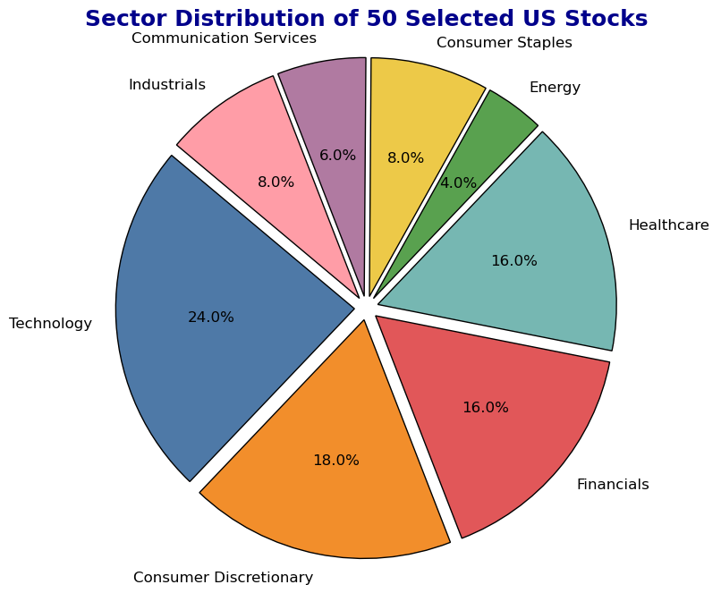
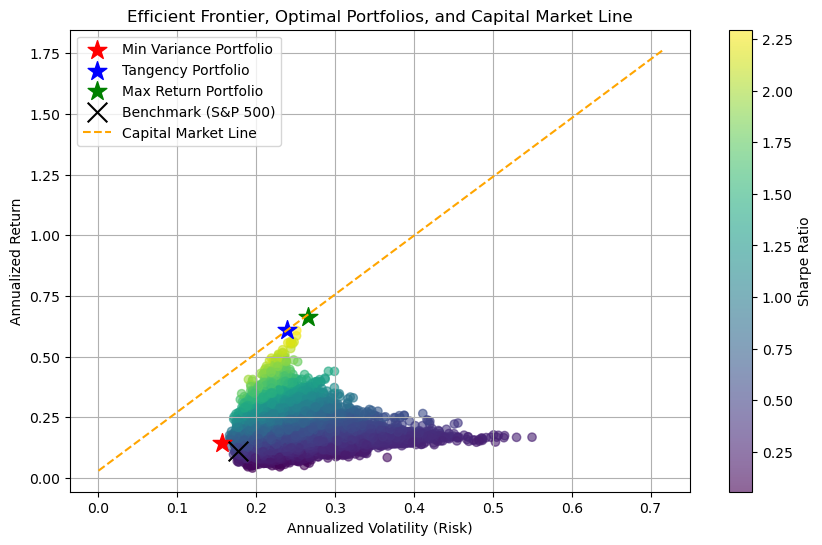
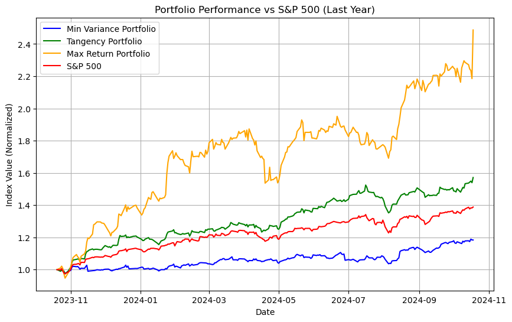
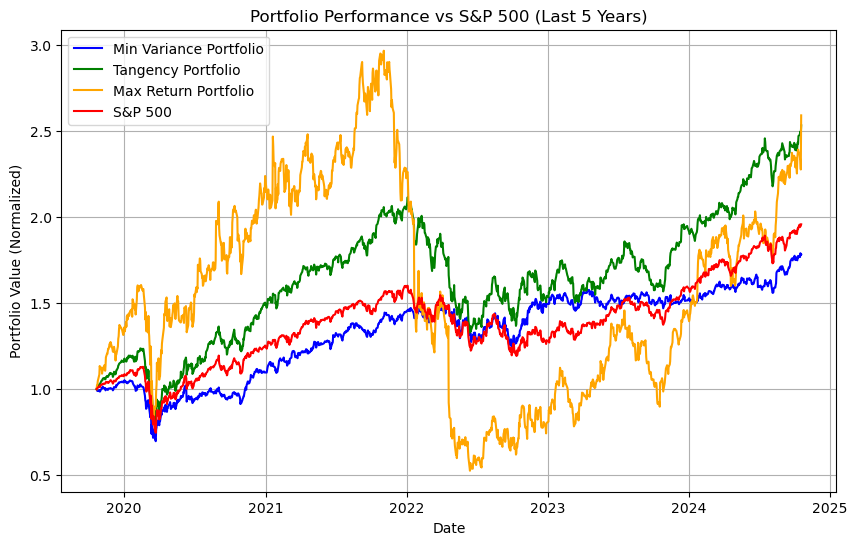

# Portfolio Optimisation
## Using the Sample of 50 US Stocks

The motivation for this project is to effectively manage a \$500,000 investment by identifying optimal, financially sound portfolio strategies. Using Modern Portfolio Theory (MPT), I aim to balance risk and return, constructing portfolios that either maximize returns for a given risk or minimize risk for a target return. This study focuses on a selection of U.S. stocks, using 10 years of historical data (2014–2024) to construct three optimized portfolios: the Minimum Variance Portfolio, the Tangency Portfolio (which maximizes the Sharpe ratio), and the Maximum Return Portfolio. Each portfolio is analyzed for its risk-return performance and compared to the S\&P 500 benchmark. While portfolio optimization follows a top-down approach, which can sometimes overlook asset-specific details, it remains a useful tool for managing diversified investments and aligning portfolios with an investor's risk tolerance.


```python
# pip install yfinance numpy pandas matplotlib scipy
```


```python
import yfinance as yf
import pandas as pd
import numpy as np
import matplotlib.pyplot as plt

# Define the expanded list of 50 US stocks and the benchmark
stocks = ['AAPL', 'MSFT', 'GOOGL', 'AMZN', 'TSLA', 'JPM', 'V', 'JNJ', 'WMT', 'PG', 
          'XOM', 'BAC', 'KO', 'DIS', 'PFE', 'CSCO', 'NFLX', 'BA', 'NKE', 'C',
          'INTC', 'IBM', 'NVDA', 'ADBE', 'PYPL', 'MA', 'MRK', 'PEP', 'MCD', 'ABT', 
          'CRM', 'ORCL', 'CVX', 'T', 'MDT', 'HON', 'GE', 'MMM', 'CAT', 'LOW',
          'LMT', 'UNH', 'HD', 'TXN', 'GS', 'AXP', 'SBUX', 'UPS', 'FDX', 'TGT']
benchmark = '^GSPC'  # S&P 500 index

# Set the time period 
start_date = '2014-01-01'
end_date = '2024-01-01'

# Download stock data
stock_data = yf.download(stocks, start=start_date, end=end_date)['Adj Close']
benchmark_data = yf.download(benchmark, start=start_date, end=end_date)['Adj Close']

# Show the first few rows of the downloaded data
# print(stock_data.head())
# print(benchmark_data.head())

```

    [*********************100%***********************]  50 of 50 completed
    [*********************100%***********************]  1 of 1 completed


In this analysis, I define a time period spanning the last ten years, from January 1, 2014, to January 1, 2024. Using this time frame, I downloaded historical stock data, specifically the adjusted closing prices, for a set of selected U.S. stocks and the S&P 500 index, which serves as benchmark. The adjusted closing prices are used as they account for corporate actions such as dividends and stock splits, providing a more accurate reflection of the stock's value over time. The data was retrieved using the {yfinance} library, a Python interface for downloading financial data from {https://finance.yahoo.com/}{Yahoo Finance}. This dataset will serve as the basis for portfolio analysis and optimization over the selected period.

## Piechart for the distribution of stocks by industries


```python
# Define the sectors and their counts based on the 50-stock list
sectors = ['Technology', 'Consumer Discretionary', 'Financials', 'Healthcare', 
           'Energy', 'Consumer Staples', 'Communication Services', 'Industrials']
sector_counts = [12, 9, 8, 8, 2, 4, 3, 4]

# Define explosion for each sector to slightly separate the slices
explode = [0.05] * len(sectors)  # Slightly explode all sectors

# Define a refined color palette suitable for financial industry
colors = ['#4E79A7', '#F28E2B', '#E15759', '#76B7B2', '#59A14F', '#EDC948', '#B07AA1', '#FF9DA7']

# Plot the pie chart with enhanced aesthetics
plt.figure(figsize=(10, 8), facecolor='white')
plt.pie(sector_counts, labels=sectors, autopct='%1.1f%%', startangle=140, 
        explode=explode, colors=colors, wedgeprops={'edgecolor': 'black'},
        textprops={'fontsize': 12, 'color': 'black'})  # Adjusting text size and color

# Add a title with professional font styling
plt.title('Sector Distribution of 50 Selected US Stocks', fontsize=18, fontweight='bold', color='darkblue')

# Equal aspect ratio ensures that the pie is drawn as a circle
plt.axis('equal')  

# Add a subtle grid-like effect for a more financial industry feel
plt.gca().set_facecolor('white')

# Show the chart
plt.show()

```


    

    


## Methodology
This section outlines the methodology used for the portfolio optimization process, implemented in Python. The process includes obtaining historical stock price data, calculating key statistics, optimizing different portfolios, and visualizing the results.


```python
# Calculate daily returns for the stocks and benchmark
daily_returns = stock_data.pct_change().dropna()
benchmark_returns = benchmark_data.pct_change().dropna()

# Annualized return and volatility (standard deviation)
annualized_returns = daily_returns.mean() * 252  # Annualized return
annualized_volatility = daily_returns.std() * np.sqrt(252)  # Annualized volatility

# Annualized return and volatility for the benchmark
benchmark_annualized_return = benchmark_returns.mean() * 252
benchmark_annualized_volatility = benchmark_returns.std() * np.sqrt(252)

# Show the first few rows of daily returns and annualized stats
# print("Daily Returns (First Few Rows):")
# print(daily_returns.head())

print("\nAnnualized Returns:")
print(annualized_returns)

print("\nAnnualized Volatility (Standard Deviation):")
print(annualized_volatility)

print("\nBenchmark Annualized Return and Volatility:")
print(benchmark_annualized_return, benchmark_annualized_volatility)

```

    
    Annualized Returns:
    Ticker
    AAPL     0.268781
    ABT      0.142669
    ADBE     0.292185
    AMZN     0.284013
    AXP      0.169503
    BA       0.174686
    BAC      0.154244
    C        0.077090
    CAT      0.224082
    CRM      0.217939
    CSCO     0.137128
    CVX      0.144987
    DIS      0.019396
    FDX      0.115326
    GE       0.055172
    GOOGL    0.234445
    GS       0.136513
    HD       0.189079
    HON      0.138742
    IBM      0.078723
    INTC     0.146364
    JNJ      0.099521
    JPM      0.176402
    KO       0.096693
    LMT      0.157365
    LOW      0.205958
    MA       0.223198
    MCD      0.180270
    MDT      0.065067
    MMM      0.022671
    MRK      0.135662
    MSFT     0.306226
    NFLX     0.296065
    NKE      0.136098
    NVDA     0.664079
    ORCL     0.166716
    PEP      0.116542
    PFE      0.054574
    PG       0.117959
    PYPL     0.135384
    SBUX     0.123292
    T        0.047645
    TGT      0.143349
    TSLA     0.470732
    TXN      0.209668
    UNH      0.221862
    UPS      0.122001
    V        0.197399
    WMT      0.135836
    XOM      0.110612
    dtype: float64
    
    Annualized Volatility (Standard Deviation):
    Ticker
    AAPL     0.293572
    ABT      0.244901
    ADBE     0.333626
    AMZN     0.332018
    AXP      0.320675
    BA       0.418034
    BAC      0.323939
    C        0.340383
    CAT      0.305562
    CRM      0.348316
    CSCO     0.258680
    CVX      0.310231
    DIS      0.285326
    FDX      0.326957
    GE       0.361368
    GOOGL    0.289454
    GS       0.296533
    HD       0.250194
    HON      0.235844
    IBM      0.241436
    INTC     0.338938
    JNJ      0.185208
    JPM      0.281778
    KO       0.185253
    LMT      0.231140
    LOW      0.297302
    MA       0.280804
    MCD      0.208486
    MDT      0.236702
    MMM      0.242945
    MRK      0.218415
    MSFT     0.278134
    NFLX     0.449044
    NKE      0.299996
    NVDA     0.490258
    ORCL     0.273105
    PEP      0.191198
    PFE      0.236414
    PG       0.190791
    PYPL     0.384950
    SBUX     0.272055
    T        0.233247
    TGT      0.319294
    TSLA     0.575391
    TXN      0.287235
    UNH      0.261814
    UPS      0.258559
    V        0.254421
    WMT      0.216905
    XOM      0.291315
    dtype: float64
    
    Benchmark Annualized Return and Volatility:
    0.11169683968110368 0.17737847647125346


### Setting up the optimization process


```python
from scipy.optimize import minimize

# Function to calculate portfolio performance (returns and volatility)
def portfolio_performance(weights, returns, cov_matrix):
    port_return = np.sum(weights * returns)  # Portfolio return
    port_volatility = np.sqrt(np.dot(weights.T, np.dot(cov_matrix, weights)))  # Portfolio volatility
    return port_return, port_volatility

# Function to generate random portfolios (for Efficient Frontier)
def generate_random_portfolios(num_portfolios, returns, cov_matrix):
    results = np.zeros((3, num_portfolios))  # Return, volatility, Sharpe ratio
    weights_array = []
    
    for _ in range(num_portfolios):
        weights = np.random.random(len(returns))
        weights /= np.sum(weights)  # Normalize to sum to 1
        weights_array.append(weights)
        
        port_return, port_volatility = portfolio_performance(weights, returns, cov_matrix)
        sharpe_ratio = port_return / port_volatility
        
        results[0, _] = port_return
        results[1, _] = port_volatility
        results[2, _] = sharpe_ratio
    
    return results, weights_array

# Function to minimize portfolio volatility (for Min Variance Portfolio)
def minimize_volatility(weights, cov_matrix):
    return np.sqrt(np.dot(weights.T, np.dot(cov_matrix, weights)))

# Function to calculate the negative Sharpe Ratio (for Tangency Portfolio)
def negative_sharpe_ratio(weights, returns, cov_matrix, risk_free_rate):
    port_return, port_volatility = portfolio_performance(weights, returns, cov_matrix)
    return -(port_return - risk_free_rate) / port_volatility

# Constraints: sum of weights must be 1
def weights_constraint(weights):
    return np.sum(weights) - 1

# Bounds: weights must be between 0 and 1 (no short selling)
bounds = tuple((0, 1) for _ in range(len(annualized_returns)))

# Risk-free rate assumption 
risk_free_rate = 0.03

```


```python
# Exclude the benchmark from the stock returns to calculate the covariance matrix
cov_matrix = daily_returns[stocks].cov() * 252  # Annualized covariance matrix

# Initial guess for weights (evenly distributed across the stocks)
initial_weights = np.array([1 / len(stocks)] * len(stocks))

# Minimize volatility (Minimum Variance Portfolio)
min_variance_result = minimize(minimize_volatility, initial_weights, args=cov_matrix, 
                               method='SLSQP', bounds=bounds, constraints={'type': 'eq', 'fun': weights_constraint})

# Maximize Sharpe ratio (Tangency Portfolio)
tangency_result = minimize(negative_sharpe_ratio, initial_weights, args=(annualized_returns, cov_matrix, risk_free_rate),
                           method='SLSQP', bounds=bounds, constraints={'type': 'eq', 'fun': weights_constraint})

# Max return portfolio (the stock with the highest return)
max_return_weights = np.zeros(len(annualized_returns))
max_return_weights[np.argmax(annualized_returns)] = 1  # Assign all weight to the stock with the max return

# Extract portfolio stats (returns, volatilities) for each portfolio
min_var_return, min_var_volatility = portfolio_performance(min_variance_result.x, annualized_returns, cov_matrix)
tangency_return, tangency_volatility = portfolio_performance(tangency_result.x, annualized_returns, cov_matrix)
max_return_return, max_return_volatility = portfolio_performance(max_return_weights, annualized_returns, cov_matrix)

# Function to generate random portfolios (for Efficient Frontier)
def generate_random_portfolios(num_portfolios, returns, cov_matrix):
    results = np.zeros((3, num_portfolios))  # Return, volatility, Sharpe ratio
    weights_array = []
    
    for _ in range(num_portfolios):
        # Increase variance by using Dirichlet with smaller values
        weights = np.random.dirichlet(np.ones(len(returns)) * 0.1)  # More variance in weight distribution
        weights /= np.sum(weights)  # Normalize to sum to 1
        weights_array.append(weights)
        
        port_return, port_volatility = portfolio_performance(weights, returns, cov_matrix)
        sharpe_ratio = (port_return - risk_free_rate) / port_volatility
        
        results[0, _] = port_return
        results[1, _] = port_volatility
        results[2, _] = sharpe_ratio
    
    return results, weights_array

# Increase the number of random portfolios and spread out the weights more
num_portfolios = 100000
random_portfolios, random_weights = generate_random_portfolios(num_portfolios, annualized_returns, cov_matrix)

# Plot the Efficient Frontier and optimal portfolios
plt.figure(figsize=(10, 6))
plt.scatter(random_portfolios[1,:], random_portfolios[0,:], c=random_portfolios[2,:], cmap='viridis', marker='o', alpha=0.6)
plt.colorbar(label='Sharpe Ratio')

# Plot the key portfolios
plt.scatter(min_var_volatility, min_var_return, color='red', marker='*', s=200, label='Min Variance Portfolio')
plt.scatter(tangency_volatility, tangency_return, color='blue', marker='*', s=200, label='Tangency Portfolio')
plt.scatter(max_return_volatility, max_return_return, color='green', marker='*', s=200, label='Max Return Portfolio')

# Plot the benchmark (S&P 500)
plt.scatter(benchmark_annualized_volatility, benchmark_annualized_return, color='black', marker='x', s=200, label='Benchmark (S&P 500)')

# Extend the Capital Market Line (CML)
cml_x = np.linspace(0, max(random_portfolios[1,:])*1.3, 100)  # Extend the CML a bit further
cml_y = risk_free_rate + (cml_x / tangency_volatility) * (tangency_return - risk_free_rate)
plt.plot(cml_x, cml_y, color='orange', linestyle='--', label='Capital Market Line')

# Labels and title
plt.title('Efficient Frontier, Optimal Portfolios, and Capital Market Line')
plt.xlabel('Annualized Volatility (Risk)')
plt.ylabel('Annualized Return')
plt.legend()
plt.grid(True)

plt.show()

```


    

    


The figure illustrates the efficient frontier along with three key portfolios: the Minimum Variance Portfolio, Tangency Portfolio, and Maximum Return Portfolio. Additionally, the Capital Market Line (CML) is plotted to demonstrate the optimal risk-return combinations, factoring in the risk-free rate. 

## Extracting the weights of portfolios and extracting their key statistics


```python
# Align all weights with the full list of stocks to ensure the same length for each portfolio
min_var_weights_series = pd.Series(min_var_weights, index=stocks).fillna(0)
tangency_weights_series = pd.Series(tangency_weights, index=stocks).fillna(0)
max_return_weights_series = pd.Series(max_return_weights, index=stocks).fillna(0)

# Create a DataFrame to store the results for the key portfolios
portfolio_stats = pd.DataFrame({
    'Asset': stocks,
    'Min Variance Weights': min_var_weights_series.values,
    'Tangency Weights': tangency_weights_series.values,
    'Max Return Weights': max_return_weights_series.values,
})

min_var_sharpe = min_var_return / min_var_volatility
tangency_sharpe = tangency_return / tangency_volatility
max_return_sharpe = max_return_return / max_return_volatility

# Create a row for the portfolio-level statistics (returns, volatilities, and sharpe ratios)
portfolio_stats_summary = pd.DataFrame({
    'Asset': ['Portfolio Stats'],
    'Min Variance Weights': [f'Return: {min_var_return:.4f}, Volatility: {min_var_volatility:.4f}, Sharpe: {min_var_sharpe:.4f}'],
    'Tangency Weights': [f'Return: {tangency_return:.4f}, Volatility: {tangency_volatility:.4f}, Sharpe: {tangency_sharpe:.4f}'],
    'Max Return Weights': [f'Return: {max_return_return:.4f}, Volatility: {max_return_volatility:.4f}, Sharpe: {max_return_sharpe:.4f}']
})

# Concatenate the original DataFrame with the summary row
final_table = pd.concat([portfolio_stats, portfolio_stats_summary], ignore_index=True)

# Display the final table for better clarity
print(final_table)

# Generate LaTeX format for saving
latex_output = final_table.to_latex(index=False)

# Save the LaTeX to a file
with open("portfolio_stats_table.tex", "w") as f:
    f.write(latex_output)

print("LaTeX file has been saved as 'portfolio_stats_table.tex'")

```

                  Asset                               Min Variance Weights  \
    0              AAPL                                                0.0   
    1              MSFT                                             0.0355   
    2             GOOGL                                                0.0   
    3              AMZN                                                0.0   
    4              TSLA                                                0.0   
    5               JPM                                                0.0   
    6                 V                                             0.0227   
    7               JNJ                                                0.0   
    8               WMT                                             0.2179   
    9                PG                                                0.0   
    10              XOM                                             0.2209   
    11              BAC                                                0.0   
    12               KO                                             0.0131   
    13              DIS                                                0.0   
    14              PFE                                             0.0934   
    15             CSCO                                             0.1536   
    16             NFLX                                                0.0   
    17               BA                                                0.0   
    18              NKE                                             0.1854   
    19                C                                             0.0576   
    20             INTC                                                0.0   
    21              IBM                                                0.0   
    22             NVDA                                                0.0   
    23             ADBE                                                0.0   
    24             PYPL                                                0.0   
    25               MA                                                0.0   
    26              MRK                                                0.0   
    27              PEP                                                0.0   
    28              MCD                                                0.0   
    29              ABT                                                0.0   
    30              CRM                                                0.0   
    31             ORCL                                                0.0   
    32              CVX                                                0.0   
    33                T                                                0.0   
    34              MDT                                                0.0   
    35              HON                                                0.0   
    36               GE                                                0.0   
    37              MMM                                                0.0   
    38              CAT                                                0.0   
    39              LOW                                                0.0   
    40              LMT                                                0.0   
    41              UNH                                                0.0   
    42               HD                                                0.0   
    43              TXN                                                0.0   
    44               GS                                                0.0   
    45              AXP                                                0.0   
    46             SBUX                                                0.0   
    47              UPS                                                0.0   
    48              FDX                                                0.0   
    49              TGT                                                0.0   
    50  Portfolio Stats  Return: 0.1460, Volatility: 0.1569, Sharpe: 0....   
    
                                         Tangency Weights  \
    0                                              0.2647   
    1                                                 0.0   
    2                                                 0.0   
    3                                                 0.0   
    4                                                 0.0   
    5                                                 0.0   
    6                                                 0.0   
    7                                                 0.0   
    8                                                 0.0   
    9                                              0.0092   
    10                                                0.0   
    11                                             0.4268   
    12                                             0.0912   
    13                                                0.0   
    14                                                0.0   
    15                                                0.0   
    16                                             0.1782   
    17                                                0.0   
    18                                             0.0298   
    19                                                0.0   
    20                                                0.0   
    21                                                0.0   
    22                                                0.0   
    23                                                0.0   
    24                                                0.0   
    25                                                0.0   
    26                                                0.0   
    27                                                0.0   
    28                                                0.0   
    29                                                0.0   
    30                                                0.0   
    31                                                0.0   
    32                                                0.0   
    33                                                0.0   
    34                                                0.0   
    35                                                0.0   
    36                                                0.0   
    37                                                0.0   
    38                                                0.0   
    39                                                0.0   
    40                                                0.0   
    41                                                0.0   
    42                                                0.0   
    43                                                0.0   
    44                                                0.0   
    45                                                0.0   
    46                                                0.0   
    47                                                0.0   
    48                                                0.0   
    49                                                0.0   
    50  Return: 0.6102, Volatility: 0.2396, Sharpe: 2....   
    
                                       Max Return Weights  
    0                                                 0.0  
    1                                                 0.0  
    2                                                 0.0  
    3                                                 0.0  
    4                                                 0.0  
    5                                                 0.0  
    6                                                 0.0  
    7                                                 0.0  
    8                                                 0.0  
    9                                                 0.0  
    10                                                0.0  
    11                                                0.0  
    12                                                0.0  
    13                                                0.0  
    14                                                0.0  
    15                                                0.0  
    16                                                0.0  
    17                                                0.0  
    18                                                0.0  
    19                                                0.0  
    20                                                0.0  
    21                                                0.0  
    22                                                0.0  
    23                                                0.0  
    24                                                0.0  
    25                                                0.0  
    26                                                0.0  
    27                                                0.0  
    28                                                0.0  
    29                                                0.0  
    30                                                0.0  
    31                                                0.0  
    32                                                0.0  
    33                                                0.0  
    34                                                1.0  
    35                                                0.0  
    36                                                0.0  
    37                                                0.0  
    38                                                0.0  
    39                                                0.0  
    40                                                0.0  
    41                                                0.0  
    42                                                0.0  
    43                                                0.0  
    44                                                0.0  
    45                                                0.0  
    46                                                0.0  
    47                                                0.0  
    48                                                0.0  
    49                                                0.0  
    50  Return: 0.6641, Volatility: 0.2655, Sharpe: 2....  
    LaTeX file has been saved as 'portfolio_stats_table.tex'


## Plotting the certain portfolios (and the benchmark) with their calculated weights with past returns (1yr and 5yr):


```python
import yfinance as yf
import pandas as pd
import numpy as np
import matplotlib.pyplot as plt

# Initial investment amount
initial_investment = 500000

# Define the expanded list of 50 stocks and the benchmark
stocks = ['AAPL', 'MSFT', 'GOOGL', 'AMZN', 'TSLA', 'JPM', 'V', 'JNJ', 'WMT', 'PG', 
          'XOM', 'BAC', 'KO', 'DIS', 'PFE', 'CSCO', 'NFLX', 'BA', 'NKE', 'C', 
          'INTC', 'IBM', 'NVDA', 'ADBE', 'PYPL', 'MA', 'MRK', 'PEP', 'MCD', 'ABT', 'CRM',
          'ORCL', 'CVX', 'T', 'MDT', 'HON', 'GE', 'MMM', 'CAT', 'LOW', 'LMT', 
          'UNH', 'HD', 'TXN', 'GS', 'AXP', 'SBUX', 'UPS', 'FDX', 'TGT']
benchmark = '^GSPC'  # S&P 500 index

# Define the three portfolio weights manually
min_var_weights = {
    "AAPL": 0.0000, "MSFT": 0.0355, "GOOGL": 0.0000, "AMZN": 0.0000, "TSLA": 0.0000,
    "JPM": 0.0000, "V": 0.0227, "JNJ": 0.0000, "WMT": 0.2179, "PG": 0.0000,
    "XOM": 0.2209, "BAC": 0.0000, "KO": 0.0131, "DIS": 0.0000, "PFE": 0.0934,
    "CSCO": 0.1536, "NFLX": 0.0000, "BA": 0.0000, "NKE": 0.1854, "C": 0.0576,
    "INTC": 0.0000, "IBM": 0.0000, "NVDA": 0.0000, "ADBE": 0.0000, "PYPL": 0.0000, 
    "MA": 0.0000, "MRK": 0.0000, "PEP": 0.0000, "MCD": 0.0000, "ABT": 0.0000,
    "CRM": 0.0000, "ORCL": 0.0000, "CVX": 0.0000, "T": 0.0000, "MDT": 0.0000,
    "HON": 0.0000, "GE": 0.0000, "MMM": 0.0000, "CAT": 0.0000, "LOW": 0.0000,
    "LMT": 0.0000, "UNH": 0.0000, "HD": 0.0000, "TXN": 0.0000, "GS": 0.0000,
    "AXP": 0.0000, "SBUX": 0.0000, "UPS": 0.0000, "FDX": 0.0000, "TGT": 0.0000
}

tangency_weights = {
    "AAPL": 0.2647, "MSFT": 0.0000, "GOOGL": 0.0000, "AMZN": 0.0000, "TSLA": 0.0000,
    "JPM": 0.0000, "V": 0.0000, "JNJ": 0.0000, "WMT": 0.0000, "PG": 0.0092,
    "XOM": 0.0000, "BAC": 0.4268, "KO": 0.0912, "DIS": 0.0000, "PFE": 0.0000,
    "CSCO": 0.0000, "NFLX": 0.1782, "BA": 0.0000, "NKE": 0.0298, "C": 0.0000,
    "INTC": 0.0000, "IBM": 0.0000, "NVDA": 0.0000, "ADBE": 0.0000, "PYPL": 0.0000, 
    "MA": 0.0000, "MRK": 0.0000, "PEP": 0.0000, "MCD": 0.0000, "ABT": 0.0000,
    "CRM": 0.0000, "ORCL": 0.0000, "CVX": 0.0000, "T": 0.0000, "MDT": 0.0000,
    "HON": 0.0000, "GE": 0.0000, "MMM": 0.0000, "CAT": 0.0000, "LOW": 0.0000,
    "LMT": 0.0000, "UNH": 0.0000, "HD": 0.0000, "TXN": 0.0000, "GS": 0.0000,
    "AXP": 0.0000, "SBUX": 0.0000, "UPS": 0.0000, "FDX": 0.0000, "TGT": 0.0000
}

max_return_weights = {
    "AAPL": 0.0000, "MSFT": 0.0000, "GOOGL": 0.0000, "AMZN": 0.0000, "TSLA": 0.0000,
    "JPM": 0.0000, "V": 0.0000, "JNJ": 0.0000, "WMT": 0.0000, "PG": 0.0000,
    "XOM": 0.0000, "BAC": 0.0000, "KO": 0.0000, "DIS": 0.0000, "PFE": 0.0000,
    "CSCO": 0.0000, "NFLX": 1.0000, "BA": 0.0000, "NKE": 0.0000, "C": 0.0000,
    "INTC": 0.0000, "IBM": 0.0000, "NVDA": 0.0000, "ADBE": 0.0000, "PYPL": 0.0000, 
    "MA": 0.0000, "MRK": 0.0000, "PEP": 0.0000, "MCD": 0.0000, "ABT": 0.0000,
    "CRM": 0.0000, "ORCL": 0.0000, "CVX": 0.0000, "T": 0.0000, "MDT": 1.0000,
    "HON": 0.0000, "GE": 0.0000, "MMM": 0.0000, "CAT": 0.0000, "LOW": 0.0000,
    "LMT": 0.0000, "UNH": 0.0000, "HD": 0.0000, "TXN": 0.0000, "GS": 0.0000,
    "AXP": 0.0000, "SBUX": 0.0000, "UPS": 0.0000, "FDX": 0.0000, "TGT": 0.0000
}

# Download data for the last year for all stocks and the benchmark
data = yf.download(stocks + [benchmark], period="1y")['Adj Close']

# Calculate daily returns for each stock
daily_returns = data.pct_change().dropna()

# Calculate portfolio returns for each portfolio
min_var_portfolio_returns = (daily_returns[stocks] * pd.Series(min_var_weights)).sum(axis=1)
tangency_portfolio_returns = (daily_returns[stocks] * pd.Series(tangency_weights)).sum(axis=1)
max_return_portfolio_returns = (daily_returns[stocks] * pd.Series(max_return_weights)).sum(axis=1)

# Calculate cumulative portfolio value over time for each portfolio
min_var_portfolio_value = (1 + min_var_portfolio_returns).cumprod() * initial_investment
tangency_portfolio_value = (1 + tangency_portfolio_returns).cumprod() * initial_investment
max_return_portfolio_value = (1 + max_return_portfolio_returns).cumprod() * initial_investment

# Calculate cumulative benchmark value
benchmark_value = (1 + daily_returns[benchmark]).cumprod() * initial_investment

# Normalize the portfolio values and benchmark to start at the same value
min_var_portfolio_index = min_var_portfolio_value / min_var_portfolio_value.iloc[0]
tangency_portfolio_index = tangency_portfolio_value / tangency_portfolio_value.iloc[0]
max_return_portfolio_index = max_return_portfolio_value / max_return_portfolio_value.iloc[0]
benchmark_index = benchmark_value / benchmark_value.iloc[0]

# Plot the portfolio indices vs S&P 500 index
plt.figure(figsize=(10, 6))
plt.plot(min_var_portfolio_index, label="Min Variance Portfolio", color="blue")
plt.plot(tangency_portfolio_index, label="Tangency Portfolio", color="green")
plt.plot(max_return_portfolio_index, label="Max Return Portfolio", color="orange")
plt.plot(benchmark_index, label="S&P 500", color="red")
plt.title("Portfolio Performance vs S&P 500 (Last Year)")
plt.xlabel("Date")
plt.ylabel("Index Value (Normalized)")
plt.legend()
plt.grid(True)
plt.show()


```

    [*********************100%***********************]  51 of 51 completed


    

    


```python
### 5yrs back in time
# Initial investment amount
initial_investment = 500000

# Define the expanded list of 50 stocks and the benchmark
stocks = ['AAPL', 'MSFT', 'GOOGL', 'AMZN', 'TSLA', 'JPM', 'V', 'JNJ', 'WMT', 'PG', 
          'XOM', 'BAC', 'KO', 'DIS', 'PFE', 'CSCO', 'NFLX', 'BA', 'NKE', 'C', 
          'INTC', 'IBM', 'NVDA', 'ADBE', 'PYPL', 'MA', 'MRK', 'PEP', 'MCD', 'ABT', 'CRM',
          'ORCL', 'CVX', 'T', 'MDT', 'HON', 'GE', 'MMM', 'CAT', 'LOW', 'LMT', 
          'UNH', 'HD', 'TXN', 'GS', 'AXP', 'SBUX', 'UPS', 'FDX', 'TGT']
benchmark = '^GSPC'  # S&P 500 index

# Define the three portfolio weights manually
min_var_weights = {
    "AAPL": 0.0000, "MSFT": 0.0355, "GOOGL": 0.0000, "AMZN": 0.0000, "TSLA": 0.0000,
    "JPM": 0.0000, "V": 0.0227, "JNJ": 0.0000, "WMT": 0.2179, "PG": 0.0000,
    "XOM": 0.2209, "BAC": 0.0000, "KO": 0.0131, "DIS": 0.0000, "PFE": 0.0934,
    "CSCO": 0.1536, "NFLX": 0.0000, "BA": 0.0000, "NKE": 0.1854, "C": 0.0576,
    "INTC": 0.0000, "IBM": 0.0000, "NVDA": 0.0000, "ADBE": 0.0000, "PYPL": 0.0000, 
    "MA": 0.0000, "MRK": 0.0000, "PEP": 0.0000, "MCD": 0.0000, "ABT": 0.0000,
    "CRM": 0.0000, "ORCL": 0.0000, "CVX": 0.0000, "T": 0.0000, "MDT": 0.0000,
    "HON": 0.0000, "GE": 0.0000, "MMM": 0.0000, "CAT": 0.0000, "LOW": 0.0000,
    "LMT": 0.0000, "UNH": 0.0000, "HD": 0.0000, "TXN": 0.0000, "GS": 0.0000,
    "AXP": 0.0000, "SBUX": 0.0000, "UPS": 0.0000, "FDX": 0.0000, "TGT": 0.0000
}

tangency_weights = {
    "AAPL": 0.2647, "MSFT": 0.0000, "GOOGL": 0.0000, "AMZN": 0.0000, "TSLA": 0.0000,
    "JPM": 0.0000, "V": 0.0000, "JNJ": 0.0000, "WMT": 0.0000, "PG": 0.0092,
    "XOM": 0.0000, "BAC": 0.4268, "KO": 0.0912, "DIS": 0.0000, "PFE": 0.0000,
    "CSCO": 0.0000, "NFLX": 0.1782, "BA": 0.0000, "NKE": 0.0298, "C": 0.0000,
    "INTC": 0.0000, "IBM": 0.0000, "NVDA": 0.0000, "ADBE": 0.0000, "PYPL": 0.0000, 
    "MA": 0.0000, "MRK": 0.0000, "PEP": 0.0000, "MCD": 0.0000, "ABT": 0.0000,
    "CRM": 0.0000, "ORCL": 0.0000, "CVX": 0.0000, "T": 0.0000, "MDT": 0.0000,
    "HON": 0.0000, "GE": 0.0000, "MMM": 0.0000, "CAT": 0.0000, "LOW": 0.0000,
    "LMT": 0.0000, "UNH": 0.0000, "HD": 0.0000, "TXN": 0.0000, "GS": 0.0000,
    "AXP": 0.0000, "SBUX": 0.0000, "UPS": 0.0000, "FDX": 0.0000, "TGT": 0.0000
}

max_return_weights = {
    "AAPL": 0.0000, "MSFT": 0.0000, "GOOGL": 0.0000, "AMZN": 0.0000, "TSLA": 0.0000,
    "JPM": 0.0000, "V": 0.0000, "JNJ": 0.0000, "WMT": 0.0000, "PG": 0.0000,
    "XOM": 0.0000, "BAC": 0.0000, "KO": 0.0000, "DIS": 0.0000, "PFE": 0.0000,
    "CSCO": 0.0000, "NFLX": 1.0000, "BA": 0.0000, "NKE": 0.0000, "C": 0.0000,
    "INTC": 0.0000, "IBM": 0.0000, "NVDA": 0.0000, "ADBE": 0.0000, "PYPL": 0.0000, 
    "MA": 0.0000, "MRK": 0.0000, "PEP": 0.0000, "MCD": 0.0000, "ABT": 0.0000,
    "CRM": 0.0000, "ORCL": 0.0000, "CVX": 0.0000, "T": 0.0000, "MDT": 1.0000,
    "HON": 0.0000, "GE": 0.0000, "MMM": 0.0000, "CAT": 0.0000, "LOW": 0.0000,
    "LMT": 0.0000, "UNH": 0.0000, "HD": 0.0000, "TXN": 0.0000, "GS": 0.0000,
    "AXP": 0.0000, "SBUX": 0.0000, "UPS": 0.0000, "FDX": 0.0000, "TGT": 0.0000
}

# Download data for the last 5 years for all stocks and the benchmark
data = yf.download(stocks + [benchmark], period="5y")['Adj Close']

# Calculate daily returns for each stock
daily_returns = data.pct_change().dropna()

# Calculate portfolio returns for each portfolio
min_var_portfolio_returns = (daily_returns[stocks] * pd.Series(min_var_weights)).sum(axis=1)
tangency_portfolio_returns = (daily_returns[stocks] * pd.Series(tangency_weights)).sum(axis=1)
max_return_portfolio_returns = (daily_returns[stocks] * pd.Series(max_return_weights)).sum(axis=1)

# Calculate cumulative portfolio value over time for each portfolio
min_var_portfolio_value = (1 + min_var_portfolio_returns).cumprod() * initial_investment
tangency_portfolio_value = (1 + tangency_portfolio_returns).cumprod() * initial_investment
max_return_portfolio_value = (1 + max_return_portfolio_returns).cumprod() * initial_investment

# Normalize the portfolio values to start at the same point 5 years ago
min_var_portfolio_index = min_var_portfolio_value / min_var_portfolio_value.iloc[0]
tangency_portfolio_index = tangency_portfolio_value / tangency_portfolio_value.iloc[0]
max_return_portfolio_index = max_return_portfolio_value / max_return_portfolio_value.iloc[0]

# Normalize the S&P 500 index to start at the price 5 years ago
benchmark_value = (1 + daily_returns[benchmark]).cumprod() * initial_investment
benchmark_index = benchmark_value / benchmark_value.iloc[0]

# Plot the portfolio indices vs S&P 500 index
plt.figure(figsize=(10, 6))
plt.plot(min_var_portfolio_index, label="Min Variance Portfolio", color="blue")
plt.plot(tangency_portfolio_index, label="Tangency Portfolio", color="green")
plt.plot(max_return_portfolio_index, label="Max Return Portfolio", color="orange")
plt.plot(benchmark_index, label="S&P 500", color="red")
plt.title("Portfolio Performance vs S&P 500 (Last 5 Years)")
plt.xlabel("Date")
plt.ylabel("Portfolio Value (Normalized)")
plt.legend()
plt.grid(True)
plt.show()
```

    [*********************100%***********************]  51 of 51 completed


    

    

